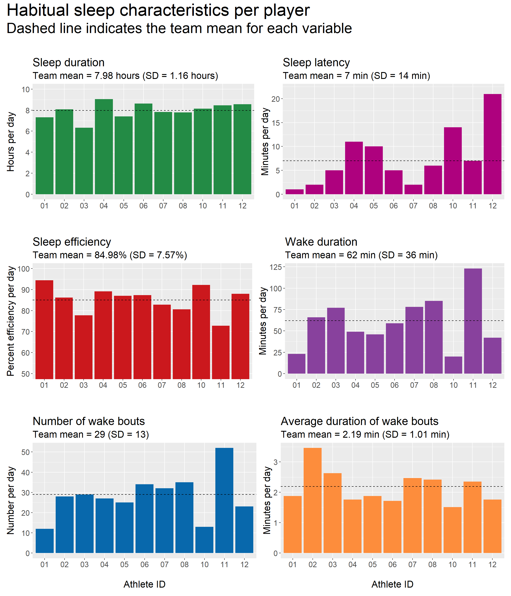

# Habitual sleep {#habitualsleep}

## Table: Per player

The data displayed in Table \@ref(tab:tablehabitualsummary) shows habitual sleep summary data for each player. One row = one player's habitual sleep measures. *Note:* Players with the `ath_id` values of 09, 13, and 14 did not record any sleep data during the habitual monitoring period.

<table class="table" style="margin-left: auto; margin-right: auto;">
<caption>(\#tab:tablehabitualsummary)Habitual sleep characteristics per player.</caption>
 <thead>
  <tr>
   <th style="text-align:left;position: sticky; top:0; background-color: #FFFFFF;"> ath_id </th>
   <th style="text-align:right;position: sticky; top:0; background-color: #FFFFFF;"> bed_time </th>
   <th style="text-align:right;position: sticky; top:0; background-color: #FFFFFF;"> wake_up_time </th>
   <th style="text-align:right;position: sticky; top:0; background-color: #FFFFFF;"> sleep_duration_min </th>
   <th style="text-align:right;position: sticky; top:0; background-color: #FFFFFF;"> sleep_duration_h </th>
   <th style="text-align:right;position: sticky; top:0; background-color: #FFFFFF;"> sleep_latency </th>
   <th style="text-align:right;position: sticky; top:0; background-color: #FFFFFF;"> sleep_efficiency </th>
   <th style="text-align:right;position: sticky; top:0; background-color: #FFFFFF;"> wake_duration </th>
   <th style="text-align:right;position: sticky; top:0; background-color: #FFFFFF;"> wake_bouts_num </th>
   <th style="text-align:right;position: sticky; top:0; background-color: #FFFFFF;"> wake_bouts_avg_duration_mean </th>
  </tr>
 </thead>
<tbody>
  <tr>
   <td style="text-align:left;"> 01 </td>
   <td style="text-align:right;"> 23:41:00 </td>
   <td style="text-align:right;"> 07:00:00 </td>
   <td style="text-align:right;"> 439 </td>
   <td style="text-align:right;"> 7.32 </td>
   <td style="text-align:right;"> 1 </td>
   <td style="text-align:right;"> 94.40 </td>
   <td style="text-align:right;"> 23 </td>
   <td style="text-align:right;"> 12 </td>
   <td style="text-align:right;"> 1.88 </td>
  </tr>
  <tr>
   <td style="text-align:left;"> 02 </td>
   <td style="text-align:right;"> 00:11:00 </td>
   <td style="text-align:right;"> 12:16:00 </td>
   <td style="text-align:right;"> 484 </td>
   <td style="text-align:right;"> 8.07 </td>
   <td style="text-align:right;"> 2 </td>
   <td style="text-align:right;"> 86.18 </td>
   <td style="text-align:right;"> 66 </td>
   <td style="text-align:right;"> 28 </td>
   <td style="text-align:right;"> 3.46 </td>
  </tr>
  <tr>
   <td style="text-align:left;"> 03 </td>
   <td style="text-align:right;"> 22:56:00 </td>
   <td style="text-align:right;"> 05:16:00 </td>
   <td style="text-align:right;"> 380 </td>
   <td style="text-align:right;"> 6.33 </td>
   <td style="text-align:right;"> 5 </td>
   <td style="text-align:right;"> 77.75 </td>
   <td style="text-align:right;"> 77 </td>
   <td style="text-align:right;"> 29 </td>
   <td style="text-align:right;"> 2.63 </td>
  </tr>
  <tr>
   <td style="text-align:left;"> 04 </td>
   <td style="text-align:right;"> 23:10:00 </td>
   <td style="text-align:right;"> 08:12:00 </td>
   <td style="text-align:right;"> 542 </td>
   <td style="text-align:right;"> 9.04 </td>
   <td style="text-align:right;"> 11 </td>
   <td style="text-align:right;"> 89.18 </td>
   <td style="text-align:right;"> 49 </td>
   <td style="text-align:right;"> 27 </td>
   <td style="text-align:right;"> 1.76 </td>
  </tr>
  <tr>
   <td style="text-align:left;"> 05 </td>
   <td style="text-align:right;"> 23:23:00 </td>
   <td style="text-align:right;"> 06:47:00 </td>
   <td style="text-align:right;"> 445 </td>
   <td style="text-align:right;"> 7.41 </td>
   <td style="text-align:right;"> 10 </td>
   <td style="text-align:right;"> 87.04 </td>
   <td style="text-align:right;"> 46 </td>
   <td style="text-align:right;"> 25 </td>
   <td style="text-align:right;"> 1.88 </td>
  </tr>
  <tr>
   <td style="text-align:left;"> 06 </td>
   <td style="text-align:right;"> 22:50:00 </td>
   <td style="text-align:right;"> 07:28:00 </td>
   <td style="text-align:right;"> 518 </td>
   <td style="text-align:right;"> 8.63 </td>
   <td style="text-align:right;"> 5 </td>
   <td style="text-align:right;"> 87.39 </td>
   <td style="text-align:right;"> 59 </td>
   <td style="text-align:right;"> 34 </td>
   <td style="text-align:right;"> 1.72 </td>
  </tr>
  <tr>
   <td style="text-align:left;"> 07 </td>
   <td style="text-align:right;"> 23:10:00 </td>
   <td style="text-align:right;"> 07:00:00 </td>
   <td style="text-align:right;"> 470 </td>
   <td style="text-align:right;"> 7.83 </td>
   <td style="text-align:right;"> 2 </td>
   <td style="text-align:right;"> 82.83 </td>
   <td style="text-align:right;"> 78 </td>
   <td style="text-align:right;"> 32 </td>
   <td style="text-align:right;"> 2.47 </td>
  </tr>
  <tr>
   <td style="text-align:left;"> 08 </td>
   <td style="text-align:right;"> 22:54:00 </td>
   <td style="text-align:right;"> 06:41:00 </td>
   <td style="text-align:right;"> 467 </td>
   <td style="text-align:right;"> 7.78 </td>
   <td style="text-align:right;"> 6 </td>
   <td style="text-align:right;"> 80.62 </td>
   <td style="text-align:right;"> 85 </td>
   <td style="text-align:right;"> 35 </td>
   <td style="text-align:right;"> 2.42 </td>
  </tr>
  <tr>
   <td style="text-align:left;"> 10 </td>
   <td style="text-align:right;"> 22:52:00 </td>
   <td style="text-align:right;"> 07:01:00 </td>
   <td style="text-align:right;"> 489 </td>
   <td style="text-align:right;"> 8.15 </td>
   <td style="text-align:right;"> 14 </td>
   <td style="text-align:right;"> 92.24 </td>
   <td style="text-align:right;"> 20 </td>
   <td style="text-align:right;"> 13 </td>
   <td style="text-align:right;"> 1.51 </td>
  </tr>
  <tr>
   <td style="text-align:left;"> 11 </td>
   <td style="text-align:right;"> 22:56:00 </td>
   <td style="text-align:right;"> 07:23:00 </td>
   <td style="text-align:right;"> 507 </td>
   <td style="text-align:right;"> 8.45 </td>
   <td style="text-align:right;"> 7 </td>
   <td style="text-align:right;"> 72.83 </td>
   <td style="text-align:right;"> 123 </td>
   <td style="text-align:right;"> 52 </td>
   <td style="text-align:right;"> 2.35 </td>
  </tr>
  <tr>
   <td style="text-align:left;"> 12 </td>
   <td style="text-align:right;"> 23:06:00 </td>
   <td style="text-align:right;"> 07:40:00 </td>
   <td style="text-align:right;"> 514 </td>
   <td style="text-align:right;"> 8.57 </td>
   <td style="text-align:right;"> 21 </td>
   <td style="text-align:right;"> 87.94 </td>
   <td style="text-align:right;"> 42 </td>
   <td style="text-align:right;"> 23 </td>
   <td style="text-align:right;"> 1.76 </td>
  </tr>
  <tr>
   <td style="text-align:left;"> 15 </td>
   <td style="text-align:right;"> 22:03:00 </td>
   <td style="text-align:right;"> 06:04:00 </td>
   <td style="text-align:right;"> 481 </td>
   <td style="text-align:right;"> 8.02 </td>
   <td style="text-align:right;"> 1 </td>
   <td style="text-align:right;"> 88.58 </td>
   <td style="text-align:right;"> 51 </td>
   <td style="text-align:right;"> 31 </td>
   <td style="text-align:right;"> 1.66 </td>
  </tr>
  <tr>
   <td style="text-align:left;"> 16 </td>
   <td style="text-align:right;"> 23:46:00 </td>
   <td style="text-align:right;"> 09:04:00 </td>
   <td style="text-align:right;"> 547 </td>
   <td style="text-align:right;"> 9.12 </td>
   <td style="text-align:right;"> 4 </td>
   <td style="text-align:right;"> 87.95 </td>
   <td style="text-align:right;"> 59 </td>
   <td style="text-align:right;"> 27 </td>
   <td style="text-align:right;"> 2.17 </td>
  </tr>
</tbody>
</table>

## Table: Team summary

Table \@ref(tab:tablehabitualteamsummary) shows habitual sleep data summarised for the whole team (means and standard deviations). These values are also obtained from day-level sleep monitoring data (i.e., they are not "averages of averages" that would be obtained by taking averages from the per-player data).

**NOTE:** The team summary data below includes all individuals who recorded habitual sleep data. However, this sample differs slightly from the group of individuals who completed on-tour sleep monitoring. Take care when preparing reports, to ensure the relevant data set is being referenced.

<table class="table" style="margin-left: auto; margin-right: auto;">
<caption>(\#tab:tablehabitualteamsummary)Habitual sleep characteristics for the whole team.</caption>
 <thead>
  <tr>
   <th style="text-align:left;"> statistic </th>
   <th style="text-align:right;"> bed_time </th>
   <th style="text-align:right;"> wake_up_time </th>
   <th style="text-align:right;"> sleep_duration_min </th>
   <th style="text-align:right;"> sleep_duration_h </th>
   <th style="text-align:right;"> sleep_latency </th>
   <th style="text-align:right;"> sleep_efficiency </th>
   <th style="text-align:right;"> wake_duration </th>
   <th style="text-align:right;"> wake_bouts_num </th>
   <th style="text-align:right;"> wake_bouts_avg_duration_mean </th>
  </tr>
 </thead>
<tbody>
  <tr>
   <td style="text-align:left;"> Mean </td>
   <td style="text-align:right;"> 23:08:00 </td>
   <td style="text-align:right;"> 07:33:00 </td>
   <td style="text-align:right;"> 485 </td>
   <td style="text-align:right;"> 8.08 </td>
   <td style="text-align:right;"> 7 </td>
   <td style="text-align:right;"> 85.57 </td>
   <td style="text-align:right;"> 61 </td>
   <td style="text-align:right;"> 29 </td>
   <td style="text-align:right;"> 2.14 </td>
  </tr>
  <tr>
   <td style="text-align:left;"> SD </td>
   <td style="text-align:right;"> 01:10:00 </td>
   <td style="text-align:right;"> 02:15:00 </td>
   <td style="text-align:right;"> 69 </td>
   <td style="text-align:right;"> 1.15 </td>
   <td style="text-align:right;"> 13 </td>
   <td style="text-align:right;"> 7.09 </td>
   <td style="text-align:right;"> 33 </td>
   <td style="text-align:right;"> 12 </td>
   <td style="text-align:right;"> 0.94 </td>
  </tr>
</tbody>
</table>

## Plots

The plots below are visual presentations of the data displayed in Tables \@ref(tab:tablehabitualsummary) and \@ref(tab:tablehabitualteamsummary) above.

