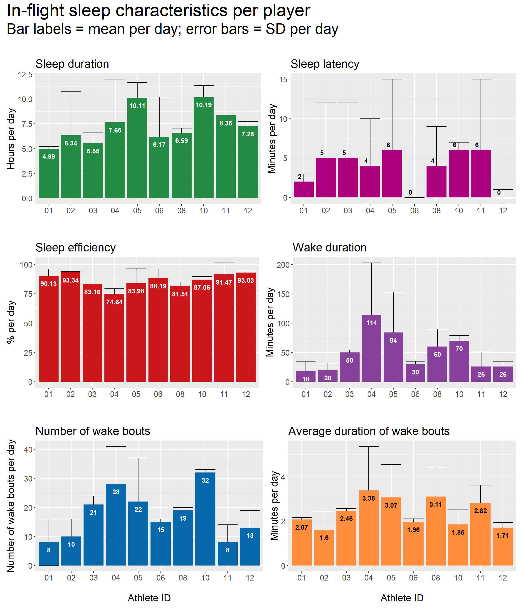
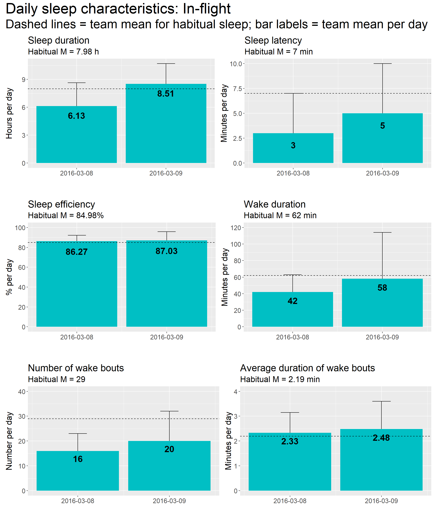

# In-flight sleep {#inflightsleep}

## Per player

### Table: Per sleep bout

### Plots: Per day

From the plots below, an example interpretation is:

> When examining sleep obtained during the international travel period, athlete 10 recorded the highest sleep duration per night (mean = 10.19 h), while athlete 01 recorded the lowest sleep duration per night (mean = 4.99 h).

**Note:** The in-flight period covers two days, so individual means and standard deviations should be interpreted in this context. Wide standard deviations are not a cause for concern, but rather a reflection of these statistics being summaries of only 2 observations per person.

## Team summary

### Table: Per sleep bout

### Plots: Daily sleep

From the plots below, an example interpretation is:

> On average, players obtained less than their habitual sleep duration on the first night of in-flight sleep (habitual sleep = 7.97 h; in-flight, 1st night = 5.69 h). On the second night of sleep, they obtained more than their habitual sleep duration (in-flight, 2nd night = 8.95 h)

### Tables: Per day across in-flight period

Table \@ref(tab:tableinflightabsoluteteam) below presents team-level summary statistics for in-flight sleep, expressed as absolute values.

**Example interpretation:**

> Over the course of the international travel days, athletes recorded a mean sleep duration of 7.32 h of per night (SD = 2.90 h).

<table class="table" style="margin-left: auto; margin-right: auto;">
<caption>(\#tab:tableinflightabsoluteteam)In-flight sleep summary for the whole team (absolute values).</caption>
 <thead>
  <tr>
   <th style="text-align:left;"> statistic </th>
   <th style="text-align:right;"> sleep_duration </th>
   <th style="text-align:right;"> sleep_duration_h </th>
   <th style="text-align:right;"> sleep_latency </th>
   <th style="text-align:right;"> sleep_efficiency </th>
   <th style="text-align:right;"> wake_duration </th>
   <th style="text-align:right;"> wake_bouts_num </th>
   <th style="text-align:right;"> wake_bouts_avg_duration </th>
  </tr>
 </thead>
<tbody>
  <tr>
   <td style="text-align:left;"> Mean </td>
   <td style="text-align:right;"> 439 </td>
   <td style="text-align:right;"> 7.32 </td>
   <td style="text-align:right;"> 4 </td>
   <td style="text-align:right;"> 87.33 </td>
   <td style="text-align:right;"> 50 </td>
   <td style="text-align:right;"> 18 </td>
   <td style="text-align:right;"> 2.31 </td>
  </tr>
  <tr>
   <td style="text-align:left;"> SD </td>
   <td style="text-align:right;"> 174 </td>
   <td style="text-align:right;"> 2.90 </td>
   <td style="text-align:right;"> 5 </td>
   <td style="text-align:right;"> 6.78 </td>
   <td style="text-align:right;"> 43 </td>
   <td style="text-align:right;"> 10 </td>
   <td style="text-align:right;"> 0.76 </td>
  </tr>
</tbody>
</table>

 

Table \@ref(tab:tableinflightrelativeteam) below presents team-level summary statistics for in-flight sleep, expressed in values that are relative to each person's habitual sleep characteristics (i.e., relative value = habitual minus in-flight).

**Example interpretation:**

> Over the course of the international travel days, athletes recorded 39 fewer minutes of sleep per night (SD = 172 min), as compared to their habitual sleep characteristics.

<table class="table" style="margin-left: auto; margin-right: auto;">
<caption>(\#tab:tableinflightrelativeteam)In-flight sleep summary for the whole team (relative to habitual).</caption>
 <thead>
  <tr>
   <th style="text-align:left;"> statistic </th>
   <th style="text-align:right;"> sleep_duration_diff </th>
   <th style="text-align:right;"> sleep_duration_h_diff </th>
   <th style="text-align:right;"> sleep_latency_diff </th>
   <th style="text-align:right;"> sleep_efficiency_diff </th>
   <th style="text-align:right;"> wake_duration_diff </th>
   <th style="text-align:right;"> wake_bouts_num_diff </th>
   <th style="text-align:right;"> wake_bouts_avg_duration_diff </th>
  </tr>
 </thead>
<tbody>
  <tr>
   <td style="text-align:left;"> Mean </td>
   <td style="text-align:right;"> -39 </td>
   <td style="text-align:right;"> -0.66 </td>
   <td style="text-align:right;"> -4 </td>
   <td style="text-align:right;"> 1.77 </td>
   <td style="text-align:right;"> -9 </td>
   <td style="text-align:right;"> -10 </td>
   <td style="text-align:right;"> 0.17 </td>
  </tr>
  <tr>
   <td style="text-align:left;"> SD </td>
   <td style="text-align:right;"> 172 </td>
   <td style="text-align:right;"> 2.87 </td>
   <td style="text-align:right;"> 8 </td>
   <td style="text-align:right;"> 9.13 </td>
   <td style="text-align:right;"> 56 </td>
   <td style="text-align:right;"> 17 </td>
   <td style="text-align:right;"> 0.96 </td>
  </tr>
</tbody>
</table>

