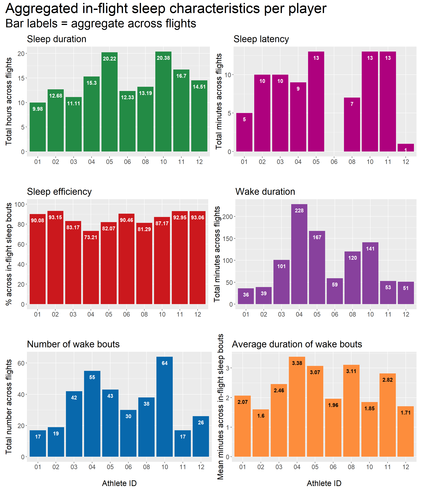

# In-flight sleep {#inflightsleep}

## Per player

### Table: Per sleep bout

### Plots: Per day

From the plots below, an example interpretation is:

> When examining sleep obtained during the international travel period, athlete 10 recorded the highest sleep duration per night (mean = 10.19 h), while athlete 01 recorded the lowest sleep duration per night (mean = 4.99 h).

**Note:** The in-flight period covers two days, so individual means and standard deviations should be interpreted in this context. Wide standard deviations are not a cause for concern, but rather a reflection of these statistics being summaries of only 2 observations per person.

### Plots: Aggregated over flights

**NOTE:** For these plots, ~~sleep efficiency and~~ average duration of wake bouts data needs to be recalculated from first principles rather than taking an average of an average.

From the plots below, an example interpretation is:

> The total wake duration recorded across all in-flight sleep bouts varied widely between players. Athlete 01 accumulated the lowest wake duration (36 min), while athlete 04 accumulated the highest total wake duration (228 min).

## Team summary

### Plots: Daily sleep

From the plots below, an example interpretation is:

> On average, players obtained less than their habitual sleep duration on the first night of in-flight sleep (habitual sleep = 7.97 h; in-flight, 1st night = 5.69 h). On the second night of sleep, they obtained more than their habitual sleep duration (in-flight, 2nd night = 8.95 h)

### Tables: Per day across in-flight period

Table \@ref(tab:tableinflightabsoluteteam) below presents team-level summary statistics for in-flight sleep per day, expressed as absolute values.

**Example interpretation:**

> Over the course of the international travel days, athletes recorded a mean sleep duration of 7.32 h of per night (SD = 2.90 h).

<table class="table" style="margin-left: auto; margin-right: auto;">
<caption>(\#tab:tableinflightabsoluteteam)In-flight sleep summary for the whole team (absolute values).</caption>
 <thead>
  <tr>
   <th style="text-align:left;"> statistic </th>
   <th style="text-align:right;"> sleep_duration </th>
   <th style="text-align:right;"> sleep_duration_h </th>
   <th style="text-align:right;"> total_time_in_bed </th>
   <th style="text-align:right;"> sleep_latency </th>
   <th style="text-align:right;"> sleep_efficiency </th>
   <th style="text-align:right;"> wake_duration </th>
   <th style="text-align:right;"> wake_bouts_num </th>
   <th style="text-align:right;"> wake_bouts_avg_duration </th>
  </tr>
 </thead>
<tbody>
  <tr>
   <td style="text-align:left;"> Mean </td>
   <td style="text-align:right;"> 439 </td>
   <td style="text-align:right;"> 7.32 </td>
   <td style="text-align:right;"> 511 </td>
   <td style="text-align:right;"> 4 </td>
   <td style="text-align:right;"> 86.65 </td>
   <td style="text-align:right;"> 50 </td>
   <td style="text-align:right;"> 18 </td>
   <td style="text-align:right;"> 2.40 </td>
  </tr>
  <tr>
   <td style="text-align:left;"> SD </td>
   <td style="text-align:right;"> 156 </td>
   <td style="text-align:right;"> 2.59 </td>
   <td style="text-align:right;"> 194 </td>
   <td style="text-align:right;"> 5 </td>
   <td style="text-align:right;"> 7.35 </td>
   <td style="text-align:right;"> 42 </td>
   <td style="text-align:right;"> 10 </td>
   <td style="text-align:right;"> 0.96 </td>
  </tr>
</tbody>
</table>

 

Table \@ref(tab:tableinflightrelativeteam) below presents team-level summary statistics for in-flight sleep per day, expressed in values that are relative to each person's habitual sleep characteristics (i.e., relative value = habitual minus in-flight).

**Example interpretation:**

> Over the course of the international travel days, athletes recorded 39 more minutes of sleep per night (SD = 154 min), as compared to their habitual sleep characteristics.

<table class="table" style="margin-left: auto; margin-right: auto;">
<caption>(\#tab:tableinflightrelativeteam)In-flight sleep summary for the whole team (relative to habitual).</caption>
 <thead>
  <tr>
   <th style="text-align:left;"> statistic </th>
   <th style="text-align:right;"> sleep_duration_diff </th>
   <th style="text-align:right;"> sleep_duration_h_diff </th>
   <th style="text-align:right;"> total_time_in_bed_diff </th>
   <th style="text-align:right;"> sleep_latency_diff </th>
   <th style="text-align:right;"> sleep_efficiency_diff </th>
   <th style="text-align:right;"> wake_duration_diff </th>
   <th style="text-align:right;"> wake_bouts_num_diff </th>
   <th style="text-align:right;"> wake_bouts_avg_duration_diff </th>
  </tr>
 </thead>
<tbody>
  <tr>
   <td style="text-align:left;"> Mean </td>
   <td style="text-align:right;"> -39 </td>
   <td style="text-align:right;"> -0.66 </td>
   <td style="text-align:right;"> -53 </td>
   <td style="text-align:right;"> -4 </td>
   <td style="text-align:right;"> 1.09 </td>
   <td style="text-align:right;"> -9 </td>
   <td style="text-align:right;"> -10 </td>
   <td style="text-align:right;"> 0.26 </td>
  </tr>
  <tr>
   <td style="text-align:left;"> SD </td>
   <td style="text-align:right;"> 154 </td>
   <td style="text-align:right;"> 2.57 </td>
   <td style="text-align:right;"> 199 </td>
   <td style="text-align:right;"> 8 </td>
   <td style="text-align:right;"> 9.78 </td>
   <td style="text-align:right;"> 55 </td>
   <td style="text-align:right;"> 17 </td>
   <td style="text-align:right;"> 1.15 </td>
  </tr>
</tbody>
</table>

### Tables: Aggregated across the in-flight period

Table \@ref(tab:tableagginflightabsoluteteam) below presents team-level summary statistics for aggregated in-flight sleep measures, expressed as absolute values.

**Example interpretation:**

> With sleep bouts aggregated across flights, athletes recorded a mean sleep duration of 14.64 h (SD = 3.56 h).

<table class="table" style="margin-left: auto; margin-right: auto;">
<caption>(\#tab:tableagginflightabsoluteteam)Aggregated in-flight sleep summary for the whole team (absolute values).</caption>
 <thead>
  <tr>
   <th style="text-align:left;"> statistic </th>
   <th style="text-align:right;"> sleep_duration </th>
   <th style="text-align:right;"> sleep_duration_h </th>
   <th style="text-align:right;"> sleep_latency </th>
   <th style="text-align:right;"> sleep_efficiency </th>
   <th style="text-align:right;"> wake_duration </th>
   <th style="text-align:right;"> wake_bouts_num </th>
   <th style="text-align:right;"> wake_bouts_avg_duration </th>
  </tr>
 </thead>
<tbody>
  <tr>
   <td style="text-align:left;"> Mean </td>
   <td style="text-align:right;"> 878 </td>
   <td style="text-align:right;"> 14.64 </td>
   <td style="text-align:right;"> 8 </td>
   <td style="text-align:right;"> 86.66 </td>
   <td style="text-align:right;"> 100 </td>
   <td style="text-align:right;"> 35 </td>
   <td style="text-align:right;"> 2.40 </td>
  </tr>
  <tr>
   <td style="text-align:left;"> SD </td>
   <td style="text-align:right;"> 214 </td>
   <td style="text-align:right;"> 3.56 </td>
   <td style="text-align:right;"> 5 </td>
   <td style="text-align:right;"> 6.60 </td>
   <td style="text-align:right;"> 64 </td>
   <td style="text-align:right;"> 16 </td>
   <td style="text-align:right;"> 0.65 </td>
  </tr>
</tbody>
</table>

Table \@ref(tab:tableagginflightrelativeteam) below presents team-level summary statistics for aggregated in-flight sleep, expressed in values that are relative to each person's habitual sleep characteristics (i.e., relative value = habitual minus aggregated in-flight measures).

**Example interpretations:**

> With sleep bouts aggregated across flights, athletes' in-flight sleep was, on average, 400 minutes longer than their habitual sleep duration (SD = 206 min).

> With sleep bouts aggregated across flights, athletes' in-flight sleep efficiency was, on average, 1.1 percentage points higher than their habitual sleep efficiency (SD = 9.61 percentage points).

<table class="table" style="margin-left: auto; margin-right: auto;">
<caption>(\#tab:tableagginflightrelativeteam)Aggregated in-flight sleep summary for the whole team (relative to habitual).</caption>
 <thead>
  <tr>
   <th style="text-align:left;"> statistic </th>
   <th style="text-align:right;"> sleep_duration_diff </th>
   <th style="text-align:right;"> sleep_duration_h_diff </th>
   <th style="text-align:right;"> sleep_latency_diff </th>
   <th style="text-align:right;"> sleep_efficiency_diff </th>
   <th style="text-align:right;"> wake_duration_diff </th>
   <th style="text-align:right;"> wake_bouts_num_diff </th>
   <th style="text-align:right;"> wake_bouts_avg_duration_diff </th>
  </tr>
 </thead>
<tbody>
  <tr>
   <td style="text-align:left;"> Mean </td>
   <td style="text-align:right;"> -400 </td>
   <td style="text-align:right;"> -6.66 </td>
   <td style="text-align:right;"> 0 </td>
   <td style="text-align:right;"> -1.10 </td>
   <td style="text-align:right;"> -40 </td>
   <td style="text-align:right;"> -7 </td>
   <td style="text-align:right;"> -0.27 </td>
  </tr>
  <tr>
   <td style="text-align:left;"> SD </td>
   <td style="text-align:right;"> 206 </td>
   <td style="text-align:right;"> 3.43 </td>
   <td style="text-align:right;"> 8 </td>
   <td style="text-align:right;"> 9.61 </td>
   <td style="text-align:right;"> 76 </td>
   <td style="text-align:right;"> 23 </td>
   <td style="text-align:right;"> 0.93 </td>
  </tr>
</tbody>
</table>

