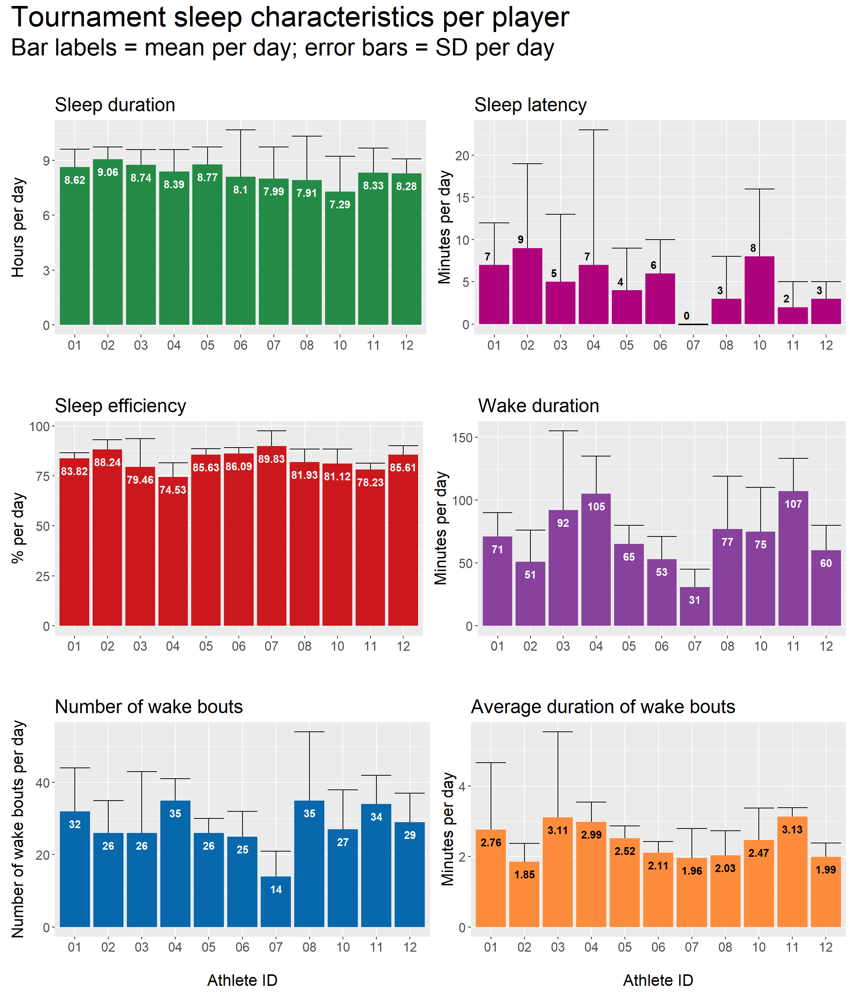
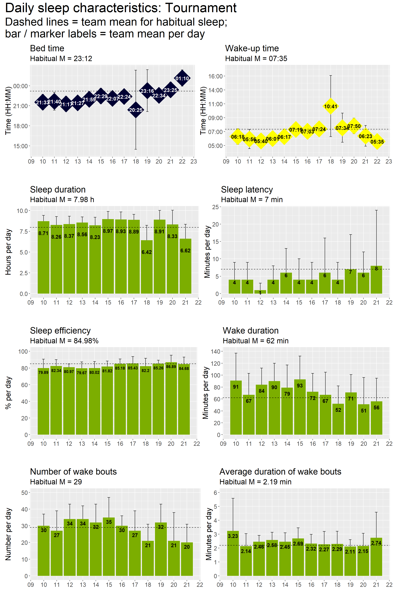

# Tournament sleep {#tournamentsleep}

## Per player

### Plots: Per day

From the plots below, an example interpretation is:

> When examining sleep obtained during the tournament, athlete 02 recorded the highest sleep duration per night (mean = 9.06 h), while athlete 10 recorded the lowest sleep duration per night (mean = 7.29 h).

## Team summary

### Plots: Daily sleep

From the plots below, an example interpretation is:

> On average, nightly sleep duration during the tournament period was greater than habitual sleep duration (habitual mean = 7.98 h), except for on March 18 (mean = 7.21 h) and March 21 (mean = 6.62 h).

### Tables: Per day across tournament period

Table \@ref(tab:tabletournamentabsoluteteam) below presents team-level summary statistics for tournament sleep, expressed as absolute values.

**Example interpretation:**

> Over the course of the tournament period, athletes recorded a mean sleep duration of 8.33 h of per night (SD = 1.54 h).

<table class="table" style="margin-left: auto; margin-right: auto;">
<caption>(\#tab:tabletournamentabsoluteteam)Tournament sleep summary for the whole team (absolute values).</caption>
 <thead>
  <tr>
   <th style="text-align:left;"> statistic </th>
   <th style="text-align:right;"> sleep_duration </th>
   <th style="text-align:right;"> sleep_duration_h </th>
   <th style="text-align:right;"> sleep_latency </th>
   <th style="text-align:right;"> sleep_efficiency </th>
   <th style="text-align:right;"> wake_duration </th>
   <th style="text-align:right;"> wake_bouts_num </th>
   <th style="text-align:right;"> wake_bouts_avg_duration </th>
  </tr>
 </thead>
<tbody>
  <tr>
   <td style="text-align:left;"> Mean </td>
   <td style="text-align:right;"> 500 </td>
   <td style="text-align:right;"> 8.33 </td>
   <td style="text-align:right;"> 5 </td>
   <td style="text-align:right;"> 82.83 </td>
   <td style="text-align:right;"> 73 </td>
   <td style="text-align:right;"> 29 </td>
   <td style="text-align:right;"> 2.45 </td>
  </tr>
  <tr>
   <td style="text-align:left;"> SD </td>
   <td style="text-align:right;"> 92 </td>
   <td style="text-align:right;"> 1.54 </td>
   <td style="text-align:right;"> 8 </td>
   <td style="text-align:right;"> 7.73 </td>
   <td style="text-align:right;"> 38 </td>
   <td style="text-align:right;"> 12 </td>
   <td style="text-align:right;"> 1.10 </td>
  </tr>
</tbody>
</table>

 

Table \@ref(tab:tabletournamentrelativeteam) below presents team-level summary statistics for tournament sleep, expressed in values that are relative to each person's habitual sleep characteristics (i.e., relative value = habitual minus tournament).

**Example interpretation:**

> Over the course of the tournament period, athletes obtained 21 more minutes of sleep (SD = 106 min), as compared to their habitual sleep characteristics.

<table class="table" style="margin-left: auto; margin-right: auto;">
<caption>(\#tab:tabletournamentrelativeteam)Tournament sleep summary for the whole team (relative to habitual).</caption>
 <thead>
  <tr>
   <th style="text-align:left;"> statistic </th>
   <th style="text-align:right;"> sleep_duration_diff </th>
   <th style="text-align:right;"> sleep_duration_h_diff </th>
   <th style="text-align:right;"> sleep_latency_diff </th>
   <th style="text-align:right;"> sleep_efficiency_diff </th>
   <th style="text-align:right;"> wake_duration_diff </th>
   <th style="text-align:right;"> wake_bouts_num_diff </th>
   <th style="text-align:right;"> wake_bouts_avg_duration_diff </th>
  </tr>
 </thead>
<tbody>
  <tr>
   <td style="text-align:left;"> Mean </td>
   <td style="text-align:right;"> 21 </td>
   <td style="text-align:right;"> 0.35 </td>
   <td style="text-align:right;"> -3 </td>
   <td style="text-align:right;"> -2.19 </td>
   <td style="text-align:right;"> 11 </td>
   <td style="text-align:right;"> 0 </td>
   <td style="text-align:right;"> 0.28 </td>
  </tr>
  <tr>
   <td style="text-align:left;"> SD </td>
   <td style="text-align:right;"> 106 </td>
   <td style="text-align:right;"> 1.77 </td>
   <td style="text-align:right;"> 10 </td>
   <td style="text-align:right;"> 9.17 </td>
   <td style="text-align:right;"> 43 </td>
   <td style="text-align:right;"> 15 </td>
   <td style="text-align:right;"> 1.28 </td>
  </tr>
</tbody>
</table>

