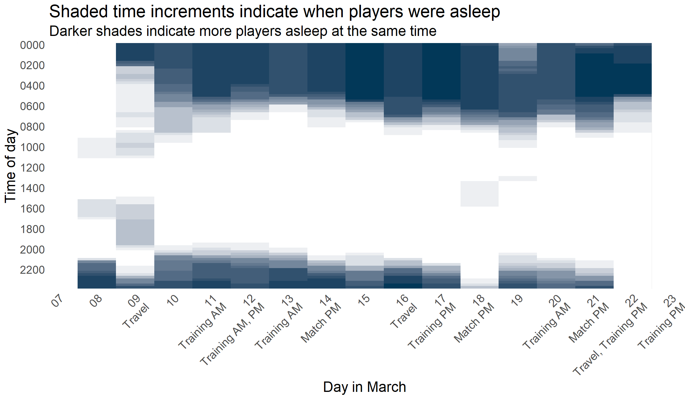
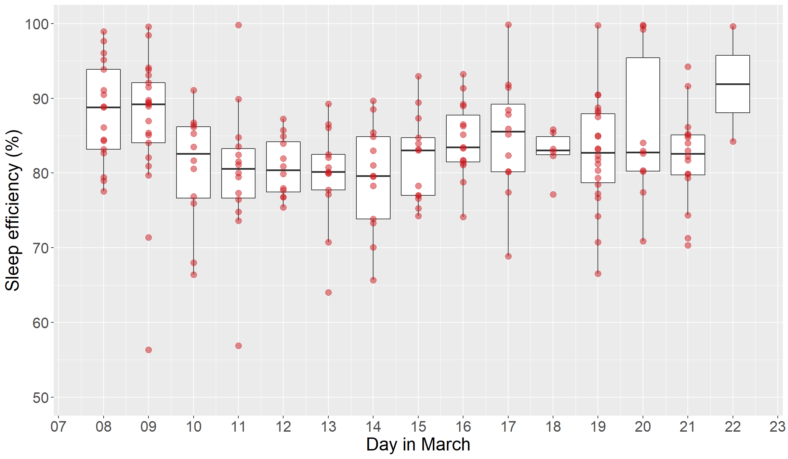
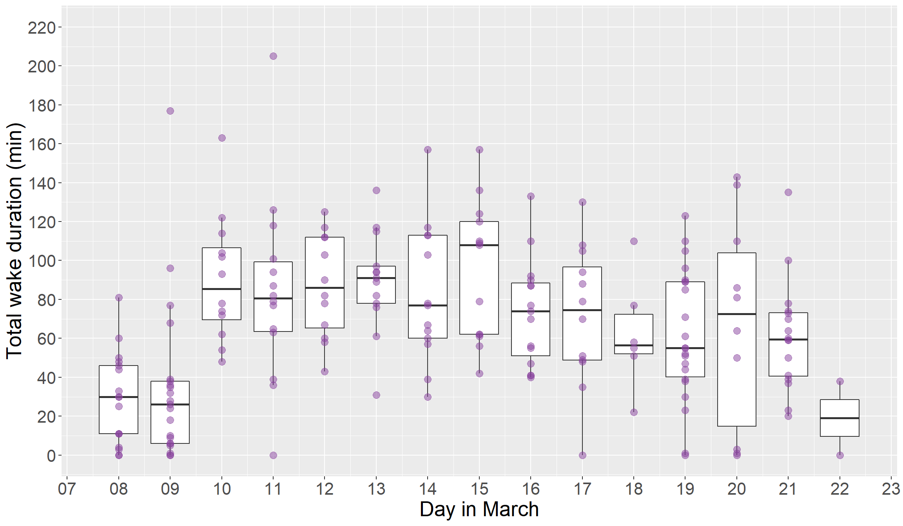
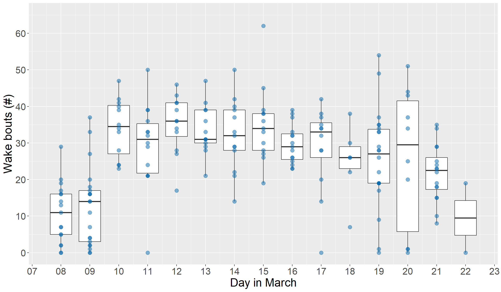

# Whole-tour sleep {#toursleep}

## Sleep bouts

The plots below use data at the level of per player per sleep bout, throughout the whole tour period.

### Bed and wake times

### Sleep duration

### Sleep latency

### Sleep efficiency

### Total duration of wake bouts

### Number of wake bouts

### Average duration of wake bouts

## Per day

Some more stuff
