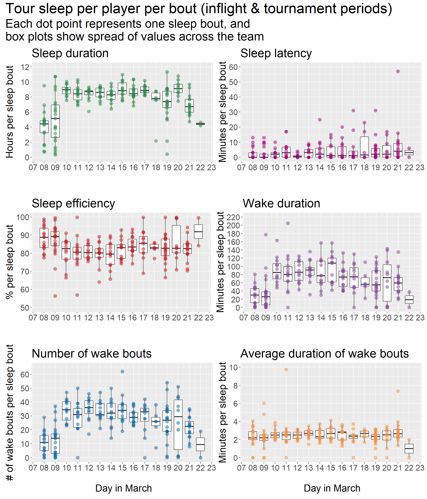

# Whole-tour sleep {#toursleep}

## Bout-level data

The plots below use data at the level of per player per sleep bout, throughout the whole tour period.

### Plot: Bed and wake times of each sleep bout

### Plots: Sleep characteristics per bout

From the plots below, an example interpretation is:

> During the international transit period (March 8 and 9), players typically slept in shorter bouts than they did once they entered the tournament period (March 10 onwards).

## Day-level data

Some more stuff
