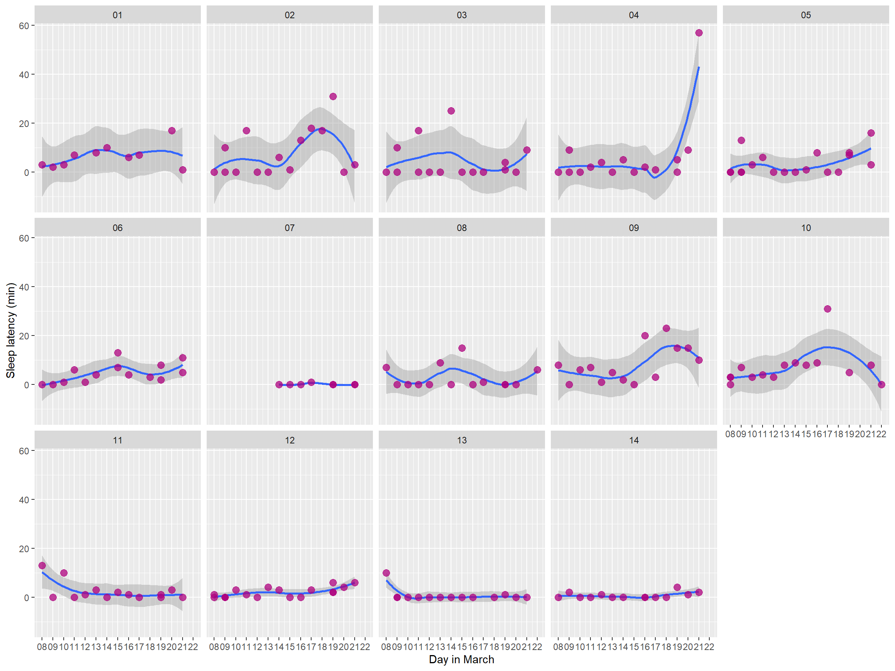
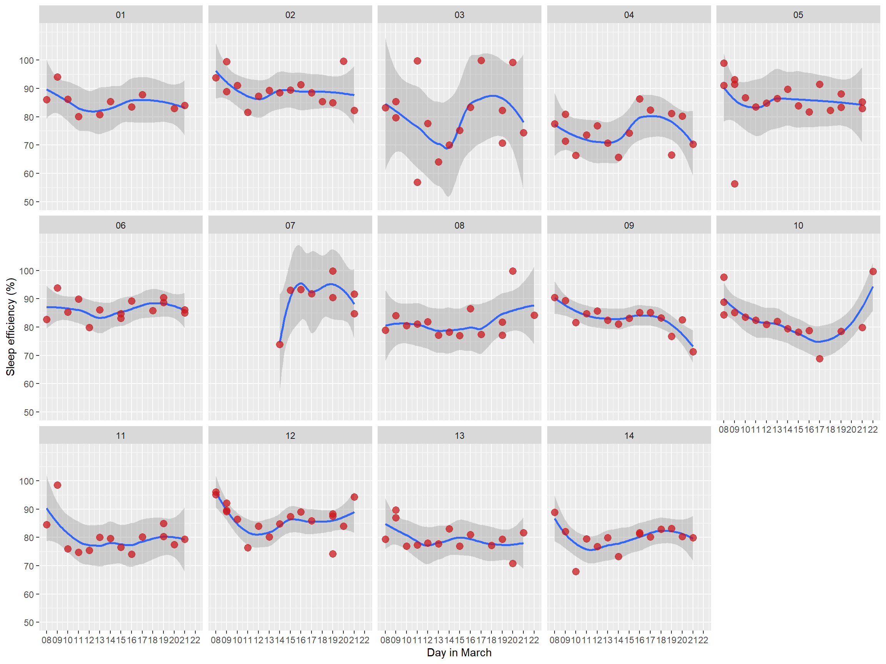
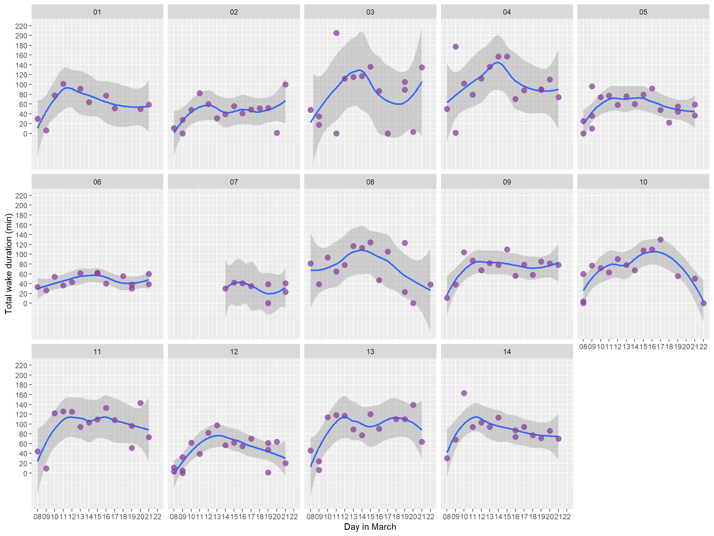
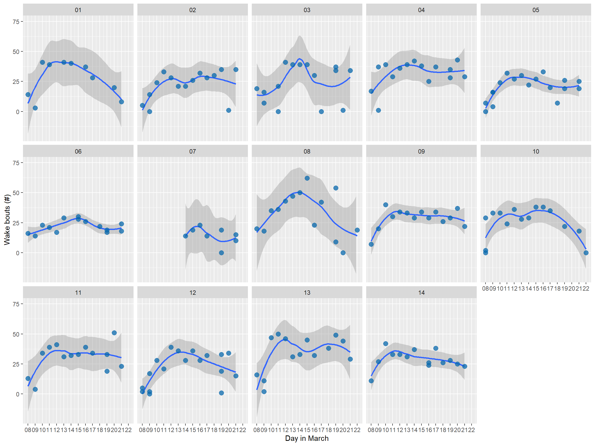
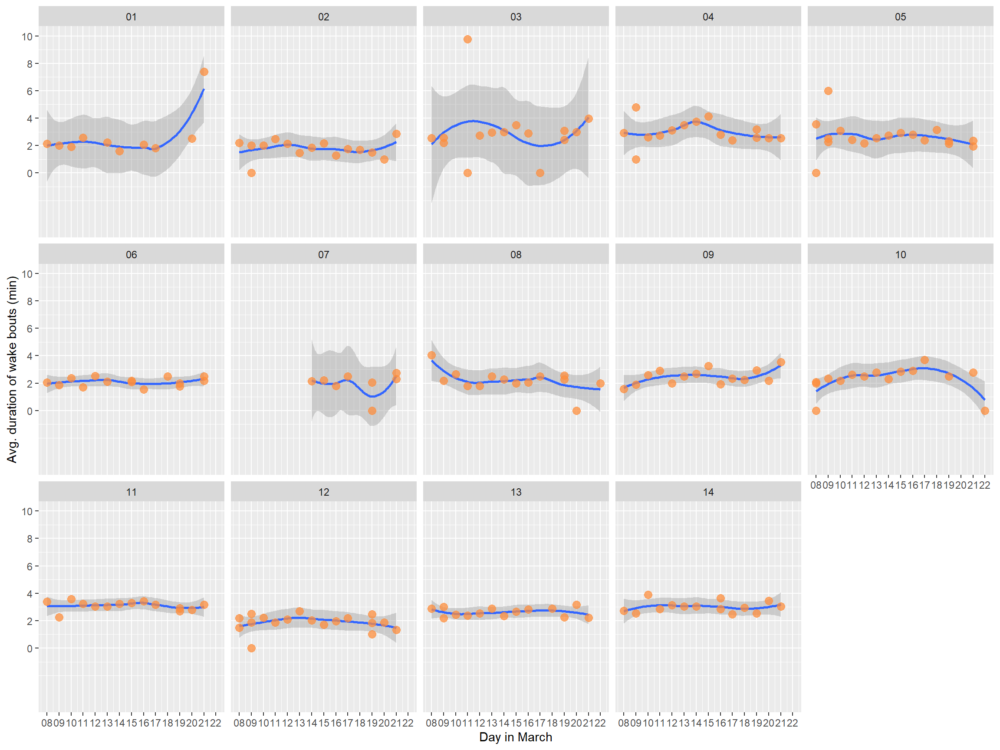

# Individual profiles {#indivprofiles}


## Per sleep bout

The plots below use data at the level of per player per sleep bout, throughout the whole tour period.


### Sleep duration


```
## `geom_smooth()` using formula 'y ~ x'
```


### Sleep latency


```
## `geom_smooth()` using formula 'y ~ x'
```



### Sleep efficiency


```
## `geom_smooth()` using formula 'y ~ x'
```



### Total duration of wake bouts


```
## `geom_smooth()` using formula 'y ~ x'
```



### Number of wake bouts


```
## `geom_smooth()` using formula 'y ~ x'
```



### Average duration of wake bouts


```
## `geom_smooth()` using formula 'y ~ x'
```



## Per day

asdfasdf
