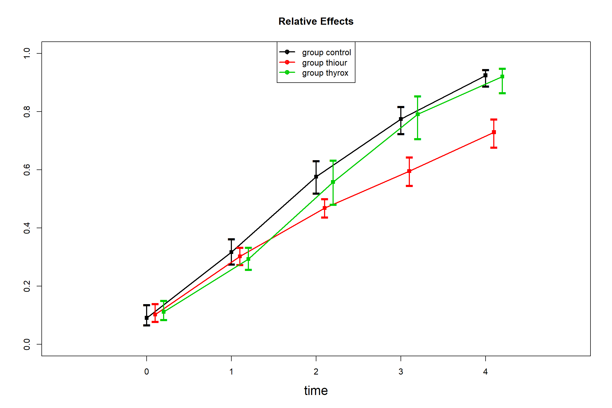

# nparLD tutorial {#nparLD}

Walkthrough of the rat growth study example from the `nparLD` paper by Noguchi, et al., 2012, "nparLD: An R software package for the nonparametric analysis of longitudinal data in factorial experiments", *Journal of Statistical Software*, *50*(12), URL: https://www.jstatsoft.org/index.php/jss/article/view/v050i12/v50i12.pdf.

## Set up


```r
# Load libraries ---------------------------------------------------------------

library(nparLD)
library(dplyr)
library(knitr)
library(kableExtra)

# Import the data --------------------------------------------------------------

data("rat")
```

The `rat` data set looks like this (first 20 observations shown):


```r
rat %>%
  head(n = 20) %>%
  kable() %>%
  kable_styling() %>%
  scroll_box(width = "400px", height = "350px")
```

<div style="border: 1px solid #ddd; padding: 0px; overflow-y: scroll; height:350px; overflow-x: scroll; width:400px; "><table class="table" style="margin-left: auto; margin-right: auto;">
 <thead>
  <tr>
   <th style="text-align:right;position: sticky; top:0; background-color: #FFFFFF;"> resp </th>
   <th style="text-align:right;position: sticky; top:0; background-color: #FFFFFF;"> time </th>
   <th style="text-align:left;position: sticky; top:0; background-color: #FFFFFF;"> group </th>
   <th style="text-align:right;position: sticky; top:0; background-color: #FFFFFF;"> subject </th>
  </tr>
 </thead>
<tbody>
  <tr>
   <td style="text-align:right;"> 46 </td>
   <td style="text-align:right;"> 0 </td>
   <td style="text-align:left;"> control </td>
   <td style="text-align:right;"> 1 </td>
  </tr>
  <tr>
   <td style="text-align:right;"> 49 </td>
   <td style="text-align:right;"> 0 </td>
   <td style="text-align:left;"> control </td>
   <td style="text-align:right;"> 2 </td>
  </tr>
  <tr>
   <td style="text-align:right;"> 49 </td>
   <td style="text-align:right;"> 0 </td>
   <td style="text-align:left;"> control </td>
   <td style="text-align:right;"> 3 </td>
  </tr>
  <tr>
   <td style="text-align:right;"> 51 </td>
   <td style="text-align:right;"> 0 </td>
   <td style="text-align:left;"> control </td>
   <td style="text-align:right;"> 4 </td>
  </tr>
  <tr>
   <td style="text-align:right;"> 52 </td>
   <td style="text-align:right;"> 0 </td>
   <td style="text-align:left;"> control </td>
   <td style="text-align:right;"> 5 </td>
  </tr>
  <tr>
   <td style="text-align:right;"> 56 </td>
   <td style="text-align:right;"> 0 </td>
   <td style="text-align:left;"> control </td>
   <td style="text-align:right;"> 6 </td>
  </tr>
  <tr>
   <td style="text-align:right;"> 57 </td>
   <td style="text-align:right;"> 0 </td>
   <td style="text-align:left;"> control </td>
   <td style="text-align:right;"> 7 </td>
  </tr>
  <tr>
   <td style="text-align:right;"> 57 </td>
   <td style="text-align:right;"> 0 </td>
   <td style="text-align:left;"> control </td>
   <td style="text-align:right;"> 8 </td>
  </tr>
  <tr>
   <td style="text-align:right;"> 60 </td>
   <td style="text-align:right;"> 0 </td>
   <td style="text-align:left;"> control </td>
   <td style="text-align:right;"> 9 </td>
  </tr>
  <tr>
   <td style="text-align:right;"> 63 </td>
   <td style="text-align:right;"> 0 </td>
   <td style="text-align:left;"> control </td>
   <td style="text-align:right;"> 10 </td>
  </tr>
  <tr>
   <td style="text-align:right;"> 52 </td>
   <td style="text-align:right;"> 0 </td>
   <td style="text-align:left;"> thyrox </td>
   <td style="text-align:right;"> 11 </td>
  </tr>
  <tr>
   <td style="text-align:right;"> 52 </td>
   <td style="text-align:right;"> 0 </td>
   <td style="text-align:left;"> thyrox </td>
   <td style="text-align:right;"> 12 </td>
  </tr>
  <tr>
   <td style="text-align:right;"> 54 </td>
   <td style="text-align:right;"> 0 </td>
   <td style="text-align:left;"> thyrox </td>
   <td style="text-align:right;"> 13 </td>
  </tr>
  <tr>
   <td style="text-align:right;"> 56 </td>
   <td style="text-align:right;"> 0 </td>
   <td style="text-align:left;"> thyrox </td>
   <td style="text-align:right;"> 14 </td>
  </tr>
  <tr>
   <td style="text-align:right;"> 57 </td>
   <td style="text-align:right;"> 0 </td>
   <td style="text-align:left;"> thyrox </td>
   <td style="text-align:right;"> 15 </td>
  </tr>
  <tr>
   <td style="text-align:right;"> 59 </td>
   <td style="text-align:right;"> 0 </td>
   <td style="text-align:left;"> thyrox </td>
   <td style="text-align:right;"> 16 </td>
  </tr>
  <tr>
   <td style="text-align:right;"> 59 </td>
   <td style="text-align:right;"> 0 </td>
   <td style="text-align:left;"> thyrox </td>
   <td style="text-align:right;"> 17 </td>
  </tr>
  <tr>
   <td style="text-align:right;"> 46 </td>
   <td style="text-align:right;"> 0 </td>
   <td style="text-align:left;"> thiour </td>
   <td style="text-align:right;"> 18 </td>
  </tr>
  <tr>
   <td style="text-align:right;"> 51 </td>
   <td style="text-align:right;"> 0 </td>
   <td style="text-align:left;"> thiour </td>
   <td style="text-align:right;"> 19 </td>
  </tr>
  <tr>
   <td style="text-align:right;"> 51 </td>
   <td style="text-align:right;"> 0 </td>
   <td style="text-align:left;"> thiour </td>
   <td style="text-align:right;"> 20 </td>
  </tr>
</tbody>
</table></div>

## Run the omnibus model

This is the code chunk that gives us our "ANOVA-type" statistics for assessing main and interaction effects.


```r
# Build the omnibus model
omnibus_model <- nparLD(
  resp ~ time * group,
  data = rat,
  subject = "subject",
  description = FALSE,
  order.warning = FALSE)
```


```r
# Print statistical output for the omnibus model
summary(omnibus_model)
```

```
## Model: 
## F1 LD F1 Model 
##  
## Call: 
## resp ~ time * group
## 
## Relative Treatment Effect (RTE):
##                    RankMeans Nobs        RTE
## groupcontrol        72.92000   50 0.53644444
## groupthyrox         72.67143   35 0.53460317
## groupthiour         59.81000   50 0.43933333
## time0               14.20714   27 0.10153439
## time1               41.55714   27 0.30412698
## time2               72.57857   27 0.53391534
## time3               97.68810   27 0.71991182
## time4              116.30476   27 0.85781305
## groupcontrol:time0  12.75000   10 0.09074074
## groupcontrol:time1  43.30000   10 0.31703704
## groupcontrol:time2  78.25000   10 0.57592593
## groupcontrol:time3 105.00000   10 0.77407407
## groupcontrol:time4 125.30000   10 0.92444444
## groupthyrox:time0   15.57143    7 0.11164021
## groupthyrox:time1   40.07143    7 0.29312169
## groupthyrox:time2   75.78571    7 0.55767196
## groupthyrox:time3  107.21429    7 0.79047619
## groupthyrox:time4  124.71429    7 0.92010582
## groupthiour:time0   14.30000   10 0.10222222
## groupthiour:time1   41.30000   10 0.30222222
## groupthiour:time2   63.70000   10 0.46814815
## groupthiour:time3   80.85000   10 0.59518519
## groupthiour:time4   98.90000   10 0.72888889
## 
## Wald-Type Statistc (WTS):
##             Statistic df      p-value
## group        12.52657  2 1.904977e-03
## time       3619.03739  4 0.000000e+00
## group:time   70.34311  8 4.199050e-12
## 
## ANOVA-Type Statistc (ATS):
##              Statistic       df      p-value
## group         5.286582 1.922792 5.654723e-03
## time       1008.512138 1.990411 0.000000e+00
## group:time   11.093940 3.516933 3.616929e-08
## 
## Modified ANOVA-Type Statistic for the Whole-Plot Factors:
##       Statistic      df1      df2    p-value
## group  5.286582 1.922792 19.23468 0.01563658
```


```r
# Display a plot of the model
plot(omnibus_model)
```



## Run multiple comparison tests

To run multiple comparison (pairwise) tests, we firstly create data subsets that focus on the pair of factor levels we want to compare.

### Main effect for GROUP

For instance, the results from the omnibus model indicate a statistically significant main effect for **"group"**. There are three possible groups that samples came from: *control*, *thyrox*, or *thiour*. We want to compare all pairs of levels within the factor "group" to identify exactly where the difference(s) lie. This means comparing these pairs:

- control vs. thyrox
- control vs. thiour
- thyrox vs. thiour


```r
rat %>%
  filter(group %in% c("control", "thyrox")
  ) -> group_control_vs_thyrox

rat %>%
  filter(group %in% c("control", "thiour")
  ) -> group_control_vs_thiour

rat %>%
  filter(group %in% c("thyrox", "thiour")
  ) -> group_thyrox_vs_thiour
```

Then we re-run the non-parametric model with the same model structure as the omnibus model, but pointing to each data subset we have created, in turn.


```r
pairwise_control_vs_thyrox <- nparLD(
  resp ~ time * group, # note: same structure as the omnibus model
  data = group_control_vs_thyrox, # we change this argument only
  subject = "subject",
  description = FALSE,
  order.warning = FALSE)

pairwise_control_vs_thiour <- nparLD(
  resp ~ time * group,
  data = group_control_vs_thiour,
  subject = "subject",
  description = FALSE,
  order.warning = FALSE)

pairwise_thyrox_vs_thiour <- nparLD(
  resp ~ time * group,
  data = group_thyrox_vs_thiour,
  subject = "subject",
  description = FALSE,
  order.warning = FALSE)
```

Check the "group" effect p value for each pairwise comparison. **Note:** Level for statistical significance with Bonferroni correction = **0.01666667** (alpha of 0.05 divided by number of tests = 0.05 / 3 = 0.01666667).


```r
# control vs. thyrox
pairwise_control_vs_thyrox_p <- data.frame(
  pairwise_control_vs_thyrox$ANOVA.test)
pairwise_control_vs_thyrox_p %>%
  mutate(
    paired_levels = "control_vs_thyrox",
    factor = rownames(pairwise_control_vs_thyrox_p)
    ) -> pairwise_control_vs_thyrox_p

# control vs. thiour
pairwise_control_vs_thiour_p <- data.frame(
  pairwise_control_vs_thiour$ANOVA.test)
pairwise_control_vs_thiour_p %>%
  mutate(
    paired_levels = "control_vs_thiour",
    factor = rownames(pairwise_control_vs_thiour_p)
    ) -> pairwise_control_vs_thiour_p

# thyrox vs. thiour
pairwise_thyrox_vs_thiour_p <- data.frame(
  pairwise_thyrox_vs_thiour$ANOVA.test)
pairwise_thyrox_vs_thiour_p %>%
  mutate(
    paired_levels = "thyrox_vs_thiour",
    factor = rownames(pairwise_thyrox_vs_thiour_p)
    ) -> pairwise_thyrox_vs_thiour_p

# Merge pairwise comparison results into one data frame
# for ease of displaying
group_pairwise_comparisons <- rbind(
  pairwise_control_vs_thyrox_p,
  pairwise_control_vs_thiour_p,
  pairwise_thyrox_vs_thiour_p)

# Set Bonferroni-corrected alpha level
group_alpha_level <- (0.05 / 3)

# Re-organise table
group_pairwise_comparisons %>%
  select(
    factor, paired_levels, Statistic, df, p.value) %>%
  filter(factor == "group") %>%
  mutate(
    sig_diff = case_when(
      p.value < group_alpha_level ~ "Yes",
      TRUE                        ~ "No")
    ) -> group_pairwise_comparisons
```


```r
# Display table
group_pairwise_comparisons %>%
  kable() %>%
  kable_styling()
```

<table class="table" style="margin-left: auto; margin-right: auto;">
 <thead>
  <tr>
   <th style="text-align:left;"> factor </th>
   <th style="text-align:left;"> paired_levels </th>
   <th style="text-align:right;"> Statistic </th>
   <th style="text-align:right;"> df </th>
   <th style="text-align:right;"> p.value </th>
   <th style="text-align:left;"> sig_diff </th>
  </tr>
 </thead>
<tbody>
  <tr>
   <td style="text-align:left;"> group </td>
   <td style="text-align:left;"> control_vs_thyrox </td>
   <td style="text-align:right;"> 0.0170903 </td>
   <td style="text-align:right;"> 1 </td>
   <td style="text-align:right;"> 0.8959890 </td>
   <td style="text-align:left;"> No </td>
  </tr>
  <tr>
   <td style="text-align:left;"> group </td>
   <td style="text-align:left;"> control_vs_thiour </td>
   <td style="text-align:right;"> 10.6081950 </td>
   <td style="text-align:right;"> 1 </td>
   <td style="text-align:right;"> 0.0011259 </td>
   <td style="text-align:left;"> Yes </td>
  </tr>
  <tr>
   <td style="text-align:left;"> group </td>
   <td style="text-align:left;"> thyrox_vs_thiour </td>
   <td style="text-align:right;"> 6.0854237 </td>
   <td style="text-align:right;"> 1 </td>
   <td style="text-align:right;"> 0.0136302 </td>
   <td style="text-align:left;"> Yes </td>
  </tr>
</tbody>
</table>

### Main effect for TIME

The omnibus model indicates a statistically significant main effect for **"time"**. This factor has 5 levels (in this case, 5 time points): time 0, time 1, time 2, time 3, time 4.

To identify where differences lie within the main effect for **"time"**, we would need to create 10 subsets for the following pairwise comparisons:

- time 0 vs. time 1
- time 0 vs. time 2
- time 0 vs. time 3
- time 0 vs. time 4
- time 1 vs. time 2
- time 1 vs. time 3
- time 1 vs. time 4
- time 2 vs. time 3
- time 2 vs. time 4
- time 3 vs. time 4

**Note:** For this part of the analysis, the Bonferroni correction would adjust the alpha level for the 10 pairwise tests we would conduct. So an alpha of 0.05 divided by 10 (# of pairwise tests) = significant pairwise differences defined at p < 0.005.

### Interaction effect for GROUP * TIME

The omnibus model indicates a statistically significant interaction effect for **"group" x "time"**.

To identify where differences lie within the interaction effect, we would need to create 15 subsets for the following pairwise comparisons:

- control vs. thyrox @ time 0
- control vs. thiour @ time 0
- thyrox vs. thiour @ time 0
- control vs. thyrox @ time 1
- control vs. thiour @ time 1
- thyrox vs. thiour @ time 1
- control vs. thyrox @ time 2
- control vs. thiour @ time 2
- thyrox vs. thiour @ time 2
- control vs. thyrox @ time 3
- control vs. thiour @ time 3
- thyrox vs. thiour @ time 3
- control vs. thyrox @ time 4
- control vs. thiour @ time 4
- thyrox vs. thiour @ time 4

**Note:** For this part of the analysis, the Bonferroni correction would adjust the alpha level for the 15 pairwise tests we would conduct. So an alpha of 0.05 divided by 15 (# of pairwise tests) = significant pairwise differences defined at p < 0.0033.
