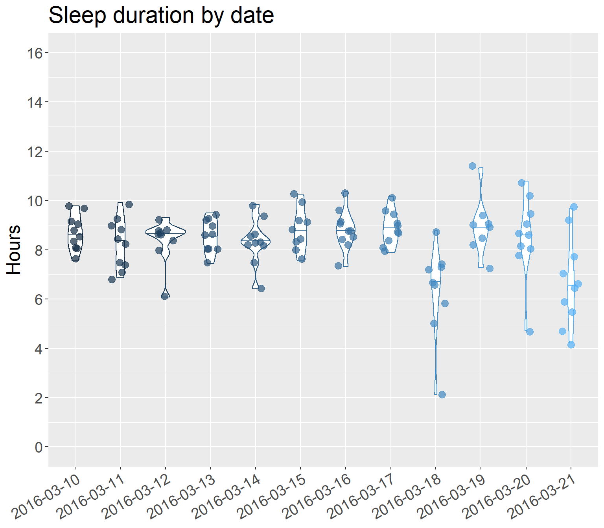
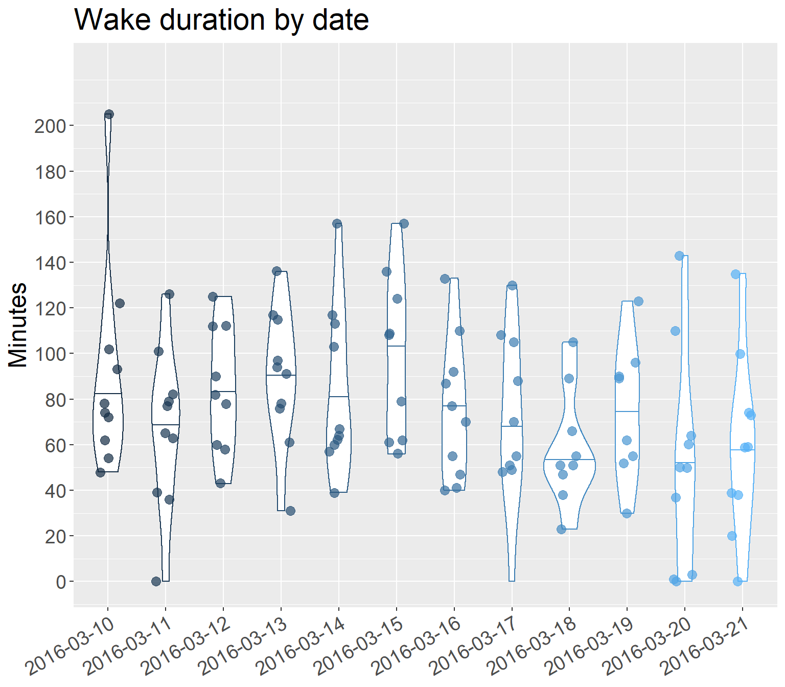

# Impact of flight on tournament sleep {#inflightsleepandtournamentsleep}

<span style="color: red; font-weight: bold;">TO DO:</span> Conduct assumption tests. Given that the assumption testing for RQ3 (correlation analysis) showed that *"many variables across the load, sleep, jetlag, and well-being measures do not approximate normal"*, we proceed for now on the basis that assumption testing for RQ2 will show similar results.


## Omnibus models: Based on in-flight duration group


<table class="table" style="margin-left: auto; margin-right: auto;">
<caption>(\#tab:tablesleepanddurationgroup)Omnibus model results: Tournament sleep &amp; in-flight duration group.</caption>
 <thead>
  <tr>
   <th style="text-align:left;"> Test effect </th>
   <th style="text-align:right;"> Statistic </th>
   <th style="text-align:right;"> df </th>
   <th style="text-align:right;"> p </th>
   <th style="text-align:left;"> Sig. difference? </th>
  </tr>
 </thead>
<tbody>
  <tr grouplength="3"><td colspan="5" style="border-bottom: 1px solid;"><strong>Sleep duration</strong></td></tr>
<tr>
   <td style="text-align:left; padding-left: 2em;" indentlevel="1"> Main effect: In-flight duration group </td>
   <td style="text-align:right;"> 0.0195 </td>
   <td style="text-align:right;"> 1.0000 </td>
   <td style="text-align:right;"> 0.8890 </td>
   <td style="text-align:left;"> <span style="     color: crimson !important;">No</span> </td>
  </tr>
  <tr>
   <td style="text-align:left; padding-left: 2em;" indentlevel="1"> Main effect: Date </td>
   <td style="text-align:right;"> 3.7801 </td>
   <td style="text-align:right;"> 4.2523 </td>
   <td style="text-align:right;"> 0.0036 </td>
   <td style="text-align:left;"> <span style="     color: dodgerblue !important;">Yes</span> </td>
  </tr>
  <tr>
   <td style="text-align:left; padding-left: 2em;" indentlevel="1"> Interaction: Group x Date </td>
   <td style="text-align:right;"> 1.2973 </td>
   <td style="text-align:right;"> 4.2523 </td>
   <td style="text-align:right;"> 0.2668 </td>
   <td style="text-align:left;"> <span style="     color: crimson !important;">No</span> </td>
  </tr>
  <tr grouplength="3"><td colspan="5" style="border-bottom: 1px solid;"><strong>Sleep efficiency</strong></td></tr>
<tr>
   <td style="text-align:left; padding-left: 2em;" indentlevel="1"> Main effect: In-flight duration group </td>
   <td style="text-align:right;"> 0.8577 </td>
   <td style="text-align:right;"> 1.0000 </td>
   <td style="text-align:right;"> 0.3544 </td>
   <td style="text-align:left;"> <span style="     color: crimson !important;">No</span> </td>
  </tr>
  <tr>
   <td style="text-align:left; padding-left: 2em;" indentlevel="1"> Main effect: Date </td>
   <td style="text-align:right;"> 1.3428 </td>
   <td style="text-align:right;"> 4.0555 </td>
   <td style="text-align:right;"> 0.2508 </td>
   <td style="text-align:left;"> <span style="     color: crimson !important;">No</span> </td>
  </tr>
  <tr>
   <td style="text-align:left; padding-left: 2em;" indentlevel="1"> Interaction: Group x Date </td>
   <td style="text-align:right;"> 1.0400 </td>
   <td style="text-align:right;"> 4.0555 </td>
   <td style="text-align:right;"> 0.3853 </td>
   <td style="text-align:left;"> <span style="     color: crimson !important;">No</span> </td>
  </tr>
  <tr grouplength="3"><td colspan="5" style="border-bottom: 1px solid;"><strong>Sleep latency</strong></td></tr>
<tr>
   <td style="text-align:left; padding-left: 2em;" indentlevel="1"> Main effect: In-flight duration group </td>
   <td style="text-align:right;"> 0.0946 </td>
   <td style="text-align:right;"> 1.0000 </td>
   <td style="text-align:right;"> 0.7584 </td>
   <td style="text-align:left;"> <span style="     color: crimson !important;">No</span> </td>
  </tr>
  <tr>
   <td style="text-align:left; padding-left: 2em;" indentlevel="1"> Main effect: Date </td>
   <td style="text-align:right;"> 0.8769 </td>
   <td style="text-align:right;"> 4.2523 </td>
   <td style="text-align:right;"> 0.4819 </td>
   <td style="text-align:left;"> <span style="     color: crimson !important;">No</span> </td>
  </tr>
  <tr>
   <td style="text-align:left; padding-left: 2em;" indentlevel="1"> Interaction: Group x Date </td>
   <td style="text-align:right;"> 0.6119 </td>
   <td style="text-align:right;"> 4.2523 </td>
   <td style="text-align:right;"> 0.6641 </td>
   <td style="text-align:left;"> <span style="     color: crimson !important;">No</span> </td>
  </tr>
  <tr grouplength="3"><td colspan="5" style="border-bottom: 1px solid;"><strong>Average duration of wake bouts</strong></td></tr>
<tr>
   <td style="text-align:left; padding-left: 2em;" indentlevel="1"> Main effect: In-flight duration group </td>
   <td style="text-align:right;"> 2.2110 </td>
   <td style="text-align:right;"> 1.0000 </td>
   <td style="text-align:right;"> 0.1370 </td>
   <td style="text-align:left;"> <span style="     color: crimson !important;">No</span> </td>
  </tr>
  <tr>
   <td style="text-align:left; padding-left: 2em;" indentlevel="1"> Main effect: Date </td>
   <td style="text-align:right;"> 1.0944 </td>
   <td style="text-align:right;"> 3.9724 </td>
   <td style="text-align:right;"> 0.3572 </td>
   <td style="text-align:left;"> <span style="     color: crimson !important;">No</span> </td>
  </tr>
  <tr>
   <td style="text-align:left; padding-left: 2em;" indentlevel="1"> Interaction: Group x Date </td>
   <td style="text-align:right;"> 1.6645 </td>
   <td style="text-align:right;"> 3.9724 </td>
   <td style="text-align:right;"> 0.1556 </td>
   <td style="text-align:left;"> <span style="     color: crimson !important;">No</span> </td>
  </tr>
  <tr grouplength="3"><td colspan="5" style="border-bottom: 1px solid;"><strong>Number of wake bouts</strong></td></tr>
<tr>
   <td style="text-align:left; padding-left: 2em;" indentlevel="1"> Main effect: In-flight duration group </td>
   <td style="text-align:right;"> 0.1377 </td>
   <td style="text-align:right;"> 1.0000 </td>
   <td style="text-align:right;"> 0.7106 </td>
   <td style="text-align:left;"> <span style="     color: crimson !important;">No</span> </td>
  </tr>
  <tr>
   <td style="text-align:left; padding-left: 2em;" indentlevel="1"> Main effect: Date </td>
   <td style="text-align:right;"> 2.9938 </td>
   <td style="text-align:right;"> 4.3257 </td>
   <td style="text-align:right;"> 0.0148 </td>
   <td style="text-align:left;"> <span style="     color: dodgerblue !important;">Yes</span> </td>
  </tr>
  <tr>
   <td style="text-align:left; padding-left: 2em;" indentlevel="1"> Interaction: Group x Date </td>
   <td style="text-align:right;"> 1.0772 </td>
   <td style="text-align:right;"> 4.3257 </td>
   <td style="text-align:right;"> 0.3677 </td>
   <td style="text-align:left;"> <span style="     color: crimson !important;">No</span> </td>
  </tr>
  <tr grouplength="3"><td colspan="5" style="border-bottom: 1px solid;"><strong>Total wake duration</strong></td></tr>
<tr>
   <td style="text-align:left; padding-left: 2em;" indentlevel="1"> Main effect: In-flight duration group </td>
   <td style="text-align:right;"> 1.2368 </td>
   <td style="text-align:right;"> 1.0000 </td>
   <td style="text-align:right;"> 0.2661 </td>
   <td style="text-align:left;"> <span style="     color: crimson !important;">No</span> </td>
  </tr>
  <tr>
   <td style="text-align:left; padding-left: 2em;" indentlevel="1"> Main effect: Date </td>
   <td style="text-align:right;"> 2.5267 </td>
   <td style="text-align:right;"> 3.8604 </td>
   <td style="text-align:right;"> 0.0407 </td>
   <td style="text-align:left;"> <span style="     color: dodgerblue !important;">Yes</span> </td>
  </tr>
  <tr>
   <td style="text-align:left; padding-left: 2em;" indentlevel="1"> Interaction: Group x Date </td>
   <td style="text-align:right;"> 1.0050 </td>
   <td style="text-align:right;"> 3.8604 </td>
   <td style="text-align:right;"> 0.4017 </td>
   <td style="text-align:left;"> <span style="     color: crimson !important;">No</span> </td>
  </tr>
</tbody>
</table>


### Pairwise tests for sleep duration

#### Main effect of date


<div style="border: 1px solid #ddd; padding: 0px; overflow-y: scroll; height:500px; overflow-x: scroll; width:650px; "><table class="table" style="margin-left: auto; margin-right: auto;">
<caption>(\#tab:tablesleepdurationanddatepairwise)Pairwise comparisons: Main effect of date on sleep duration.</caption>
 <thead>
  <tr>
   <th style="text-align:left;position: sticky; top:0; background-color: #FFFFFF;"> Tested pair </th>
   <th style="text-align:right;position: sticky; top:0; background-color: #FFFFFF;"> p </th>
   <th style="text-align:right;position: sticky; top:0; background-color: #FFFFFF;"> p_bonferroni </th>
   <th style="text-align:left;position: sticky; top:0; background-color: #FFFFFF;"> Pairwise difference? </th>
  </tr>
 </thead>
<tbody>
  <tr>
   <td style="text-align:left;"> subset_march_10_vs_18 </td>
   <td style="text-align:right;"> 0.00000 </td>
   <td style="text-align:right;"> 0.00076 </td>
   <td style="text-align:left;"> <span style="     color: dodgerblue !important;">Yes</span> </td>
  </tr>
  <tr>
   <td style="text-align:left;"> subset_march_10_vs_21 </td>
   <td style="text-align:right;"> 0.00029 </td>
   <td style="text-align:right;"> 0.00076 </td>
   <td style="text-align:left;"> <span style="     color: dodgerblue !important;">Yes</span> </td>
  </tr>
  <tr>
   <td style="text-align:left;"> subset_march_11_vs_18 </td>
   <td style="text-align:right;"> 0.00048 </td>
   <td style="text-align:right;"> 0.00076 </td>
   <td style="text-align:left;"> <span style="     color: dodgerblue !important;">Yes</span> </td>
  </tr>
  <tr>
   <td style="text-align:left;"> subset_march_12_vs_18 </td>
   <td style="text-align:right;"> 0.00075 </td>
   <td style="text-align:right;"> 0.00076 </td>
   <td style="text-align:left;"> <span style="     color: dodgerblue !important;">Yes</span> </td>
  </tr>
  <tr>
   <td style="text-align:left;"> subset_march_12_vs_21 </td>
   <td style="text-align:right;"> 0.00070 </td>
   <td style="text-align:right;"> 0.00076 </td>
   <td style="text-align:left;"> <span style="     color: dodgerblue !important;">Yes</span> </td>
  </tr>
  <tr>
   <td style="text-align:left;"> subset_march_13_vs_18 </td>
   <td style="text-align:right;"> 0.00046 </td>
   <td style="text-align:right;"> 0.00076 </td>
   <td style="text-align:left;"> <span style="     color: dodgerblue !important;">Yes</span> </td>
  </tr>
  <tr>
   <td style="text-align:left;"> subset_march_15_vs_18 </td>
   <td style="text-align:right;"> 0.00004 </td>
   <td style="text-align:right;"> 0.00076 </td>
   <td style="text-align:left;"> <span style="     color: dodgerblue !important;">Yes</span> </td>
  </tr>
  <tr>
   <td style="text-align:left;"> subset_march_16_vs_18 </td>
   <td style="text-align:right;"> 0.00000 </td>
   <td style="text-align:right;"> 0.00076 </td>
   <td style="text-align:left;"> <span style="     color: dodgerblue !important;">Yes</span> </td>
  </tr>
  <tr>
   <td style="text-align:left;"> subset_march_16_vs_21 </td>
   <td style="text-align:right;"> 0.00003 </td>
   <td style="text-align:right;"> 0.00076 </td>
   <td style="text-align:left;"> <span style="     color: dodgerblue !important;">Yes</span> </td>
  </tr>
  <tr>
   <td style="text-align:left;"> subset_march_17_vs_18 </td>
   <td style="text-align:right;"> 0.00000 </td>
   <td style="text-align:right;"> 0.00076 </td>
   <td style="text-align:left;"> <span style="     color: dodgerblue !important;">Yes</span> </td>
  </tr>
  <tr>
   <td style="text-align:left;"> subset_march_17_vs_21 </td>
   <td style="text-align:right;"> 0.00000 </td>
   <td style="text-align:right;"> 0.00076 </td>
   <td style="text-align:left;"> <span style="     color: dodgerblue !important;">Yes</span> </td>
  </tr>
  <tr>
   <td style="text-align:left;"> subset_march_10_vs_11 </td>
   <td style="text-align:right;"> 0.11301 </td>
   <td style="text-align:right;"> 0.00076 </td>
   <td style="text-align:left;"> <span style="     color: crimson !important;">No</span> </td>
  </tr>
  <tr>
   <td style="text-align:left;"> subset_march_10_vs_12 </td>
   <td style="text-align:right;"> 0.35764 </td>
   <td style="text-align:right;"> 0.00076 </td>
   <td style="text-align:left;"> <span style="     color: crimson !important;">No</span> </td>
  </tr>
  <tr>
   <td style="text-align:left;"> subset_march_10_vs_13 </td>
   <td style="text-align:right;"> 0.64030 </td>
   <td style="text-align:right;"> 0.00076 </td>
   <td style="text-align:left;"> <span style="     color: crimson !important;">No</span> </td>
  </tr>
  <tr>
   <td style="text-align:left;"> subset_march_10_vs_14 </td>
   <td style="text-align:right;"> 0.23407 </td>
   <td style="text-align:right;"> 0.00076 </td>
   <td style="text-align:left;"> <span style="     color: crimson !important;">No</span> </td>
  </tr>
  <tr>
   <td style="text-align:left;"> subset_march_10_vs_15 </td>
   <td style="text-align:right;"> 0.64408 </td>
   <td style="text-align:right;"> 0.00076 </td>
   <td style="text-align:left;"> <span style="     color: crimson !important;">No</span> </td>
  </tr>
  <tr>
   <td style="text-align:left;"> subset_march_10_vs_16 </td>
   <td style="text-align:right;"> 0.73532 </td>
   <td style="text-align:right;"> 0.00076 </td>
   <td style="text-align:left;"> <span style="     color: crimson !important;">No</span> </td>
  </tr>
  <tr>
   <td style="text-align:left;"> subset_march_10_vs_17 </td>
   <td style="text-align:right;"> 0.52552 </td>
   <td style="text-align:right;"> 0.00076 </td>
   <td style="text-align:left;"> <span style="     color: crimson !important;">No</span> </td>
  </tr>
  <tr>
   <td style="text-align:left;"> subset_march_10_vs_19 </td>
   <td style="text-align:right;"> 0.62195 </td>
   <td style="text-align:right;"> 0.00076 </td>
   <td style="text-align:left;"> <span style="     color: crimson !important;">No</span> </td>
  </tr>
  <tr>
   <td style="text-align:left;"> subset_march_10_vs_20 </td>
   <td style="text-align:right;"> 0.94257 </td>
   <td style="text-align:right;"> 0.00076 </td>
   <td style="text-align:left;"> <span style="     color: crimson !important;">No</span> </td>
  </tr>
  <tr>
   <td style="text-align:left;"> subset_march_11_vs_12 </td>
   <td style="text-align:right;"> 0.78777 </td>
   <td style="text-align:right;"> 0.00076 </td>
   <td style="text-align:left;"> <span style="     color: crimson !important;">No</span> </td>
  </tr>
  <tr>
   <td style="text-align:left;"> subset_march_11_vs_13 </td>
   <td style="text-align:right;"> 0.46976 </td>
   <td style="text-align:right;"> 0.00076 </td>
   <td style="text-align:left;"> <span style="     color: crimson !important;">No</span> </td>
  </tr>
  <tr>
   <td style="text-align:left;"> subset_march_11_vs_14 </td>
   <td style="text-align:right;"> NA </td>
   <td style="text-align:right;"> 0.00076 </td>
   <td style="text-align:left;"> <span style="     color: crimson !important;">No</span> </td>
  </tr>
  <tr>
   <td style="text-align:left;"> subset_march_11_vs_15 </td>
   <td style="text-align:right;"> 0.14729 </td>
   <td style="text-align:right;"> 0.00076 </td>
   <td style="text-align:left;"> <span style="     color: crimson !important;">No</span> </td>
  </tr>
  <tr>
   <td style="text-align:left;"> subset_march_11_vs_16 </td>
   <td style="text-align:right;"> 0.12038 </td>
   <td style="text-align:right;"> 0.00076 </td>
   <td style="text-align:left;"> <span style="     color: crimson !important;">No</span> </td>
  </tr>
  <tr>
   <td style="text-align:left;"> subset_march_11_vs_17 </td>
   <td style="text-align:right;"> 0.00412 </td>
   <td style="text-align:right;"> 0.00076 </td>
   <td style="text-align:left;"> <span style="     color: crimson !important;">No</span> </td>
  </tr>
  <tr>
   <td style="text-align:left;"> subset_march_11_vs_19 </td>
   <td style="text-align:right;"> 0.23004 </td>
   <td style="text-align:right;"> 0.00076 </td>
   <td style="text-align:left;"> <span style="     color: crimson !important;">No</span> </td>
  </tr>
  <tr>
   <td style="text-align:left;"> subset_march_11_vs_20 </td>
   <td style="text-align:right;"> 0.41494 </td>
   <td style="text-align:right;"> 0.00076 </td>
   <td style="text-align:left;"> <span style="     color: crimson !important;">No</span> </td>
  </tr>
  <tr>
   <td style="text-align:left;"> subset_march_11_vs_21 </td>
   <td style="text-align:right;"> 0.00429 </td>
   <td style="text-align:right;"> 0.00076 </td>
   <td style="text-align:left;"> <span style="     color: crimson !important;">No</span> </td>
  </tr>
  <tr>
   <td style="text-align:left;"> subset_march_12_vs_13 </td>
   <td style="text-align:right;"> 0.81671 </td>
   <td style="text-align:right;"> 0.00076 </td>
   <td style="text-align:left;"> <span style="     color: crimson !important;">No</span> </td>
  </tr>
  <tr>
   <td style="text-align:left;"> subset_march_12_vs_14 </td>
   <td style="text-align:right;"> 0.50713 </td>
   <td style="text-align:right;"> 0.00076 </td>
   <td style="text-align:left;"> <span style="     color: crimson !important;">No</span> </td>
  </tr>
  <tr>
   <td style="text-align:left;"> subset_march_12_vs_15 </td>
   <td style="text-align:right;"> 0.31740 </td>
   <td style="text-align:right;"> 0.00076 </td>
   <td style="text-align:left;"> <span style="     color: crimson !important;">No</span> </td>
  </tr>
  <tr>
   <td style="text-align:left;"> subset_march_12_vs_16 </td>
   <td style="text-align:right;"> 0.08755 </td>
   <td style="text-align:right;"> 0.00076 </td>
   <td style="text-align:left;"> <span style="     color: crimson !important;">No</span> </td>
  </tr>
  <tr>
   <td style="text-align:left;"> subset_march_12_vs_17 </td>
   <td style="text-align:right;"> 0.03915 </td>
   <td style="text-align:right;"> 0.00076 </td>
   <td style="text-align:left;"> <span style="     color: crimson !important;">No</span> </td>
  </tr>
  <tr>
   <td style="text-align:left;"> subset_march_12_vs_19 </td>
   <td style="text-align:right;"> 0.10071 </td>
   <td style="text-align:right;"> 0.00076 </td>
   <td style="text-align:left;"> <span style="     color: crimson !important;">No</span> </td>
  </tr>
  <tr>
   <td style="text-align:left;"> subset_march_12_vs_20 </td>
   <td style="text-align:right;"> 0.82686 </td>
   <td style="text-align:right;"> 0.00076 </td>
   <td style="text-align:left;"> <span style="     color: crimson !important;">No</span> </td>
  </tr>
  <tr>
   <td style="text-align:left;"> subset_march_13_vs_14 </td>
   <td style="text-align:right;"> 0.73065 </td>
   <td style="text-align:right;"> 0.00076 </td>
   <td style="text-align:left;"> <span style="     color: crimson !important;">No</span> </td>
  </tr>
  <tr>
   <td style="text-align:left;"> subset_march_13_vs_15 </td>
   <td style="text-align:right;"> 0.64154 </td>
   <td style="text-align:right;"> 0.00076 </td>
   <td style="text-align:left;"> <span style="     color: crimson !important;">No</span> </td>
  </tr>
  <tr>
   <td style="text-align:left;"> subset_march_13_vs_16 </td>
   <td style="text-align:right;"> 0.66511 </td>
   <td style="text-align:right;"> 0.00076 </td>
   <td style="text-align:left;"> <span style="     color: crimson !important;">No</span> </td>
  </tr>
  <tr>
   <td style="text-align:left;"> subset_march_13_vs_17 </td>
   <td style="text-align:right;"> 0.40435 </td>
   <td style="text-align:right;"> 0.00076 </td>
   <td style="text-align:left;"> <span style="     color: crimson !important;">No</span> </td>
  </tr>
  <tr>
   <td style="text-align:left;"> subset_march_13_vs_19 </td>
   <td style="text-align:right;"> 0.46426 </td>
   <td style="text-align:right;"> 0.00076 </td>
   <td style="text-align:left;"> <span style="     color: crimson !important;">No</span> </td>
  </tr>
  <tr>
   <td style="text-align:left;"> subset_march_13_vs_20 </td>
   <td style="text-align:right;"> 0.89000 </td>
   <td style="text-align:right;"> 0.00076 </td>
   <td style="text-align:left;"> <span style="     color: crimson !important;">No</span> </td>
  </tr>
  <tr>
   <td style="text-align:left;"> subset_march_13_vs_21 </td>
   <td style="text-align:right;"> 0.02862 </td>
   <td style="text-align:right;"> 0.00076 </td>
   <td style="text-align:left;"> <span style="     color: crimson !important;">No</span> </td>
  </tr>
  <tr>
   <td style="text-align:left;"> subset_march_14_vs_15 </td>
   <td style="text-align:right;"> 0.24196 </td>
   <td style="text-align:right;"> 0.00076 </td>
   <td style="text-align:left;"> <span style="     color: crimson !important;">No</span> </td>
  </tr>
  <tr>
   <td style="text-align:left;"> subset_march_14_vs_16 </td>
   <td style="text-align:right;"> 0.26086 </td>
   <td style="text-align:right;"> 0.00076 </td>
   <td style="text-align:left;"> <span style="     color: crimson !important;">No</span> </td>
  </tr>
  <tr>
   <td style="text-align:left;"> subset_march_14_vs_17 </td>
   <td style="text-align:right;"> 0.17079 </td>
   <td style="text-align:right;"> 0.00076 </td>
   <td style="text-align:left;"> <span style="     color: crimson !important;">No</span> </td>
  </tr>
  <tr>
   <td style="text-align:left;"> subset_march_14_vs_18 </td>
   <td style="text-align:right;"> 0.00543 </td>
   <td style="text-align:right;"> 0.00076 </td>
   <td style="text-align:left;"> <span style="     color: crimson !important;">No</span> </td>
  </tr>
  <tr>
   <td style="text-align:left;"> subset_march_14_vs_19 </td>
   <td style="text-align:right;"> 0.21615 </td>
   <td style="text-align:right;"> 0.00076 </td>
   <td style="text-align:left;"> <span style="     color: crimson !important;">No</span> </td>
  </tr>
  <tr>
   <td style="text-align:left;"> subset_march_14_vs_20 </td>
   <td style="text-align:right;"> 0.60634 </td>
   <td style="text-align:right;"> 0.00076 </td>
   <td style="text-align:left;"> <span style="     color: crimson !important;">No</span> </td>
  </tr>
  <tr>
   <td style="text-align:left;"> subset_march_14_vs_21 </td>
   <td style="text-align:right;"> 0.01645 </td>
   <td style="text-align:right;"> 0.00076 </td>
   <td style="text-align:left;"> <span style="     color: crimson !important;">No</span> </td>
  </tr>
  <tr>
   <td style="text-align:left;"> subset_march_15_vs_16 </td>
   <td style="text-align:right;"> 0.87636 </td>
   <td style="text-align:right;"> 0.00076 </td>
   <td style="text-align:left;"> <span style="     color: crimson !important;">No</span> </td>
  </tr>
  <tr>
   <td style="text-align:left;"> subset_march_15_vs_17 </td>
   <td style="text-align:right;"> 0.86818 </td>
   <td style="text-align:right;"> 0.00076 </td>
   <td style="text-align:left;"> <span style="     color: crimson !important;">No</span> </td>
  </tr>
  <tr>
   <td style="text-align:left;"> subset_march_15_vs_19 </td>
   <td style="text-align:right;"> 0.90741 </td>
   <td style="text-align:right;"> 0.00076 </td>
   <td style="text-align:left;"> <span style="     color: crimson !important;">No</span> </td>
  </tr>
  <tr>
   <td style="text-align:left;"> subset_march_15_vs_20 </td>
   <td style="text-align:right;"> 0.82615 </td>
   <td style="text-align:right;"> 0.00076 </td>
   <td style="text-align:left;"> <span style="     color: crimson !important;">No</span> </td>
  </tr>
  <tr>
   <td style="text-align:left;"> subset_march_15_vs_21 </td>
   <td style="text-align:right;"> 0.00231 </td>
   <td style="text-align:right;"> 0.00076 </td>
   <td style="text-align:left;"> <span style="     color: crimson !important;">No</span> </td>
  </tr>
  <tr>
   <td style="text-align:left;"> subset_march_16_vs_17 </td>
   <td style="text-align:right;"> 0.76665 </td>
   <td style="text-align:right;"> 0.00076 </td>
   <td style="text-align:left;"> <span style="     color: crimson !important;">No</span> </td>
  </tr>
  <tr>
   <td style="text-align:left;"> subset_march_16_vs_19 </td>
   <td style="text-align:right;"> 0.65597 </td>
   <td style="text-align:right;"> 0.00076 </td>
   <td style="text-align:left;"> <span style="     color: crimson !important;">No</span> </td>
  </tr>
  <tr>
   <td style="text-align:left;"> subset_march_16_vs_20 </td>
   <td style="text-align:right;"> 0.75685 </td>
   <td style="text-align:right;"> 0.00076 </td>
   <td style="text-align:left;"> <span style="     color: crimson !important;">No</span> </td>
  </tr>
  <tr>
   <td style="text-align:left;"> subset_march_17_vs_19 </td>
   <td style="text-align:right;"> 0.96609 </td>
   <td style="text-align:right;"> 0.00076 </td>
   <td style="text-align:left;"> <span style="     color: crimson !important;">No</span> </td>
  </tr>
  <tr>
   <td style="text-align:left;"> subset_march_17_vs_20 </td>
   <td style="text-align:right;"> 0.49586 </td>
   <td style="text-align:right;"> 0.00076 </td>
   <td style="text-align:left;"> <span style="     color: crimson !important;">No</span> </td>
  </tr>
  <tr>
   <td style="text-align:left;"> subset_march_18_vs_19 </td>
   <td style="text-align:right;"> 0.00096 </td>
   <td style="text-align:right;"> 0.00076 </td>
   <td style="text-align:left;"> <span style="     color: crimson !important;">No</span> </td>
  </tr>
  <tr>
   <td style="text-align:left;"> subset_march_18_vs_20 </td>
   <td style="text-align:right;"> 0.00191 </td>
   <td style="text-align:right;"> 0.00076 </td>
   <td style="text-align:left;"> <span style="     color: crimson !important;">No</span> </td>
  </tr>
  <tr>
   <td style="text-align:left;"> subset_march_18_vs_21 </td>
   <td style="text-align:right;"> 0.90672 </td>
   <td style="text-align:right;"> 0.00076 </td>
   <td style="text-align:left;"> <span style="     color: crimson !important;">No</span> </td>
  </tr>
  <tr>
   <td style="text-align:left;"> subset_march_19_vs_20 </td>
   <td style="text-align:right;"> 0.60021 </td>
   <td style="text-align:right;"> 0.00076 </td>
   <td style="text-align:left;"> <span style="     color: crimson !important;">No</span> </td>
  </tr>
  <tr>
   <td style="text-align:left;"> subset_march_19_vs_21 </td>
   <td style="text-align:right;"> 0.00411 </td>
   <td style="text-align:right;"> 0.00076 </td>
   <td style="text-align:left;"> <span style="     color: crimson !important;">No</span> </td>
  </tr>
  <tr>
   <td style="text-align:left;"> subset_march_20_vs_21 </td>
   <td style="text-align:right;"> 0.00639 </td>
   <td style="text-align:right;"> 0.00076 </td>
   <td style="text-align:left;"> <span style="     color: crimson !important;">No</span> </td>
  </tr>
</tbody>
</table></div>

#### Summary stats: Sleep duration by date


<div style="border: 1px solid #ddd; padding: 5px; overflow-x: scroll; width:550px; "><table class="table" style="margin-left: auto; margin-right: auto;">
<caption>(\#tab:tablesummarystatssleepdurationbydate)Summary stats: Sleep duration by date of tournament period.</caption>
 <thead>
  <tr>
   <th style="text-align:left;"> date </th>
   <th style="text-align:right;"> median </th>
   <th style="text-align:right;"> IQR </th>
  </tr>
 </thead>
<tbody>
  <tr>
   <td style="text-align:left;background-color: powderblue !important;"> 2016-03-10 </td>
   <td style="text-align:right;background-color: powderblue !important;"> 8.65 </td>
   <td style="text-align:right;background-color: powderblue !important;"> 0.90 </td>
  </tr>
  <tr>
   <td style="text-align:left;background-color: powderblue !important;"> 2016-03-11 </td>
   <td style="text-align:right;background-color: powderblue !important;"> 8.43 </td>
   <td style="text-align:right;background-color: powderblue !important;"> 1.53 </td>
  </tr>
  <tr>
   <td style="text-align:left;background-color: powderblue !important;"> 2016-03-12 </td>
   <td style="text-align:right;background-color: powderblue !important;"> 8.70 </td>
   <td style="text-align:right;background-color: powderblue !important;"> 0.38 </td>
  </tr>
  <tr>
   <td style="text-align:left;background-color: powderblue !important;"> 2016-03-13 </td>
   <td style="text-align:right;background-color: powderblue !important;"> 8.63 </td>
   <td style="text-align:right;background-color: powderblue !important;"> 1.10 </td>
  </tr>
  <tr>
   <td style="text-align:left;"> 2016-03-14 </td>
   <td style="text-align:right;"> 8.33 </td>
   <td style="text-align:right;"> 0.45 </td>
  </tr>
  <tr>
   <td style="text-align:left;background-color: powderblue !important;"> 2016-03-15 </td>
   <td style="text-align:right;background-color: powderblue !important;"> 8.83 </td>
   <td style="text-align:right;background-color: powderblue !important;"> 0.85 </td>
  </tr>
  <tr>
   <td style="text-align:left;background-color: powderblue !important;"> 2016-03-16 </td>
   <td style="text-align:right;background-color: powderblue !important;"> 8.80 </td>
   <td style="text-align:right;background-color: powderblue !important;"> 0.65 </td>
  </tr>
  <tr>
   <td style="text-align:left;background-color: powderblue !important;"> 2016-03-17 </td>
   <td style="text-align:right;background-color: powderblue !important;"> 8.80 </td>
   <td style="text-align:right;background-color: powderblue !important;"> 0.95 </td>
  </tr>
  <tr>
   <td style="text-align:left;background-color: powderblue !important;"> 2016-03-18 </td>
   <td style="text-align:right;background-color: powderblue !important;"> 6.73 </td>
   <td style="text-align:right;background-color: powderblue !important;"> 1.43 </td>
  </tr>
  <tr>
   <td style="text-align:left;"> 2016-03-19 </td>
   <td style="text-align:right;"> 8.97 </td>
   <td style="text-align:right;"> 0.80 </td>
  </tr>
  <tr>
   <td style="text-align:left;"> 2016-03-20 </td>
   <td style="text-align:right;"> 8.60 </td>
   <td style="text-align:right;"> 1.23 </td>
  </tr>
  <tr>
   <td style="text-align:left;background-color: powderblue !important;"> 2016-03-21 </td>
   <td style="text-align:right;background-color: powderblue !important;"> 6.57 </td>
   <td style="text-align:right;background-color: powderblue !important;"> 1.92 </td>
  </tr>
</tbody>
</table></div>

<br />


### Pairwise tests for number of wake bouts

#### Main effect of date


<div style="border: 1px solid #ddd; padding: 0px; overflow-y: scroll; height:500px; overflow-x: scroll; width:650px; "><table class="table" style="margin-left: auto; margin-right: auto;">
<caption>(\#tab:tablewakeboutsnumanddatepairwise)Pairwise comparisons: Main effect of date on number of wake bouts.</caption>
 <thead>
  <tr>
   <th style="text-align:left;position: sticky; top:0; background-color: #FFFFFF;"> Tested pair </th>
   <th style="text-align:right;position: sticky; top:0; background-color: #FFFFFF;"> p </th>
   <th style="text-align:right;position: sticky; top:0; background-color: #FFFFFF;"> p_bonferroni </th>
   <th style="text-align:left;position: sticky; top:0; background-color: #FFFFFF;"> Pairwise difference? </th>
  </tr>
 </thead>
<tbody>
  <tr>
   <td style="text-align:left;"> subset_march_10_vs_11 </td>
   <td style="text-align:right;"> 0.46211 </td>
   <td style="text-align:right;"> 0.00076 </td>
   <td style="text-align:left;"> <span style="     color: crimson !important;">No</span> </td>
  </tr>
  <tr>
   <td style="text-align:left;"> subset_march_10_vs_12 </td>
   <td style="text-align:right;"> 0.13266 </td>
   <td style="text-align:right;"> 0.00076 </td>
   <td style="text-align:left;"> <span style="     color: crimson !important;">No</span> </td>
  </tr>
  <tr>
   <td style="text-align:left;"> subset_march_10_vs_13 </td>
   <td style="text-align:right;"> 0.11945 </td>
   <td style="text-align:right;"> 0.00076 </td>
   <td style="text-align:left;"> <span style="     color: crimson !important;">No</span> </td>
  </tr>
  <tr>
   <td style="text-align:left;"> subset_march_10_vs_14 </td>
   <td style="text-align:right;"> 0.31084 </td>
   <td style="text-align:right;"> 0.00076 </td>
   <td style="text-align:left;"> <span style="     color: crimson !important;">No</span> </td>
  </tr>
  <tr>
   <td style="text-align:left;"> subset_march_10_vs_15 </td>
   <td style="text-align:right;"> 0.11601 </td>
   <td style="text-align:right;"> 0.00076 </td>
   <td style="text-align:left;"> <span style="     color: crimson !important;">No</span> </td>
  </tr>
  <tr>
   <td style="text-align:left;"> subset_march_10_vs_16 </td>
   <td style="text-align:right;"> 0.76440 </td>
   <td style="text-align:right;"> 0.00076 </td>
   <td style="text-align:left;"> <span style="     color: crimson !important;">No</span> </td>
  </tr>
  <tr>
   <td style="text-align:left;"> subset_march_10_vs_17 </td>
   <td style="text-align:right;"> 0.67310 </td>
   <td style="text-align:right;"> 0.00076 </td>
   <td style="text-align:left;"> <span style="     color: crimson !important;">No</span> </td>
  </tr>
  <tr>
   <td style="text-align:left;"> subset_march_10_vs_18 </td>
   <td style="text-align:right;"> 0.09920 </td>
   <td style="text-align:right;"> 0.00076 </td>
   <td style="text-align:left;"> <span style="     color: crimson !important;">No</span> </td>
  </tr>
  <tr>
   <td style="text-align:left;"> subset_march_10_vs_19 </td>
   <td style="text-align:right;"> 0.30794 </td>
   <td style="text-align:right;"> 0.00076 </td>
   <td style="text-align:left;"> <span style="     color: crimson !important;">No</span> </td>
  </tr>
  <tr>
   <td style="text-align:left;"> subset_march_10_vs_20 </td>
   <td style="text-align:right;"> 0.04005 </td>
   <td style="text-align:right;"> 0.00076 </td>
   <td style="text-align:left;"> <span style="     color: crimson !important;">No</span> </td>
  </tr>
  <tr>
   <td style="text-align:left;"> subset_march_10_vs_21 </td>
   <td style="text-align:right;"> 0.08613 </td>
   <td style="text-align:right;"> 0.00076 </td>
   <td style="text-align:left;"> <span style="     color: crimson !important;">No</span> </td>
  </tr>
  <tr>
   <td style="text-align:left;"> subset_march_11_vs_12 </td>
   <td style="text-align:right;"> 0.14844 </td>
   <td style="text-align:right;"> 0.00076 </td>
   <td style="text-align:left;"> <span style="     color: crimson !important;">No</span> </td>
  </tr>
  <tr>
   <td style="text-align:left;"> subset_march_11_vs_13 </td>
   <td style="text-align:right;"> 0.20930 </td>
   <td style="text-align:right;"> 0.00076 </td>
   <td style="text-align:left;"> <span style="     color: crimson !important;">No</span> </td>
  </tr>
  <tr>
   <td style="text-align:left;"> subset_march_11_vs_14 </td>
   <td style="text-align:right;"> 0.30866 </td>
   <td style="text-align:right;"> 0.00076 </td>
   <td style="text-align:left;"> <span style="     color: crimson !important;">No</span> </td>
  </tr>
  <tr>
   <td style="text-align:left;"> subset_march_11_vs_15 </td>
   <td style="text-align:right;"> 0.23514 </td>
   <td style="text-align:right;"> 0.00076 </td>
   <td style="text-align:left;"> <span style="     color: crimson !important;">No</span> </td>
  </tr>
  <tr>
   <td style="text-align:left;"> subset_march_11_vs_16 </td>
   <td style="text-align:right;"> 0.51323 </td>
   <td style="text-align:right;"> 0.00076 </td>
   <td style="text-align:left;"> <span style="     color: crimson !important;">No</span> </td>
  </tr>
  <tr>
   <td style="text-align:left;"> subset_march_11_vs_17 </td>
   <td style="text-align:right;"> NA </td>
   <td style="text-align:right;"> 0.00076 </td>
   <td style="text-align:left;"> <span style="     color: crimson !important;">No</span> </td>
  </tr>
  <tr>
   <td style="text-align:left;"> subset_march_11_vs_18 </td>
   <td style="text-align:right;"> 0.23457 </td>
   <td style="text-align:right;"> 0.00076 </td>
   <td style="text-align:left;"> <span style="     color: crimson !important;">No</span> </td>
  </tr>
  <tr>
   <td style="text-align:left;"> subset_march_11_vs_19 </td>
   <td style="text-align:right;"> 0.30608 </td>
   <td style="text-align:right;"> 0.00076 </td>
   <td style="text-align:left;"> <span style="     color: crimson !important;">No</span> </td>
  </tr>
  <tr>
   <td style="text-align:left;"> subset_march_11_vs_20 </td>
   <td style="text-align:right;"> 0.21871 </td>
   <td style="text-align:right;"> 0.00076 </td>
   <td style="text-align:left;"> <span style="     color: crimson !important;">No</span> </td>
  </tr>
  <tr>
   <td style="text-align:left;"> subset_march_11_vs_21 </td>
   <td style="text-align:right;"> 0.16641 </td>
   <td style="text-align:right;"> 0.00076 </td>
   <td style="text-align:left;"> <span style="     color: crimson !important;">No</span> </td>
  </tr>
  <tr>
   <td style="text-align:left;"> subset_march_12_vs_13 </td>
   <td style="text-align:right;"> 0.85837 </td>
   <td style="text-align:right;"> 0.00076 </td>
   <td style="text-align:left;"> <span style="     color: crimson !important;">No</span> </td>
  </tr>
  <tr>
   <td style="text-align:left;"> subset_march_12_vs_14 </td>
   <td style="text-align:right;"> 0.72831 </td>
   <td style="text-align:right;"> 0.00076 </td>
   <td style="text-align:left;"> <span style="     color: crimson !important;">No</span> </td>
  </tr>
  <tr>
   <td style="text-align:left;"> subset_march_12_vs_15 </td>
   <td style="text-align:right;"> 0.56509 </td>
   <td style="text-align:right;"> 0.00076 </td>
   <td style="text-align:left;"> <span style="     color: crimson !important;">No</span> </td>
  </tr>
  <tr>
   <td style="text-align:left;"> subset_march_12_vs_16 </td>
   <td style="text-align:right;"> 0.27506 </td>
   <td style="text-align:right;"> 0.00076 </td>
   <td style="text-align:left;"> <span style="     color: crimson !important;">No</span> </td>
  </tr>
  <tr>
   <td style="text-align:left;"> subset_march_12_vs_17 </td>
   <td style="text-align:right;"> 0.09271 </td>
   <td style="text-align:right;"> 0.00076 </td>
   <td style="text-align:left;"> <span style="     color: crimson !important;">No</span> </td>
  </tr>
  <tr>
   <td style="text-align:left;"> subset_march_12_vs_18 </td>
   <td style="text-align:right;"> 0.01717 </td>
   <td style="text-align:right;"> 0.00076 </td>
   <td style="text-align:left;"> <span style="     color: crimson !important;">No</span> </td>
  </tr>
  <tr>
   <td style="text-align:left;"> subset_march_12_vs_19 </td>
   <td style="text-align:right;"> 0.02984 </td>
   <td style="text-align:right;"> 0.00076 </td>
   <td style="text-align:left;"> <span style="     color: crimson !important;">No</span> </td>
  </tr>
  <tr>
   <td style="text-align:left;"> subset_march_12_vs_20 </td>
   <td style="text-align:right;"> 0.07627 </td>
   <td style="text-align:right;"> 0.00076 </td>
   <td style="text-align:left;"> <span style="     color: crimson !important;">No</span> </td>
  </tr>
  <tr>
   <td style="text-align:left;"> subset_march_12_vs_21 </td>
   <td style="text-align:right;"> 0.00326 </td>
   <td style="text-align:right;"> 0.00076 </td>
   <td style="text-align:left;"> <span style="     color: crimson !important;">No</span> </td>
  </tr>
  <tr>
   <td style="text-align:left;"> subset_march_13_vs_14 </td>
   <td style="text-align:right;"> 0.72760 </td>
   <td style="text-align:right;"> 0.00076 </td>
   <td style="text-align:left;"> <span style="     color: crimson !important;">No</span> </td>
  </tr>
  <tr>
   <td style="text-align:left;"> subset_march_13_vs_15 </td>
   <td style="text-align:right;"> 0.76591 </td>
   <td style="text-align:right;"> 0.00076 </td>
   <td style="text-align:left;"> <span style="     color: crimson !important;">No</span> </td>
  </tr>
  <tr>
   <td style="text-align:left;"> subset_march_13_vs_16 </td>
   <td style="text-align:right;"> 0.41488 </td>
   <td style="text-align:right;"> 0.00076 </td>
   <td style="text-align:left;"> <span style="     color: crimson !important;">No</span> </td>
  </tr>
  <tr>
   <td style="text-align:left;"> subset_march_13_vs_17 </td>
   <td style="text-align:right;"> 0.12507 </td>
   <td style="text-align:right;"> 0.00076 </td>
   <td style="text-align:left;"> <span style="     color: crimson !important;">No</span> </td>
  </tr>
  <tr>
   <td style="text-align:left;"> subset_march_13_vs_18 </td>
   <td style="text-align:right;"> 0.00599 </td>
   <td style="text-align:right;"> 0.00076 </td>
   <td style="text-align:left;"> <span style="     color: crimson !important;">No</span> </td>
  </tr>
  <tr>
   <td style="text-align:left;"> subset_march_13_vs_19 </td>
   <td style="text-align:right;"> 0.66051 </td>
   <td style="text-align:right;"> 0.00076 </td>
   <td style="text-align:left;"> <span style="     color: crimson !important;">No</span> </td>
  </tr>
  <tr>
   <td style="text-align:left;"> subset_march_13_vs_20 </td>
   <td style="text-align:right;"> 0.00977 </td>
   <td style="text-align:right;"> 0.00076 </td>
   <td style="text-align:left;"> <span style="     color: crimson !important;">No</span> </td>
  </tr>
  <tr>
   <td style="text-align:left;"> subset_march_13_vs_21 </td>
   <td style="text-align:right;"> 0.00364 </td>
   <td style="text-align:right;"> 0.00076 </td>
   <td style="text-align:left;"> <span style="     color: crimson !important;">No</span> </td>
  </tr>
  <tr>
   <td style="text-align:left;"> subset_march_14_vs_15 </td>
   <td style="text-align:right;"> 0.69880 </td>
   <td style="text-align:right;"> 0.00076 </td>
   <td style="text-align:left;"> <span style="     color: crimson !important;">No</span> </td>
  </tr>
  <tr>
   <td style="text-align:left;"> subset_march_14_vs_16 </td>
   <td style="text-align:right;"> 0.65694 </td>
   <td style="text-align:right;"> 0.00076 </td>
   <td style="text-align:left;"> <span style="     color: crimson !important;">No</span> </td>
  </tr>
  <tr>
   <td style="text-align:left;"> subset_march_14_vs_17 </td>
   <td style="text-align:right;"> 0.21702 </td>
   <td style="text-align:right;"> 0.00076 </td>
   <td style="text-align:left;"> <span style="     color: crimson !important;">No</span> </td>
  </tr>
  <tr>
   <td style="text-align:left;"> subset_march_14_vs_18 </td>
   <td style="text-align:right;"> 0.03013 </td>
   <td style="text-align:right;"> 0.00076 </td>
   <td style="text-align:left;"> <span style="     color: crimson !important;">No</span> </td>
  </tr>
  <tr>
   <td style="text-align:left;"> subset_march_14_vs_19 </td>
   <td style="text-align:right;"> 0.79246 </td>
   <td style="text-align:right;"> 0.00076 </td>
   <td style="text-align:left;"> <span style="     color: crimson !important;">No</span> </td>
  </tr>
  <tr>
   <td style="text-align:left;"> subset_march_14_vs_20 </td>
   <td style="text-align:right;"> 0.01259 </td>
   <td style="text-align:right;"> 0.00076 </td>
   <td style="text-align:left;"> <span style="     color: crimson !important;">No</span> </td>
  </tr>
  <tr>
   <td style="text-align:left;"> subset_march_14_vs_21 </td>
   <td style="text-align:right;"> 0.01983 </td>
   <td style="text-align:right;"> 0.00076 </td>
   <td style="text-align:left;"> <span style="     color: crimson !important;">No</span> </td>
  </tr>
  <tr>
   <td style="text-align:left;"> subset_march_15_vs_16 </td>
   <td style="text-align:right;"> 0.33657 </td>
   <td style="text-align:right;"> 0.00076 </td>
   <td style="text-align:left;"> <span style="     color: crimson !important;">No</span> </td>
  </tr>
  <tr>
   <td style="text-align:left;"> subset_march_15_vs_17 </td>
   <td style="text-align:right;"> 0.07174 </td>
   <td style="text-align:right;"> 0.00076 </td>
   <td style="text-align:left;"> <span style="     color: crimson !important;">No</span> </td>
  </tr>
  <tr>
   <td style="text-align:left;"> subset_march_15_vs_18 </td>
   <td style="text-align:right;"> 0.00507 </td>
   <td style="text-align:right;"> 0.00076 </td>
   <td style="text-align:left;"> <span style="     color: crimson !important;">No</span> </td>
  </tr>
  <tr>
   <td style="text-align:left;"> subset_march_15_vs_19 </td>
   <td style="text-align:right;"> 0.21772 </td>
   <td style="text-align:right;"> 0.00076 </td>
   <td style="text-align:left;"> <span style="     color: crimson !important;">No</span> </td>
  </tr>
  <tr>
   <td style="text-align:left;"> subset_march_15_vs_20 </td>
   <td style="text-align:right;"> 0.01653 </td>
   <td style="text-align:right;"> 0.00076 </td>
   <td style="text-align:left;"> <span style="     color: crimson !important;">No</span> </td>
  </tr>
  <tr>
   <td style="text-align:left;"> subset_march_15_vs_21 </td>
   <td style="text-align:right;"> 0.00200 </td>
   <td style="text-align:right;"> 0.00076 </td>
   <td style="text-align:left;"> <span style="     color: crimson !important;">No</span> </td>
  </tr>
  <tr>
   <td style="text-align:left;"> subset_march_16_vs_17 </td>
   <td style="text-align:right;"> 0.68792 </td>
   <td style="text-align:right;"> 0.00076 </td>
   <td style="text-align:left;"> <span style="     color: crimson !important;">No</span> </td>
  </tr>
  <tr>
   <td style="text-align:left;"> subset_march_16_vs_18 </td>
   <td style="text-align:right;"> 0.00804 </td>
   <td style="text-align:right;"> 0.00076 </td>
   <td style="text-align:left;"> <span style="     color: crimson !important;">No</span> </td>
  </tr>
  <tr>
   <td style="text-align:left;"> subset_march_16_vs_19 </td>
   <td style="text-align:right;"> 0.55387 </td>
   <td style="text-align:right;"> 0.00076 </td>
   <td style="text-align:left;"> <span style="     color: crimson !important;">No</span> </td>
  </tr>
  <tr>
   <td style="text-align:left;"> subset_march_16_vs_20 </td>
   <td style="text-align:right;"> 0.05323 </td>
   <td style="text-align:right;"> 0.00076 </td>
   <td style="text-align:left;"> <span style="     color: crimson !important;">No</span> </td>
  </tr>
  <tr>
   <td style="text-align:left;"> subset_march_16_vs_21 </td>
   <td style="text-align:right;"> 0.01798 </td>
   <td style="text-align:right;"> 0.00076 </td>
   <td style="text-align:left;"> <span style="     color: crimson !important;">No</span> </td>
  </tr>
  <tr>
   <td style="text-align:left;"> subset_march_17_vs_18 </td>
   <td style="text-align:right;"> 0.19259 </td>
   <td style="text-align:right;"> 0.00076 </td>
   <td style="text-align:left;"> <span style="     color: crimson !important;">No</span> </td>
  </tr>
  <tr>
   <td style="text-align:left;"> subset_march_17_vs_19 </td>
   <td style="text-align:right;"> 0.18638 </td>
   <td style="text-align:right;"> 0.00076 </td>
   <td style="text-align:left;"> <span style="     color: crimson !important;">No</span> </td>
  </tr>
  <tr>
   <td style="text-align:left;"> subset_march_17_vs_20 </td>
   <td style="text-align:right;"> 0.18590 </td>
   <td style="text-align:right;"> 0.00076 </td>
   <td style="text-align:left;"> <span style="     color: crimson !important;">No</span> </td>
  </tr>
  <tr>
   <td style="text-align:left;"> subset_march_17_vs_21 </td>
   <td style="text-align:right;"> 0.16403 </td>
   <td style="text-align:right;"> 0.00076 </td>
   <td style="text-align:left;"> <span style="     color: crimson !important;">No</span> </td>
  </tr>
  <tr>
   <td style="text-align:left;"> subset_march_18_vs_19 </td>
   <td style="text-align:right;"> 0.00929 </td>
   <td style="text-align:right;"> 0.00076 </td>
   <td style="text-align:left;"> <span style="     color: crimson !important;">No</span> </td>
  </tr>
  <tr>
   <td style="text-align:left;"> subset_march_18_vs_20 </td>
   <td style="text-align:right;"> 0.64055 </td>
   <td style="text-align:right;"> 0.00076 </td>
   <td style="text-align:left;"> <span style="     color: crimson !important;">No</span> </td>
  </tr>
  <tr>
   <td style="text-align:left;"> subset_march_18_vs_21 </td>
   <td style="text-align:right;"> 0.42537 </td>
   <td style="text-align:right;"> 0.00076 </td>
   <td style="text-align:left;"> <span style="     color: crimson !important;">No</span> </td>
  </tr>
  <tr>
   <td style="text-align:left;"> subset_march_19_vs_20 </td>
   <td style="text-align:right;"> 0.08452 </td>
   <td style="text-align:right;"> 0.00076 </td>
   <td style="text-align:left;"> <span style="     color: crimson !important;">No</span> </td>
  </tr>
  <tr>
   <td style="text-align:left;"> subset_march_19_vs_21 </td>
   <td style="text-align:right;"> 0.00219 </td>
   <td style="text-align:right;"> 0.00076 </td>
   <td style="text-align:left;"> <span style="     color: crimson !important;">No</span> </td>
  </tr>
  <tr>
   <td style="text-align:left;"> subset_march_20_vs_21 </td>
   <td style="text-align:right;"> NA </td>
   <td style="text-align:right;"> 0.00076 </td>
   <td style="text-align:left;"> <span style="     color: crimson !important;">No</span> </td>
  </tr>
</tbody>
</table></div>

**Note:** Because the pairwise comparisons are interpreted against a stricter threshold for statistical significance (due to the Bonferroni adjustment), the table above shows that there are no statistically significant differences between date-pairs, despite the fact that the omnibus model indicates a significant main effect for date. This indicates that the main effect for date is negligible.

### Pairwise tests for total wake duration

#### Main effect of date


<div style="border: 1px solid #ddd; padding: 0px; overflow-y: scroll; height:500px; overflow-x: scroll; width:650px; "><table class="table" style="margin-left: auto; margin-right: auto;">
<caption>(\#tab:tablewakedurationanddatepairwise)Pairwise comparisons: Main effect of date on wake.</caption>
 <thead>
  <tr>
   <th style="text-align:left;position: sticky; top:0; background-color: #FFFFFF;"> Tested pair </th>
   <th style="text-align:right;position: sticky; top:0; background-color: #FFFFFF;"> p </th>
   <th style="text-align:right;position: sticky; top:0; background-color: #FFFFFF;"> p_bonferroni </th>
   <th style="text-align:left;position: sticky; top:0; background-color: #FFFFFF;"> Pairwise difference? </th>
  </tr>
 </thead>
<tbody>
  <tr>
   <td style="text-align:left;"> subset_march_15_vs_18 </td>
   <td style="text-align:right;"> 0.00004 </td>
   <td style="text-align:right;"> 0.00076 </td>
   <td style="text-align:left;"> <span style="     color: dodgerblue !important;">Yes</span> </td>
  </tr>
  <tr>
   <td style="text-align:left;"> subset_march_15_vs_19 </td>
   <td style="text-align:right;"> 0.00006 </td>
   <td style="text-align:right;"> 0.00076 </td>
   <td style="text-align:left;"> <span style="     color: dodgerblue !important;">Yes</span> </td>
  </tr>
  <tr>
   <td style="text-align:left;"> subset_march_10_vs_11 </td>
   <td style="text-align:right;"> 0.38413 </td>
   <td style="text-align:right;"> 0.00076 </td>
   <td style="text-align:left;"> <span style="     color: crimson !important;">No</span> </td>
  </tr>
  <tr>
   <td style="text-align:left;"> subset_march_10_vs_12 </td>
   <td style="text-align:right;"> 0.93353 </td>
   <td style="text-align:right;"> 0.00076 </td>
   <td style="text-align:left;"> <span style="     color: crimson !important;">No</span> </td>
  </tr>
  <tr>
   <td style="text-align:left;"> subset_march_10_vs_13 </td>
   <td style="text-align:right;"> 0.27010 </td>
   <td style="text-align:right;"> 0.00076 </td>
   <td style="text-align:left;"> <span style="     color: crimson !important;">No</span> </td>
  </tr>
  <tr>
   <td style="text-align:left;"> subset_march_10_vs_14 </td>
   <td style="text-align:right;"> 0.44849 </td>
   <td style="text-align:right;"> 0.00076 </td>
   <td style="text-align:left;"> <span style="     color: crimson !important;">No</span> </td>
  </tr>
  <tr>
   <td style="text-align:left;"> subset_march_10_vs_15 </td>
   <td style="text-align:right;"> 0.01682 </td>
   <td style="text-align:right;"> 0.00076 </td>
   <td style="text-align:left;"> <span style="     color: crimson !important;">No</span> </td>
  </tr>
  <tr>
   <td style="text-align:left;"> subset_march_10_vs_16 </td>
   <td style="text-align:right;"> 0.18622 </td>
   <td style="text-align:right;"> 0.00076 </td>
   <td style="text-align:left;"> <span style="     color: crimson !important;">No</span> </td>
  </tr>
  <tr>
   <td style="text-align:left;"> subset_march_10_vs_17 </td>
   <td style="text-align:right;"> 0.34955 </td>
   <td style="text-align:right;"> 0.00076 </td>
   <td style="text-align:left;"> <span style="     color: crimson !important;">No</span> </td>
  </tr>
  <tr>
   <td style="text-align:left;"> subset_march_10_vs_18 </td>
   <td style="text-align:right;"> 0.00445 </td>
   <td style="text-align:right;"> 0.00076 </td>
   <td style="text-align:left;"> <span style="     color: crimson !important;">No</span> </td>
  </tr>
  <tr>
   <td style="text-align:left;"> subset_march_10_vs_19 </td>
   <td style="text-align:right;"> 0.21102 </td>
   <td style="text-align:right;"> 0.00076 </td>
   <td style="text-align:left;"> <span style="     color: crimson !important;">No</span> </td>
  </tr>
  <tr>
   <td style="text-align:left;"> subset_march_10_vs_20 </td>
   <td style="text-align:right;"> 0.00836 </td>
   <td style="text-align:right;"> 0.00076 </td>
   <td style="text-align:left;"> <span style="     color: crimson !important;">No</span> </td>
  </tr>
  <tr>
   <td style="text-align:left;"> subset_march_10_vs_21 </td>
   <td style="text-align:right;"> 0.02719 </td>
   <td style="text-align:right;"> 0.00076 </td>
   <td style="text-align:left;"> <span style="     color: crimson !important;">No</span> </td>
  </tr>
  <tr>
   <td style="text-align:left;"> subset_march_11_vs_12 </td>
   <td style="text-align:right;"> 0.34754 </td>
   <td style="text-align:right;"> 0.00076 </td>
   <td style="text-align:left;"> <span style="     color: crimson !important;">No</span> </td>
  </tr>
  <tr>
   <td style="text-align:left;"> subset_march_11_vs_13 </td>
   <td style="text-align:right;"> 0.22122 </td>
   <td style="text-align:right;"> 0.00076 </td>
   <td style="text-align:left;"> <span style="     color: crimson !important;">No</span> </td>
  </tr>
  <tr>
   <td style="text-align:left;"> subset_march_11_vs_14 </td>
   <td style="text-align:right;"> 0.57812 </td>
   <td style="text-align:right;"> 0.00076 </td>
   <td style="text-align:left;"> <span style="     color: crimson !important;">No</span> </td>
  </tr>
  <tr>
   <td style="text-align:left;"> subset_march_11_vs_15 </td>
   <td style="text-align:right;"> 0.18215 </td>
   <td style="text-align:right;"> 0.00076 </td>
   <td style="text-align:left;"> <span style="     color: crimson !important;">No</span> </td>
  </tr>
  <tr>
   <td style="text-align:left;"> subset_march_11_vs_16 </td>
   <td style="text-align:right;"> 0.50842 </td>
   <td style="text-align:right;"> 0.00076 </td>
   <td style="text-align:left;"> <span style="     color: crimson !important;">No</span> </td>
  </tr>
  <tr>
   <td style="text-align:left;"> subset_march_11_vs_17 </td>
   <td style="text-align:right;"> 0.75693 </td>
   <td style="text-align:right;"> 0.00076 </td>
   <td style="text-align:left;"> <span style="     color: crimson !important;">No</span> </td>
  </tr>
  <tr>
   <td style="text-align:left;"> subset_march_11_vs_18 </td>
   <td style="text-align:right;"> 0.55789 </td>
   <td style="text-align:right;"> 0.00076 </td>
   <td style="text-align:left;"> <span style="     color: crimson !important;">No</span> </td>
  </tr>
  <tr>
   <td style="text-align:left;"> subset_march_11_vs_19 </td>
   <td style="text-align:right;"> 0.77493 </td>
   <td style="text-align:right;"> 0.00076 </td>
   <td style="text-align:left;"> <span style="     color: crimson !important;">No</span> </td>
  </tr>
  <tr>
   <td style="text-align:left;"> subset_march_11_vs_20 </td>
   <td style="text-align:right;"> 0.21510 </td>
   <td style="text-align:right;"> 0.00076 </td>
   <td style="text-align:left;"> <span style="     color: crimson !important;">No</span> </td>
  </tr>
  <tr>
   <td style="text-align:left;"> subset_march_11_vs_21 </td>
   <td style="text-align:right;"> 0.42119 </td>
   <td style="text-align:right;"> 0.00076 </td>
   <td style="text-align:left;"> <span style="     color: crimson !important;">No</span> </td>
  </tr>
  <tr>
   <td style="text-align:left;"> subset_march_12_vs_13 </td>
   <td style="text-align:right;"> 0.20384 </td>
   <td style="text-align:right;"> 0.00076 </td>
   <td style="text-align:left;"> <span style="     color: crimson !important;">No</span> </td>
  </tr>
  <tr>
   <td style="text-align:left;"> subset_march_12_vs_14 </td>
   <td style="text-align:right;"> 0.94457 </td>
   <td style="text-align:right;"> 0.00076 </td>
   <td style="text-align:left;"> <span style="     color: crimson !important;">No</span> </td>
  </tr>
  <tr>
   <td style="text-align:left;"> subset_march_12_vs_15 </td>
   <td style="text-align:right;"> 0.14103 </td>
   <td style="text-align:right;"> 0.00076 </td>
   <td style="text-align:left;"> <span style="     color: crimson !important;">No</span> </td>
  </tr>
  <tr>
   <td style="text-align:left;"> subset_march_12_vs_16 </td>
   <td style="text-align:right;"> 0.19049 </td>
   <td style="text-align:right;"> 0.00076 </td>
   <td style="text-align:left;"> <span style="     color: crimson !important;">No</span> </td>
  </tr>
  <tr>
   <td style="text-align:left;"> subset_march_12_vs_17 </td>
   <td style="text-align:right;"> 0.31303 </td>
   <td style="text-align:right;"> 0.00076 </td>
   <td style="text-align:left;"> <span style="     color: crimson !important;">No</span> </td>
  </tr>
  <tr>
   <td style="text-align:left;"> subset_march_12_vs_18 </td>
   <td style="text-align:right;"> 0.00210 </td>
   <td style="text-align:right;"> 0.00076 </td>
   <td style="text-align:left;"> <span style="     color: crimson !important;">No</span> </td>
  </tr>
  <tr>
   <td style="text-align:left;"> subset_march_12_vs_19 </td>
   <td style="text-align:right;"> 0.33561 </td>
   <td style="text-align:right;"> 0.00076 </td>
   <td style="text-align:left;"> <span style="     color: crimson !important;">No</span> </td>
  </tr>
  <tr>
   <td style="text-align:left;"> subset_march_12_vs_20 </td>
   <td style="text-align:right;"> 0.01980 </td>
   <td style="text-align:right;"> 0.00076 </td>
   <td style="text-align:left;"> <span style="     color: crimson !important;">No</span> </td>
  </tr>
  <tr>
   <td style="text-align:left;"> subset_march_12_vs_21 </td>
   <td style="text-align:right;"> 0.02375 </td>
   <td style="text-align:right;"> 0.00076 </td>
   <td style="text-align:left;"> <span style="     color: crimson !important;">No</span> </td>
  </tr>
  <tr>
   <td style="text-align:left;"> subset_march_13_vs_14 </td>
   <td style="text-align:right;"> 0.16424 </td>
   <td style="text-align:right;"> 0.00076 </td>
   <td style="text-align:left;"> <span style="     color: crimson !important;">No</span> </td>
  </tr>
  <tr>
   <td style="text-align:left;"> subset_march_13_vs_15 </td>
   <td style="text-align:right;"> 0.27910 </td>
   <td style="text-align:right;"> 0.00076 </td>
   <td style="text-align:left;"> <span style="     color: crimson !important;">No</span> </td>
  </tr>
  <tr>
   <td style="text-align:left;"> subset_march_13_vs_16 </td>
   <td style="text-align:right;"> 0.19197 </td>
   <td style="text-align:right;"> 0.00076 </td>
   <td style="text-align:left;"> <span style="     color: crimson !important;">No</span> </td>
  </tr>
  <tr>
   <td style="text-align:left;"> subset_march_13_vs_17 </td>
   <td style="text-align:right;"> 0.13822 </td>
   <td style="text-align:right;"> 0.00076 </td>
   <td style="text-align:left;"> <span style="     color: crimson !important;">No</span> </td>
  </tr>
  <tr>
   <td style="text-align:left;"> subset_march_13_vs_18 </td>
   <td style="text-align:right;"> 0.00653 </td>
   <td style="text-align:right;"> 0.00076 </td>
   <td style="text-align:left;"> <span style="     color: crimson !important;">No</span> </td>
  </tr>
  <tr>
   <td style="text-align:left;"> subset_march_13_vs_19 </td>
   <td style="text-align:right;"> 0.02916 </td>
   <td style="text-align:right;"> 0.00076 </td>
   <td style="text-align:left;"> <span style="     color: crimson !important;">No</span> </td>
  </tr>
  <tr>
   <td style="text-align:left;"> subset_march_13_vs_20 </td>
   <td style="text-align:right;"> 0.00560 </td>
   <td style="text-align:right;"> 0.00076 </td>
   <td style="text-align:left;"> <span style="     color: crimson !important;">No</span> </td>
  </tr>
  <tr>
   <td style="text-align:left;"> subset_march_13_vs_21 </td>
   <td style="text-align:right;"> 0.03058 </td>
   <td style="text-align:right;"> 0.00076 </td>
   <td style="text-align:left;"> <span style="     color: crimson !important;">No</span> </td>
  </tr>
  <tr>
   <td style="text-align:left;"> subset_march_14_vs_15 </td>
   <td style="text-align:right;"> 0.00793 </td>
   <td style="text-align:right;"> 0.00076 </td>
   <td style="text-align:left;"> <span style="     color: crimson !important;">No</span> </td>
  </tr>
  <tr>
   <td style="text-align:left;"> subset_march_14_vs_16 </td>
   <td style="text-align:right;"> 0.56280 </td>
   <td style="text-align:right;"> 0.00076 </td>
   <td style="text-align:left;"> <span style="     color: crimson !important;">No</span> </td>
  </tr>
  <tr>
   <td style="text-align:left;"> subset_march_14_vs_17 </td>
   <td style="text-align:right;"> 0.30710 </td>
   <td style="text-align:right;"> 0.00076 </td>
   <td style="text-align:left;"> <span style="     color: crimson !important;">No</span> </td>
  </tr>
  <tr>
   <td style="text-align:left;"> subset_march_14_vs_18 </td>
   <td style="text-align:right;"> 0.01544 </td>
   <td style="text-align:right;"> 0.00076 </td>
   <td style="text-align:left;"> <span style="     color: crimson !important;">No</span> </td>
  </tr>
  <tr>
   <td style="text-align:left;"> subset_march_14_vs_19 </td>
   <td style="text-align:right;"> 0.15267 </td>
   <td style="text-align:right;"> 0.00076 </td>
   <td style="text-align:left;"> <span style="     color: crimson !important;">No</span> </td>
  </tr>
  <tr>
   <td style="text-align:left;"> subset_march_14_vs_20 </td>
   <td style="text-align:right;"> 0.01084 </td>
   <td style="text-align:right;"> 0.00076 </td>
   <td style="text-align:left;"> <span style="     color: crimson !important;">No</span> </td>
  </tr>
  <tr>
   <td style="text-align:left;"> subset_march_14_vs_21 </td>
   <td style="text-align:right;"> 0.08851 </td>
   <td style="text-align:right;"> 0.00076 </td>
   <td style="text-align:left;"> <span style="     color: crimson !important;">No</span> </td>
  </tr>
  <tr>
   <td style="text-align:left;"> subset_march_15_vs_16 </td>
   <td style="text-align:right;"> 0.03654 </td>
   <td style="text-align:right;"> 0.00076 </td>
   <td style="text-align:left;"> <span style="     color: crimson !important;">No</span> </td>
  </tr>
  <tr>
   <td style="text-align:left;"> subset_march_15_vs_17 </td>
   <td style="text-align:right;"> 0.02023 </td>
   <td style="text-align:right;"> 0.00076 </td>
   <td style="text-align:left;"> <span style="     color: crimson !important;">No</span> </td>
  </tr>
  <tr>
   <td style="text-align:left;"> subset_march_15_vs_20 </td>
   <td style="text-align:right;"> 0.00474 </td>
   <td style="text-align:right;"> 0.00076 </td>
   <td style="text-align:left;"> <span style="     color: crimson !important;">No</span> </td>
  </tr>
  <tr>
   <td style="text-align:left;"> subset_march_15_vs_21 </td>
   <td style="text-align:right;"> 0.00901 </td>
   <td style="text-align:right;"> 0.00076 </td>
   <td style="text-align:left;"> <span style="     color: crimson !important;">No</span> </td>
  </tr>
  <tr>
   <td style="text-align:left;"> subset_march_16_vs_17 </td>
   <td style="text-align:right;"> 0.93479 </td>
   <td style="text-align:right;"> 0.00076 </td>
   <td style="text-align:left;"> <span style="     color: crimson !important;">No</span> </td>
  </tr>
  <tr>
   <td style="text-align:left;"> subset_march_16_vs_18 </td>
   <td style="text-align:right;"> 0.07034 </td>
   <td style="text-align:right;"> 0.00076 </td>
   <td style="text-align:left;"> <span style="     color: crimson !important;">No</span> </td>
  </tr>
  <tr>
   <td style="text-align:left;"> subset_march_16_vs_19 </td>
   <td style="text-align:right;"> 0.86579 </td>
   <td style="text-align:right;"> 0.00076 </td>
   <td style="text-align:left;"> <span style="     color: crimson !important;">No</span> </td>
  </tr>
  <tr>
   <td style="text-align:left;"> subset_march_16_vs_20 </td>
   <td style="text-align:right;"> 0.10996 </td>
   <td style="text-align:right;"> 0.00076 </td>
   <td style="text-align:left;"> <span style="     color: crimson !important;">No</span> </td>
  </tr>
  <tr>
   <td style="text-align:left;"> subset_march_16_vs_21 </td>
   <td style="text-align:right;"> 0.18502 </td>
   <td style="text-align:right;"> 0.00076 </td>
   <td style="text-align:left;"> <span style="     color: crimson !important;">No</span> </td>
  </tr>
  <tr>
   <td style="text-align:left;"> subset_march_17_vs_18 </td>
   <td style="text-align:right;"> 0.46335 </td>
   <td style="text-align:right;"> 0.00076 </td>
   <td style="text-align:left;"> <span style="     color: crimson !important;">No</span> </td>
  </tr>
  <tr>
   <td style="text-align:left;"> subset_march_17_vs_19 </td>
   <td style="text-align:right;"> 0.57394 </td>
   <td style="text-align:right;"> 0.00076 </td>
   <td style="text-align:left;"> <span style="     color: crimson !important;">No</span> </td>
  </tr>
  <tr>
   <td style="text-align:left;"> subset_march_17_vs_20 </td>
   <td style="text-align:right;"> 0.23735 </td>
   <td style="text-align:right;"> 0.00076 </td>
   <td style="text-align:left;"> <span style="     color: crimson !important;">No</span> </td>
  </tr>
  <tr>
   <td style="text-align:left;"> subset_march_17_vs_21 </td>
   <td style="text-align:right;"> 0.64682 </td>
   <td style="text-align:right;"> 0.00076 </td>
   <td style="text-align:left;"> <span style="     color: crimson !important;">No</span> </td>
  </tr>
  <tr>
   <td style="text-align:left;"> subset_march_18_vs_19 </td>
   <td style="text-align:right;"> 0.16548 </td>
   <td style="text-align:right;"> 0.00076 </td>
   <td style="text-align:left;"> <span style="     color: crimson !important;">No</span> </td>
  </tr>
  <tr>
   <td style="text-align:left;"> subset_march_18_vs_20 </td>
   <td style="text-align:right;"> 0.56420 </td>
   <td style="text-align:right;"> 0.00076 </td>
   <td style="text-align:left;"> <span style="     color: crimson !important;">No</span> </td>
  </tr>
  <tr>
   <td style="text-align:left;"> subset_march_18_vs_21 </td>
   <td style="text-align:right;"> 0.74817 </td>
   <td style="text-align:right;"> 0.00076 </td>
   <td style="text-align:left;"> <span style="     color: crimson !important;">No</span> </td>
  </tr>
  <tr>
   <td style="text-align:left;"> subset_march_19_vs_20 </td>
   <td style="text-align:right;"> 0.13629 </td>
   <td style="text-align:right;"> 0.00076 </td>
   <td style="text-align:left;"> <span style="     color: crimson !important;">No</span> </td>
  </tr>
  <tr>
   <td style="text-align:left;"> subset_march_19_vs_21 </td>
   <td style="text-align:right;"> 0.41031 </td>
   <td style="text-align:right;"> 0.00076 </td>
   <td style="text-align:left;"> <span style="     color: crimson !important;">No</span> </td>
  </tr>
  <tr>
   <td style="text-align:left;"> subset_march_20_vs_21 </td>
   <td style="text-align:right;"> 0.56936 </td>
   <td style="text-align:right;"> 0.00076 </td>
   <td style="text-align:left;"> <span style="     color: crimson !important;">No</span> </td>
  </tr>
</tbody>
</table></div>

#### Summary stats: Total wake duration by date


<div style="border: 1px solid #ddd; padding: 5px; overflow-x: scroll; width:550px; "><table class="table" style="margin-left: auto; margin-right: auto;">
<caption>(\#tab:tablesummarystatswakedurationbydate)Summary stats: Wake duration by date of tournament period.</caption>
 <thead>
  <tr>
   <th style="text-align:left;"> date </th>
   <th style="text-align:right;"> median </th>
   <th style="text-align:right;"> IQR </th>
  </tr>
 </thead>
<tbody>
  <tr>
   <td style="text-align:left;"> 2016-03-10 </td>
   <td style="text-align:right;"> 76 </td>
   <td style="text-align:right;"> 35 </td>
  </tr>
  <tr>
   <td style="text-align:left;"> 2016-03-11 </td>
   <td style="text-align:right;"> 71 </td>
   <td style="text-align:right;"> 36 </td>
  </tr>
  <tr>
   <td style="text-align:left;"> 2016-03-12 </td>
   <td style="text-align:right;"> 82 </td>
   <td style="text-align:right;"> 52 </td>
  </tr>
  <tr>
   <td style="text-align:left;"> 2016-03-13 </td>
   <td style="text-align:right;"> 92 </td>
   <td style="text-align:right;"> 34 </td>
  </tr>
  <tr>
   <td style="text-align:left;"> 2016-03-14 </td>
   <td style="text-align:right;"> 66 </td>
   <td style="text-align:right;"> 50 </td>
  </tr>
  <tr>
   <td style="text-align:left;background-color: powderblue !important;"> 2016-03-15 </td>
   <td style="text-align:right;background-color: powderblue !important;"> 108 </td>
   <td style="text-align:right;background-color: powderblue !important;"> 62 </td>
  </tr>
  <tr>
   <td style="text-align:left;"> 2016-03-16 </td>
   <td style="text-align:right;"> 74 </td>
   <td style="text-align:right;"> 42 </td>
  </tr>
  <tr>
   <td style="text-align:left;"> 2016-03-17 </td>
   <td style="text-align:right;"> 62 </td>
   <td style="text-align:right;"> 51 </td>
  </tr>
  <tr>
   <td style="text-align:left;background-color: powderblue !important;"> 2016-03-18 </td>
   <td style="text-align:right;background-color: powderblue !important;"> 51 </td>
   <td style="text-align:right;background-color: powderblue !important;"> 19 </td>
  </tr>
  <tr>
   <td style="text-align:left;background-color: powderblue !important;"> 2016-03-19 </td>
   <td style="text-align:right;background-color: powderblue !important;"> 76 </td>
   <td style="text-align:right;background-color: powderblue !important;"> 37 </td>
  </tr>
  <tr>
   <td style="text-align:left;"> 2016-03-20 </td>
   <td style="text-align:right;"> 50 </td>
   <td style="text-align:right;"> 52 </td>
  </tr>
  <tr>
   <td style="text-align:left;"> 2016-03-21 </td>
   <td style="text-align:right;"> 59 </td>
   <td style="text-align:right;"> 36 </td>
  </tr>
</tbody>
</table></div>

<br />

```
## Warning: Removed 1 rows containing missing values (geom_point).
```



## Omnibus models: Based on in-flight efficiency group


<table class="table" style="margin-left: auto; margin-right: auto;">
<caption>(\#tab:tablesleepandefficiencygroup)Omnibus model results: Tournament sleep &amp; in-flight efficiency group.</caption>
 <thead>
  <tr>
   <th style="text-align:left;"> Test effect </th>
   <th style="text-align:right;"> Statistic </th>
   <th style="text-align:right;"> df </th>
   <th style="text-align:right;"> p </th>
   <th style="text-align:left;"> Sig. difference? </th>
  </tr>
 </thead>
<tbody>
  <tr grouplength="3"><td colspan="5" style="border-bottom: 1px solid;"><strong>Sleep duration</strong></td></tr>
<tr>
   <td style="text-align:left; padding-left: 2em;" indentlevel="1"> Main effect: In-flight efficiency group </td>
   <td style="text-align:right;"> 0.1538 </td>
   <td style="text-align:right;"> 1.0000 </td>
   <td style="text-align:right;"> 0.6949 </td>
   <td style="text-align:left;"> <span style="     color: crimson !important;">No</span> </td>
  </tr>
  <tr>
   <td style="text-align:left; padding-left: 2em;" indentlevel="1"> Main effect: Date </td>
   <td style="text-align:right;"> 3.5297 </td>
   <td style="text-align:right;"> 4.5673 </td>
   <td style="text-align:right;"> 0.0046 </td>
   <td style="text-align:left;"> <span style="     color: dodgerblue !important;">Yes</span> </td>
  </tr>
  <tr>
   <td style="text-align:left; padding-left: 2em;" indentlevel="1"> Interaction: Group x Date </td>
   <td style="text-align:right;"> 0.8803 </td>
   <td style="text-align:right;"> 4.5673 </td>
   <td style="text-align:right;"> 0.4857 </td>
   <td style="text-align:left;"> <span style="     color: crimson !important;">No</span> </td>
  </tr>
  <tr grouplength="3"><td colspan="5" style="border-bottom: 1px solid;"><strong>Sleep efficiency</strong></td></tr>
<tr>
   <td style="text-align:left; padding-left: 2em;" indentlevel="1"> Main effect: In-flight efficiency group </td>
   <td style="text-align:right;"> 2.1564 </td>
   <td style="text-align:right;"> 1.0000 </td>
   <td style="text-align:right;"> 0.1420 </td>
   <td style="text-align:left;"> <span style="     color: crimson !important;">No</span> </td>
  </tr>
  <tr>
   <td style="text-align:left; padding-left: 2em;" indentlevel="1"> Main effect: Date </td>
   <td style="text-align:right;"> 1.3545 </td>
   <td style="text-align:right;"> 3.7514 </td>
   <td style="text-align:right;"> 0.2491 </td>
   <td style="text-align:left;"> <span style="     color: crimson !important;">No</span> </td>
  </tr>
  <tr>
   <td style="text-align:left; padding-left: 2em;" indentlevel="1"> Interaction: Group x Date </td>
   <td style="text-align:right;"> 1.5556 </td>
   <td style="text-align:right;"> 3.7514 </td>
   <td style="text-align:right;"> 0.1868 </td>
   <td style="text-align:left;"> <span style="     color: crimson !important;">No</span> </td>
  </tr>
  <tr grouplength="3"><td colspan="5" style="border-bottom: 1px solid;"><strong>Sleep latency</strong></td></tr>
<tr>
   <td style="text-align:left; padding-left: 2em;" indentlevel="1"> Main effect: In-flight efficiency group </td>
   <td style="text-align:right;"> 0.4563 </td>
   <td style="text-align:right;"> 1.0000 </td>
   <td style="text-align:right;"> 0.4994 </td>
   <td style="text-align:left;"> <span style="     color: crimson !important;">No</span> </td>
  </tr>
  <tr>
   <td style="text-align:left; padding-left: 2em;" indentlevel="1"> Main effect: Date </td>
   <td style="text-align:right;"> 0.8400 </td>
   <td style="text-align:right;"> 4.7851 </td>
   <td style="text-align:right;"> 0.5167 </td>
   <td style="text-align:left;"> <span style="     color: crimson !important;">No</span> </td>
  </tr>
  <tr>
   <td style="text-align:left; padding-left: 2em;" indentlevel="1"> Interaction: Group x Date </td>
   <td style="text-align:right;"> 0.2911 </td>
   <td style="text-align:right;"> 4.7851 </td>
   <td style="text-align:right;"> 0.9119 </td>
   <td style="text-align:left;"> <span style="     color: crimson !important;">No</span> </td>
  </tr>
  <tr grouplength="3"><td colspan="5" style="border-bottom: 1px solid;"><strong>Average duration of wake bouts</strong></td></tr>
<tr>
   <td style="text-align:left; padding-left: 2em;" indentlevel="1"> Main effect: In-flight efficiency group </td>
   <td style="text-align:right;"> 1.2656 </td>
   <td style="text-align:right;"> 1.0000 </td>
   <td style="text-align:right;"> 0.2606 </td>
   <td style="text-align:left;"> <span style="     color: crimson !important;">No</span> </td>
  </tr>
  <tr>
   <td style="text-align:left; padding-left: 2em;" indentlevel="1"> Main effect: Date </td>
   <td style="text-align:right;"> 1.1196 </td>
   <td style="text-align:right;"> 3.7708 </td>
   <td style="text-align:right;"> 0.3442 </td>
   <td style="text-align:left;"> <span style="     color: crimson !important;">No</span> </td>
  </tr>
  <tr>
   <td style="text-align:left; padding-left: 2em;" indentlevel="1"> Interaction: Group x Date </td>
   <td style="text-align:right;"> 1.6948 </td>
   <td style="text-align:right;"> 3.7708 </td>
   <td style="text-align:right;"> 0.1520 </td>
   <td style="text-align:left;"> <span style="     color: crimson !important;">No</span> </td>
  </tr>
  <tr grouplength="3"><td colspan="5" style="border-bottom: 1px solid;"><strong>Number of wake bouts</strong></td></tr>
<tr>
   <td style="text-align:left; padding-left: 2em;" indentlevel="1"> Main effect: In-flight efficiency group </td>
   <td style="text-align:right;"> 0.5435 </td>
   <td style="text-align:right;"> 1.0000 </td>
   <td style="text-align:right;"> 0.4610 </td>
   <td style="text-align:left;"> <span style="     color: crimson !important;">No</span> </td>
  </tr>
  <tr>
   <td style="text-align:left; padding-left: 2em;" indentlevel="1"> Main effect: Date </td>
   <td style="text-align:right;"> 2.9144 </td>
   <td style="text-align:right;"> 4.9537 </td>
   <td style="text-align:right;"> 0.0126 </td>
   <td style="text-align:left;"> <span style="     color: dodgerblue !important;">Yes</span> </td>
  </tr>
  <tr>
   <td style="text-align:left; padding-left: 2em;" indentlevel="1"> Interaction: Group x Date </td>
   <td style="text-align:right;"> 0.6997 </td>
   <td style="text-align:right;"> 4.9537 </td>
   <td style="text-align:right;"> 0.6223 </td>
   <td style="text-align:left;"> <span style="     color: crimson !important;">No</span> </td>
  </tr>
  <tr grouplength="3"><td colspan="5" style="border-bottom: 1px solid;"><strong>Total wake duration</strong></td></tr>
<tr>
   <td style="text-align:left; padding-left: 2em;" indentlevel="1"> Main effect: In-flight efficiency group </td>
   <td style="text-align:right;"> 1.6841 </td>
   <td style="text-align:right;"> 1.0000 </td>
   <td style="text-align:right;"> 0.1944 </td>
   <td style="text-align:left;"> <span style="     color: crimson !important;">No</span> </td>
  </tr>
  <tr>
   <td style="text-align:left; padding-left: 2em;" indentlevel="1"> Main effect: Date </td>
   <td style="text-align:right;"> 2.6995 </td>
   <td style="text-align:right;"> 3.9328 </td>
   <td style="text-align:right;"> 0.0297 </td>
   <td style="text-align:left;"> <span style="     color: dodgerblue !important;">Yes</span> </td>
  </tr>
  <tr>
   <td style="text-align:left; padding-left: 2em;" indentlevel="1"> Interaction: Group x Date </td>
   <td style="text-align:right;"> 1.2934 </td>
   <td style="text-align:right;"> 3.9328 </td>
   <td style="text-align:right;"> 0.2703 </td>
   <td style="text-align:left;"> <span style="     color: crimson !important;">No</span> </td>
  </tr>
</tbody>
</table>

### Pairwise tests for sleep duration

#### Main effect of date

**Note:** There is no need for additional pairwise tests here, since this is the same main effect identified earlier - sleep duration changes over time during the tournament period. The relevant pairwise test results are shown in Table \@ref(tab:tablesleepdurationanddatepairwise).

### Pairwise tests for number of wake bouts

#### Main effect of date

**Note:** There is no need for additional pairwise tests here, since this is the same main effect identified earlier. See Table \@ref(tab:tablewakeboutsnumanddatepairwise).
