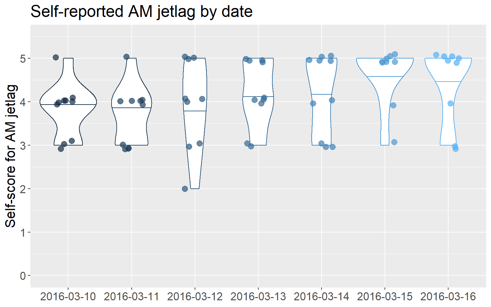
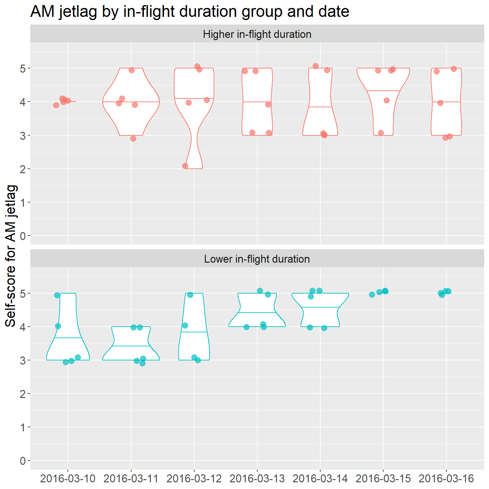
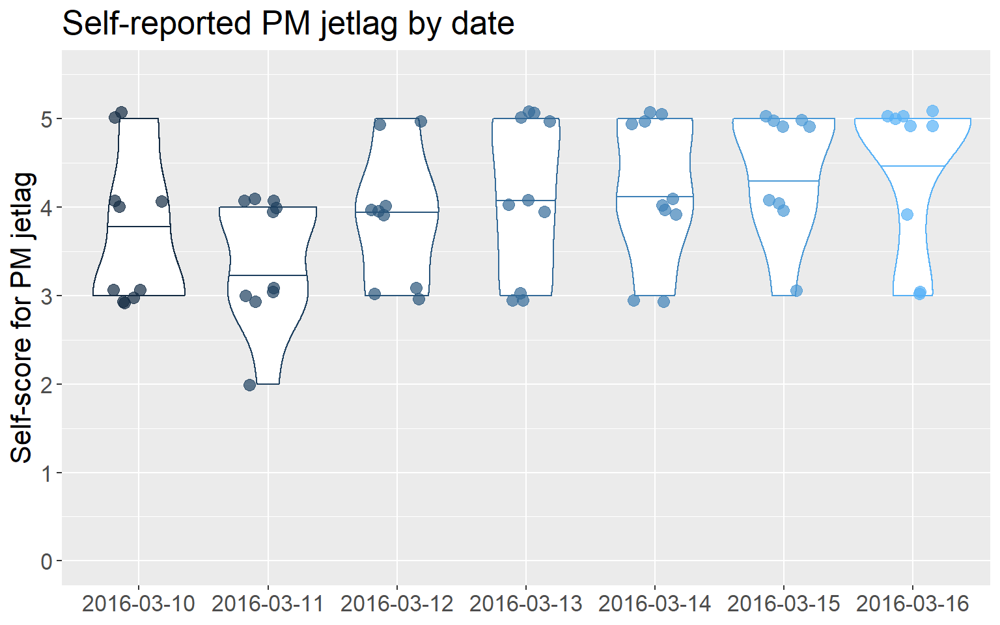
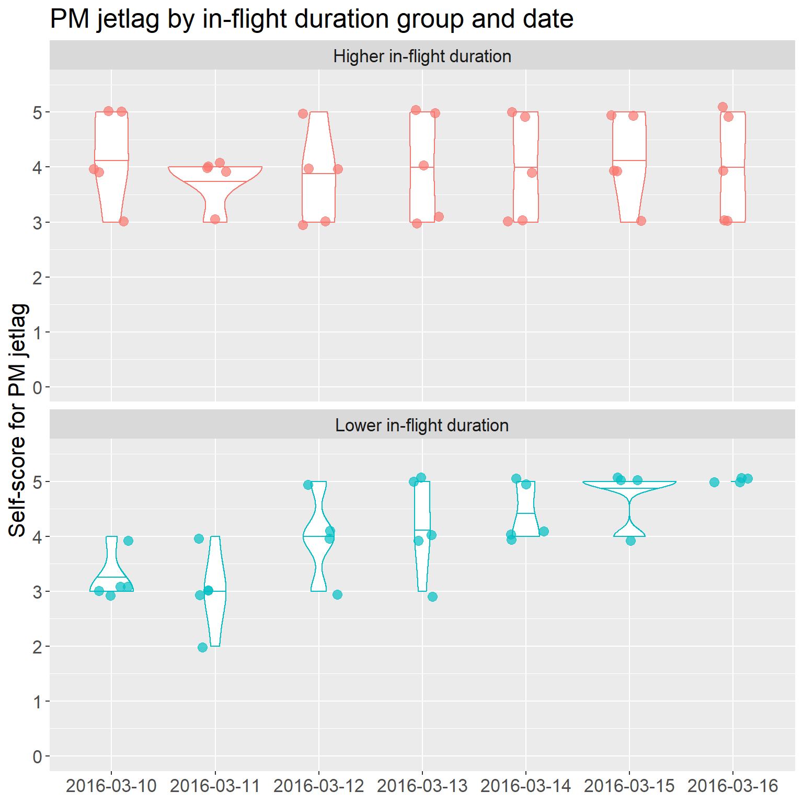
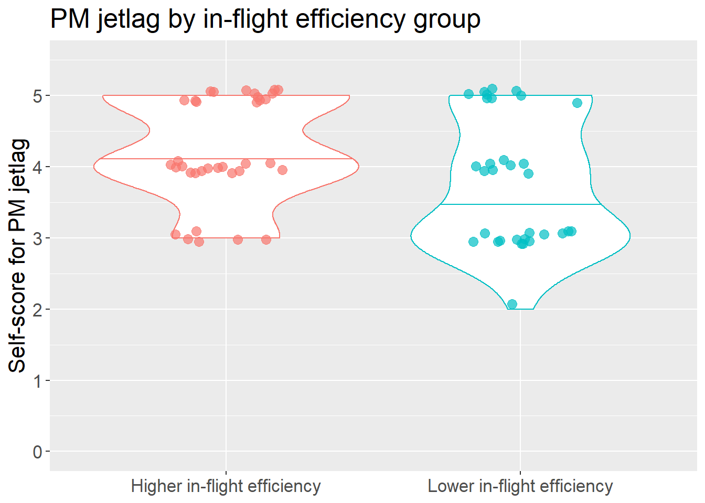

# Impact of flight on jetlag {#inflightsleepandjetlag}

## Omnibus models: Based on in-flight duration group

<table class="table" style="margin-left: auto; margin-right: auto;">
<caption>(\#tab:tablejetlaganddurationgroup)Omnibus model results: Jetlag &amp; in-flight duration group.</caption>
 <thead>
  <tr>
   <th style="text-align:left;"> Test effect </th>
   <th style="text-align:right;"> Statistic </th>
   <th style="text-align:right;"> df </th>
   <th style="text-align:right;"> p </th>
   <th style="text-align:left;"> Sig. difference? </th>
  </tr>
 </thead>
<tbody>
  <tr grouplength="3"><td colspan="5" style="border-bottom: 1px solid;"><strong>AM jetlag</strong></td></tr>
<tr>
   <td style="text-align:left; padding-left: 2em;" indentlevel="1"> Main effect: In-flight duration group </td>
   <td style="text-align:right;"> 0.3579 </td>
   <td style="text-align:right;"> 1.0000 </td>
   <td style="text-align:right;"> 0.5497 </td>
   <td style="text-align:left;"> No </td>
  </tr>
  <tr>
   <td style="text-align:left; padding-left: 2em;" indentlevel="1"> Main effect: Date </td>
   <td style="text-align:right;"> 4.6602 </td>
   <td style="text-align:right;"> 3.2735 </td>
   <td style="text-align:right;"> 0.0021 </td>
   <td style="text-align:left;"> Yes </td>
  </tr>
  <tr>
   <td style="text-align:left; padding-left: 2em;" indentlevel="1"> Interaction: Group x Date </td>
   <td style="text-align:right;"> 3.0758 </td>
   <td style="text-align:right;"> 3.2735 </td>
   <td style="text-align:right;"> 0.0227 </td>
   <td style="text-align:left;"> Yes </td>
  </tr>
  <tr grouplength="3"><td colspan="5" style="border-bottom: 1px solid;"><strong>PM jetlag</strong></td></tr>
<tr>
   <td style="text-align:left; padding-left: 2em;" indentlevel="1"> Main effect: In-flight duration group </td>
   <td style="text-align:right;"> 0.0775 </td>
   <td style="text-align:right;"> 1.0000 </td>
   <td style="text-align:right;"> 0.7807 </td>
   <td style="text-align:left;"> No </td>
  </tr>
  <tr>
   <td style="text-align:left; padding-left: 2em;" indentlevel="1"> Main effect: Date </td>
   <td style="text-align:right;"> 4.8525 </td>
   <td style="text-align:right;"> 2.9489 </td>
   <td style="text-align:right;"> 0.0024 </td>
   <td style="text-align:left;"> Yes </td>
  </tr>
  <tr>
   <td style="text-align:left; padding-left: 2em;" indentlevel="1"> Interaction: Group x Date </td>
   <td style="text-align:right;"> 3.8401 </td>
   <td style="text-align:right;"> 2.9489 </td>
   <td style="text-align:right;"> 0.0096 </td>
   <td style="text-align:left;"> Yes </td>
  </tr>
</tbody>
</table>

### Pairwise tests for AM jetlag

#### Main effect of date

Perceived jetlag data was recorded from 2016-03-10 to 2016-03-16, inclusive. To test all pairs of dates requires 21 pairwise comparisons, so the Bonferroni-adjusted p value = 0.05 / 21 = 0.00238.

<table class="table" style="margin-left: auto; margin-right: auto;">
<caption>(\#tab:tablejetlagamanddatepairwise)Pairwise comparisons: Main effect of date on AM jetlag.</caption>
 <thead>
  <tr>
   <th style="text-align:left;position: sticky; top:0; background-color: #FFFFFF;"> Tested pair </th>
   <th style="text-align:right;position: sticky; top:0; background-color: #FFFFFF;"> p </th>
   <th style="text-align:right;position: sticky; top:0; background-color: #FFFFFF;"> p_bonferroni </th>
   <th style="text-align:left;position: sticky; top:0; background-color: #FFFFFF;"> Pairwise difference? </th>
  </tr>
 </thead>
<tbody>
  <tr>
   <td style="text-align:left;"> subset_march_10_vs_15 </td>
   <td style="text-align:right;"> 0.00057 </td>
   <td style="text-align:right;"> 0.00238 </td>
   <td style="text-align:left;"> Yes </td>
  </tr>
  <tr>
   <td style="text-align:left;"> subset_march_11_vs_15 </td>
   <td style="text-align:right;"> 0.00000 </td>
   <td style="text-align:right;"> 0.00238 </td>
   <td style="text-align:left;"> Yes </td>
  </tr>
  <tr>
   <td style="text-align:left;"> subset_march_11_vs_16 </td>
   <td style="text-align:right;"> 0.00003 </td>
   <td style="text-align:right;"> 0.00238 </td>
   <td style="text-align:left;"> Yes </td>
  </tr>
  <tr>
   <td style="text-align:left;"> subset_march_12_vs_15 </td>
   <td style="text-align:right;"> 0.00182 </td>
   <td style="text-align:right;"> 0.00238 </td>
   <td style="text-align:left;"> Yes </td>
  </tr>
  <tr>
   <td style="text-align:left;"> subset_march_10_vs_11 </td>
   <td style="text-align:right;"> 0.74177 </td>
   <td style="text-align:right;"> 0.00238 </td>
   <td style="text-align:left;"> No </td>
  </tr>
  <tr>
   <td style="text-align:left;"> subset_march_10_vs_12 </td>
   <td style="text-align:right;"> 0.71070 </td>
   <td style="text-align:right;"> 0.00238 </td>
   <td style="text-align:left;"> No </td>
  </tr>
  <tr>
   <td style="text-align:left;"> subset_march_10_vs_13 </td>
   <td style="text-align:right;"> 0.17007 </td>
   <td style="text-align:right;"> 0.00238 </td>
   <td style="text-align:left;"> No </td>
  </tr>
  <tr>
   <td style="text-align:left;"> subset_march_10_vs_14 </td>
   <td style="text-align:right;"> 0.17007 </td>
   <td style="text-align:right;"> 0.00238 </td>
   <td style="text-align:left;"> No </td>
  </tr>
  <tr>
   <td style="text-align:left;"> subset_march_10_vs_16 </td>
   <td style="text-align:right;"> 0.01349 </td>
   <td style="text-align:right;"> 0.00238 </td>
   <td style="text-align:left;"> No </td>
  </tr>
  <tr>
   <td style="text-align:left;"> subset_march_11_vs_12 </td>
   <td style="text-align:right;"> 0.58509 </td>
   <td style="text-align:right;"> 0.00238 </td>
   <td style="text-align:left;"> No </td>
  </tr>
  <tr>
   <td style="text-align:left;"> subset_march_11_vs_13 </td>
   <td style="text-align:right;"> 0.06986 </td>
   <td style="text-align:right;"> 0.00238 </td>
   <td style="text-align:left;"> No </td>
  </tr>
  <tr>
   <td style="text-align:left;"> subset_march_11_vs_14 </td>
   <td style="text-align:right;"> 0.11344 </td>
   <td style="text-align:right;"> 0.00238 </td>
   <td style="text-align:left;"> No </td>
  </tr>
  <tr>
   <td style="text-align:left;"> subset_march_12_vs_13 </td>
   <td style="text-align:right;"> 0.36605 </td>
   <td style="text-align:right;"> 0.00238 </td>
   <td style="text-align:left;"> No </td>
  </tr>
  <tr>
   <td style="text-align:left;"> subset_march_12_vs_14 </td>
   <td style="text-align:right;"> 0.14179 </td>
   <td style="text-align:right;"> 0.00238 </td>
   <td style="text-align:left;"> No </td>
  </tr>
  <tr>
   <td style="text-align:left;"> subset_march_12_vs_16 </td>
   <td style="text-align:right;"> 0.01448 </td>
   <td style="text-align:right;"> 0.00238 </td>
   <td style="text-align:left;"> No </td>
  </tr>
  <tr>
   <td style="text-align:left;"> subset_march_13_vs_14 </td>
   <td style="text-align:right;"> 0.82974 </td>
   <td style="text-align:right;"> 0.00238 </td>
   <td style="text-align:left;"> No </td>
  </tr>
  <tr>
   <td style="text-align:left;"> subset_march_13_vs_15 </td>
   <td style="text-align:right;"> 0.00443 </td>
   <td style="text-align:right;"> 0.00238 </td>
   <td style="text-align:left;"> No </td>
  </tr>
  <tr>
   <td style="text-align:left;"> subset_march_13_vs_16 </td>
   <td style="text-align:right;"> 0.01431 </td>
   <td style="text-align:right;"> 0.00238 </td>
   <td style="text-align:left;"> No </td>
  </tr>
  <tr>
   <td style="text-align:left;"> subset_march_14_vs_15 </td>
   <td style="text-align:right;"> 0.03622 </td>
   <td style="text-align:right;"> 0.00238 </td>
   <td style="text-align:left;"> No </td>
  </tr>
  <tr>
   <td style="text-align:left;"> subset_march_14_vs_16 </td>
   <td style="text-align:right;"> 0.05709 </td>
   <td style="text-align:right;"> 0.00238 </td>
   <td style="text-align:left;"> No </td>
  </tr>
  <tr>
   <td style="text-align:left;"> subset_march_15_vs_16 </td>
   <td style="text-align:right;"> 0.17007 </td>
   <td style="text-align:right;"> 0.00238 </td>
   <td style="text-align:left;"> No </td>
  </tr>
</tbody>
</table>

#### Summary stats: AM jetlag by date

<table class="table" style="margin-left: auto; margin-right: auto;">
<caption>(\#tab:tablesummarystatsjetlagambydate)Summary stats: AM jetlag by date of tournament period.</caption>
 <thead>
  <tr>
   <th style="text-align:left;"> date </th>
   <th style="text-align:right;"> median </th>
   <th style="text-align:right;"> IQR </th>
  </tr>
 </thead>
<tbody>
  <tr>
   <td style="text-align:left;background-color: powderblue !important;"> 2016-03-10 </td>
   <td style="text-align:right;background-color: powderblue !important;"> 4 </td>
   <td style="text-align:right;background-color: powderblue !important;"> 1 </td>
  </tr>
  <tr>
   <td style="text-align:left;background-color: powderblue !important;"> 2016-03-11 </td>
   <td style="text-align:right;background-color: powderblue !important;"> 4 </td>
   <td style="text-align:right;background-color: powderblue !important;"> 1 </td>
  </tr>
  <tr>
   <td style="text-align:left;background-color: powderblue !important;"> 2016-03-12 </td>
   <td style="text-align:right;background-color: powderblue !important;"> 4 </td>
   <td style="text-align:right;background-color: powderblue !important;"> 2 </td>
  </tr>
  <tr>
   <td style="text-align:left;"> 2016-03-13 </td>
   <td style="text-align:right;"> 4 </td>
   <td style="text-align:right;"> 1 </td>
  </tr>
  <tr>
   <td style="text-align:left;"> 2016-03-14 </td>
   <td style="text-align:right;"> 4 </td>
   <td style="text-align:right;"> 2 </td>
  </tr>
  <tr>
   <td style="text-align:left;background-color: powderblue !important;"> 2016-03-15 </td>
   <td style="text-align:right;background-color: powderblue !important;"> 5 </td>
   <td style="text-align:right;background-color: powderblue !important;"> 0 </td>
  </tr>
  <tr>
   <td style="text-align:left;background-color: powderblue !important;"> 2016-03-16 </td>
   <td style="text-align:right;background-color: powderblue !important;"> 5 </td>
   <td style="text-align:right;background-color: powderblue !important;"> 1 </td>
  </tr>
</tbody>
</table>

 

#### Interaction effect of group x date

From the omnibus model, the interaction effect of `group` x `date` indicates that there are differences between the in-flight duration groups in terms of their AM jetlag time profiles. More specifically, the groups differ in the way that AM jetlag changes between time points.

Perceived jetlag data was recorded from 2016-03-10 to 2016-03-16, inclusive. There are two levels within the factor `inflight_duration_group`. To conduct pairwise comparisons of an interaction effect, we need to create subsets that allow us to compare the two in-flight duration groups on each pair of dates. In other words, we create one subset per pair of dates (i.e., 21 possible date-pairs, so 21 subsets). We run 1 comparison test for each subset (i.e., 21 comparison tests), where we are comparing the higher vs. lower in-flight duration groups in terms of their change from one date to another. For this part of the analysis, the Bonferroni-adjusted p value = 0.05 / 21 = 0.00238.

<table class="table" style="margin-left: auto; margin-right: auto;">
<caption>(\#tab:tablejetlagamanddurationgroupxdatepairwise)Pairwise comparisons: Interaction of duration group x date on AM jetlag.</caption>
 <thead>
  <tr>
   <th style="text-align:left;position: sticky; top:0; background-color: #FFFFFF;"> Tested date-pairs </th>
   <th style="text-align:right;position: sticky; top:0; background-color: #FFFFFF;"> p </th>
   <th style="text-align:right;position: sticky; top:0; background-color: #FFFFFF;"> p_bonferroni </th>
   <th style="text-align:left;position: sticky; top:0; background-color: #FFFFFF;"> Pairwise difference? </th>
  </tr>
 </thead>
<tbody>
  <tr>
   <td style="text-align:left;"> subset_march_11_vs_15 </td>
   <td style="text-align:right;"> 0.00058 </td>
   <td style="text-align:right;"> 0.00238 </td>
   <td style="text-align:left;"> Yes </td>
  </tr>
  <tr>
   <td style="text-align:left;"> subset_march_11_vs_16 </td>
   <td style="text-align:right;"> 0.00005 </td>
   <td style="text-align:right;"> 0.00238 </td>
   <td style="text-align:left;"> Yes </td>
  </tr>
  <tr>
   <td style="text-align:left;"> subset_march_10_vs_11 </td>
   <td style="text-align:right;"> 0.88357 </td>
   <td style="text-align:right;"> 0.00238 </td>
   <td style="text-align:left;"> No </td>
  </tr>
  <tr>
   <td style="text-align:left;"> subset_march_10_vs_12 </td>
   <td style="text-align:right;"> 0.92272 </td>
   <td style="text-align:right;"> 0.00238 </td>
   <td style="text-align:left;"> No </td>
  </tr>
  <tr>
   <td style="text-align:left;"> subset_march_10_vs_13 </td>
   <td style="text-align:right;"> 0.17007 </td>
   <td style="text-align:right;"> 0.00238 </td>
   <td style="text-align:left;"> No </td>
  </tr>
  <tr>
   <td style="text-align:left;"> subset_march_10_vs_14 </td>
   <td style="text-align:right;"> 0.03959 </td>
   <td style="text-align:right;"> 0.00238 </td>
   <td style="text-align:left;"> No </td>
  </tr>
  <tr>
   <td style="text-align:left;"> subset_march_10_vs_15 </td>
   <td style="text-align:right;"> 0.10963 </td>
   <td style="text-align:right;"> 0.00238 </td>
   <td style="text-align:left;"> No </td>
  </tr>
  <tr>
   <td style="text-align:left;"> subset_march_10_vs_16 </td>
   <td style="text-align:right;"> 0.02354 </td>
   <td style="text-align:right;"> 0.00238 </td>
   <td style="text-align:left;"> No </td>
  </tr>
  <tr>
   <td style="text-align:left;"> subset_march_11_vs_12 </td>
   <td style="text-align:right;"> 0.73103 </td>
   <td style="text-align:right;"> 0.00238 </td>
   <td style="text-align:left;"> No </td>
  </tr>
  <tr>
   <td style="text-align:left;"> subset_march_11_vs_13 </td>
   <td style="text-align:right;"> 0.06244 </td>
   <td style="text-align:right;"> 0.00238 </td>
   <td style="text-align:left;"> No </td>
  </tr>
  <tr>
   <td style="text-align:left;"> subset_march_11_vs_14 </td>
   <td style="text-align:right;"> 0.02131 </td>
   <td style="text-align:right;"> 0.00238 </td>
   <td style="text-align:left;"> No </td>
  </tr>
  <tr>
   <td style="text-align:left;"> subset_march_12_vs_13 </td>
   <td style="text-align:right;"> 0.21392 </td>
   <td style="text-align:right;"> 0.00238 </td>
   <td style="text-align:left;"> No </td>
  </tr>
  <tr>
   <td style="text-align:left;"> subset_march_12_vs_14 </td>
   <td style="text-align:right;"> 0.00719 </td>
   <td style="text-align:right;"> 0.00238 </td>
   <td style="text-align:left;"> No </td>
  </tr>
  <tr>
   <td style="text-align:left;"> subset_march_12_vs_15 </td>
   <td style="text-align:right;"> 0.06540 </td>
   <td style="text-align:right;"> 0.00238 </td>
   <td style="text-align:left;"> No </td>
  </tr>
  <tr>
   <td style="text-align:left;"> subset_march_12_vs_16 </td>
   <td style="text-align:right;"> 0.00762 </td>
   <td style="text-align:right;"> 0.00238 </td>
   <td style="text-align:left;"> No </td>
  </tr>
  <tr>
   <td style="text-align:left;"> subset_march_13_vs_14 </td>
   <td style="text-align:right;"> 0.16218 </td>
   <td style="text-align:right;"> 0.00238 </td>
   <td style="text-align:left;"> No </td>
  </tr>
  <tr>
   <td style="text-align:left;"> subset_march_13_vs_15 </td>
   <td style="text-align:right;"> 0.34278 </td>
   <td style="text-align:right;"> 0.00238 </td>
   <td style="text-align:left;"> No </td>
  </tr>
  <tr>
   <td style="text-align:left;"> subset_march_13_vs_16 </td>
   <td style="text-align:right;"> 0.01431 </td>
   <td style="text-align:right;"> 0.00238 </td>
   <td style="text-align:left;"> No </td>
  </tr>
  <tr>
   <td style="text-align:left;"> subset_march_14_vs_15 </td>
   <td style="text-align:right;"> 0.97168 </td>
   <td style="text-align:right;"> 0.00238 </td>
   <td style="text-align:left;"> No </td>
  </tr>
  <tr>
   <td style="text-align:left;"> subset_march_14_vs_16 </td>
   <td style="text-align:right;"> 0.29050 </td>
   <td style="text-align:right;"> 0.00238 </td>
   <td style="text-align:left;"> No </td>
  </tr>
  <tr>
   <td style="text-align:left;"> subset_march_15_vs_16 </td>
   <td style="text-align:right;"> 0.17007 </td>
   <td style="text-align:right;"> 0.00238 </td>
   <td style="text-align:left;"> No </td>
  </tr>
</tbody>
</table>

#### Summary stats: AM jetlag by group and date

<table class="table" style="margin-left: auto; margin-right: auto;">
<caption>(\#tab:tablesummarystatsjetlagambydurationgroupanddate)Summary stats: AM jetlag by in-flight duration group and date-pairs.</caption>
 <thead>
  <tr>
   <th style="text-align:left;"> subset_id </th>
   <th style="text-align:left;"> higher_duration_group_change </th>
   <th style="text-align:left;"> lower_duration_group_change </th>
  </tr>
 </thead>
<tbody>
  <tr>
   <td style="text-align:left;"> subset_march_10_vs_11 </td>
   <td style="text-align:left;"> 0 ± 0 </td>
   <td style="text-align:left;"> 0 ± 2 </td>
  </tr>
  <tr>
   <td style="text-align:left;"> subset_march_10_vs_12 </td>
   <td style="text-align:left;"> 0 ± 1 </td>
   <td style="text-align:left;"> 0 ± 1 </td>
  </tr>
  <tr>
   <td style="text-align:left;"> subset_march_10_vs_13 </td>
   <td style="text-align:left;"> 0 ± 2 </td>
   <td style="text-align:left;"> -1 ± 1 </td>
  </tr>
  <tr>
   <td style="text-align:left;"> subset_march_10_vs_14 </td>
   <td style="text-align:left;"> 1 ± 2 </td>
   <td style="text-align:left;"> -1 ± 0 </td>
  </tr>
  <tr>
   <td style="text-align:left;"> subset_march_10_vs_15 </td>
   <td style="text-align:left;"> -1 ± 1 </td>
   <td style="text-align:left;"> -2 ± 0 </td>
  </tr>
  <tr>
   <td style="text-align:left;"> subset_march_10_vs_16 </td>
   <td style="text-align:left;"> 0 ± 2 </td>
   <td style="text-align:left;"> -2 ± 0 </td>
  </tr>
  <tr>
   <td style="text-align:left;"> subset_march_11_vs_12 </td>
   <td style="text-align:left;"> 0 ± 0 </td>
   <td style="text-align:left;"> 0 ± 2 </td>
  </tr>
  <tr>
   <td style="text-align:left;"> subset_march_11_vs_13 </td>
   <td style="text-align:left;"> 0 ± 0 </td>
   <td style="text-align:left;"> -1 ± 2 </td>
  </tr>
  <tr>
   <td style="text-align:left;"> subset_march_11_vs_14 </td>
   <td style="text-align:left;"> 0 ± 1 </td>
   <td style="text-align:left;"> -2 ± 2 </td>
  </tr>
  <tr>
   <td style="text-align:left;background-color: powderblue !important;"> subset_march_11_vs_15 </td>
   <td style="text-align:left;background-color: powderblue !important;"> 0 ± 1 </td>
   <td style="text-align:left;background-color: powderblue !important;"> -2 ± 1 </td>
  </tr>
  <tr>
   <td style="text-align:left;background-color: powderblue !important;"> subset_march_11_vs_16 </td>
   <td style="text-align:left;background-color: powderblue !important;"> 0 ± 0 </td>
   <td style="text-align:left;background-color: powderblue !important;"> -2 ± 1 </td>
  </tr>
  <tr>
   <td style="text-align:left;"> subset_march_12_vs_13 </td>
   <td style="text-align:left;"> 0 ± 0 </td>
   <td style="text-align:left;"> -1 ± 0 </td>
  </tr>
  <tr>
   <td style="text-align:left;"> subset_march_12_vs_14 </td>
   <td style="text-align:left;"> 0 ± 1 </td>
   <td style="text-align:left;"> -1 ± 0 </td>
  </tr>
  <tr>
   <td style="text-align:left;"> subset_march_12_vs_15 </td>
   <td style="text-align:left;"> 0 ± 1 </td>
   <td style="text-align:left;"> -2 ± 1 </td>
  </tr>
  <tr>
   <td style="text-align:left;"> subset_march_12_vs_16 </td>
   <td style="text-align:left;"> 0 ± 0 </td>
   <td style="text-align:left;"> -2 ± 1 </td>
  </tr>
  <tr>
   <td style="text-align:left;"> subset_march_13_vs_14 </td>
   <td style="text-align:left;"> 0 ± 0 </td>
   <td style="text-align:left;"> 0 ± 0 </td>
  </tr>
  <tr>
   <td style="text-align:left;"> subset_march_13_vs_15 </td>
   <td style="text-align:left;"> 0 ± 1 </td>
   <td style="text-align:left;"> -1 ± 0 </td>
  </tr>
  <tr>
   <td style="text-align:left;"> subset_march_13_vs_16 </td>
   <td style="text-align:left;"> 0 ± 0 </td>
   <td style="text-align:left;"> -1 ± 0 </td>
  </tr>
  <tr>
   <td style="text-align:left;"> subset_march_14_vs_15 </td>
   <td style="text-align:left;"> 0 ± 1 </td>
   <td style="text-align:left;"> 0 ± 1 </td>
  </tr>
  <tr>
   <td style="text-align:left;"> subset_march_14_vs_16 </td>
   <td style="text-align:left;"> 0 ± 0 </td>
   <td style="text-align:left;"> 0 ± 1 </td>
  </tr>
  <tr>
   <td style="text-align:left;"> subset_march_15_vs_16 </td>
   <td style="text-align:left;"> 0 ± 1 </td>
   <td style="text-align:left;"> 0 ± 0 </td>
  </tr>
</tbody>
</table>

 

### Pairwise tests for PM jetlag

#### Main effect of date

Perceived jetlag data was recorded from 2016-03-10 to 2016-03-16, inclusive. To test all pairs of dates requires 21 pairwise comparisons, so the Bonferroni-adjusted p value = 0.05 / 21 = 0.00238.

<table class="table" style="margin-left: auto; margin-right: auto;">
<caption>(\#tab:tablejetlagpmanddatepairwise)Pairwise comparisons: Main effect of date on PM jetlag.</caption>
 <thead>
  <tr>
   <th style="text-align:left;position: sticky; top:0; background-color: #FFFFFF;"> Tested pair </th>
   <th style="text-align:right;position: sticky; top:0; background-color: #FFFFFF;"> p </th>
   <th style="text-align:right;position: sticky; top:0; background-color: #FFFFFF;"> p_bonferroni </th>
   <th style="text-align:left;position: sticky; top:0; background-color: #FFFFFF;"> Pairwise difference? </th>
  </tr>
 </thead>
<tbody>
  <tr>
   <td style="text-align:left;"> subset_march_11_vs_14 </td>
   <td style="text-align:right;"> 0.00042 </td>
   <td style="text-align:right;"> 0.00238 </td>
   <td style="text-align:left;"> Yes </td>
  </tr>
  <tr>
   <td style="text-align:left;"> subset_march_11_vs_15 </td>
   <td style="text-align:right;"> 0.00000 </td>
   <td style="text-align:right;"> 0.00238 </td>
   <td style="text-align:left;"> Yes </td>
  </tr>
  <tr>
   <td style="text-align:left;"> subset_march_11_vs_16 </td>
   <td style="text-align:right;"> 0.00000 </td>
   <td style="text-align:right;"> 0.00238 </td>
   <td style="text-align:left;"> Yes </td>
  </tr>
  <tr>
   <td style="text-align:left;"> subset_march_10_vs_11 </td>
   <td style="text-align:right;"> 0.05778 </td>
   <td style="text-align:right;"> 0.00238 </td>
   <td style="text-align:left;"> No </td>
  </tr>
  <tr>
   <td style="text-align:left;"> subset_march_10_vs_12 </td>
   <td style="text-align:right;"> 0.33465 </td>
   <td style="text-align:right;"> 0.00238 </td>
   <td style="text-align:left;"> No </td>
  </tr>
  <tr>
   <td style="text-align:left;"> subset_march_10_vs_13 </td>
   <td style="text-align:right;"> 0.21542 </td>
   <td style="text-align:right;"> 0.00238 </td>
   <td style="text-align:left;"> No </td>
  </tr>
  <tr>
   <td style="text-align:left;"> subset_march_10_vs_14 </td>
   <td style="text-align:right;"> 0.09636 </td>
   <td style="text-align:right;"> 0.00238 </td>
   <td style="text-align:left;"> No </td>
  </tr>
  <tr>
   <td style="text-align:left;"> subset_march_10_vs_15 </td>
   <td style="text-align:right;"> 0.00389 </td>
   <td style="text-align:right;"> 0.00238 </td>
   <td style="text-align:left;"> No </td>
  </tr>
  <tr>
   <td style="text-align:left;"> subset_march_10_vs_16 </td>
   <td style="text-align:right;"> 0.00967 </td>
   <td style="text-align:right;"> 0.00238 </td>
   <td style="text-align:left;"> No </td>
  </tr>
  <tr>
   <td style="text-align:left;"> subset_march_11_vs_12 </td>
   <td style="text-align:right;"> 0.05489 </td>
   <td style="text-align:right;"> 0.00238 </td>
   <td style="text-align:left;"> No </td>
  </tr>
  <tr>
   <td style="text-align:left;"> subset_march_11_vs_13 </td>
   <td style="text-align:right;"> 0.02212 </td>
   <td style="text-align:right;"> 0.00238 </td>
   <td style="text-align:left;"> No </td>
  </tr>
  <tr>
   <td style="text-align:left;"> subset_march_12_vs_13 </td>
   <td style="text-align:right;"> 0.53383 </td>
   <td style="text-align:right;"> 0.00238 </td>
   <td style="text-align:left;"> No </td>
  </tr>
  <tr>
   <td style="text-align:left;"> subset_march_12_vs_14 </td>
   <td style="text-align:right;"> 0.29042 </td>
   <td style="text-align:right;"> 0.00238 </td>
   <td style="text-align:left;"> No </td>
  </tr>
  <tr>
   <td style="text-align:left;"> subset_march_12_vs_15 </td>
   <td style="text-align:right;"> 0.06047 </td>
   <td style="text-align:right;"> 0.00238 </td>
   <td style="text-align:left;"> No </td>
  </tr>
  <tr>
   <td style="text-align:left;"> subset_march_12_vs_16 </td>
   <td style="text-align:right;"> 0.03944 </td>
   <td style="text-align:right;"> 0.00238 </td>
   <td style="text-align:left;"> No </td>
  </tr>
  <tr>
   <td style="text-align:left;"> subset_march_13_vs_14 </td>
   <td style="text-align:right;"> 0.72419 </td>
   <td style="text-align:right;"> 0.00238 </td>
   <td style="text-align:left;"> No </td>
  </tr>
  <tr>
   <td style="text-align:left;"> subset_march_13_vs_15 </td>
   <td style="text-align:right;"> 0.21873 </td>
   <td style="text-align:right;"> 0.00238 </td>
   <td style="text-align:left;"> No </td>
  </tr>
  <tr>
   <td style="text-align:left;"> subset_march_13_vs_16 </td>
   <td style="text-align:right;"> 0.02270 </td>
   <td style="text-align:right;"> 0.00238 </td>
   <td style="text-align:left;"> No </td>
  </tr>
  <tr>
   <td style="text-align:left;"> subset_march_14_vs_15 </td>
   <td style="text-align:right;"> 0.14228 </td>
   <td style="text-align:right;"> 0.00238 </td>
   <td style="text-align:left;"> No </td>
  </tr>
  <tr>
   <td style="text-align:left;"> subset_march_14_vs_16 </td>
   <td style="text-align:right;"> 0.01431 </td>
   <td style="text-align:right;"> 0.00238 </td>
   <td style="text-align:left;"> No </td>
  </tr>
  <tr>
   <td style="text-align:left;"> subset_march_15_vs_16 </td>
   <td style="text-align:right;"> 0.55715 </td>
   <td style="text-align:right;"> 0.00238 </td>
   <td style="text-align:left;"> No </td>
  </tr>
</tbody>
</table>

#### Summary stats: PM jetlag by date

<table class="table" style="margin-left: auto; margin-right: auto;">
<caption>(\#tab:tablesummarystatsjetlagpmbydate)Summary stats: PM jetlag by date of tournament period.</caption>
 <thead>
  <tr>
   <th style="text-align:left;"> date </th>
   <th style="text-align:right;"> median </th>
   <th style="text-align:right;"> IQR </th>
  </tr>
 </thead>
<tbody>
  <tr>
   <td style="text-align:left;"> 2016-03-10 </td>
   <td style="text-align:right;"> 4 </td>
   <td style="text-align:right;"> 1 </td>
  </tr>
  <tr>
   <td style="text-align:left;background-color: powderblue !important;"> 2016-03-11 </td>
   <td style="text-align:right;background-color: powderblue !important;"> 4 </td>
   <td style="text-align:right;background-color: powderblue !important;"> 1 </td>
  </tr>
  <tr>
   <td style="text-align:left;"> 2016-03-12 </td>
   <td style="text-align:right;"> 4 </td>
   <td style="text-align:right;"> 1 </td>
  </tr>
  <tr>
   <td style="text-align:left;"> 2016-03-13 </td>
   <td style="text-align:right;"> 4 </td>
   <td style="text-align:right;"> 2 </td>
  </tr>
  <tr>
   <td style="text-align:left;background-color: powderblue !important;"> 2016-03-14 </td>
   <td style="text-align:right;background-color: powderblue !important;"> 4 </td>
   <td style="text-align:right;background-color: powderblue !important;"> 1 </td>
  </tr>
  <tr>
   <td style="text-align:left;background-color: powderblue !important;"> 2016-03-15 </td>
   <td style="text-align:right;background-color: powderblue !important;"> 5 </td>
   <td style="text-align:right;background-color: powderblue !important;"> 1 </td>
  </tr>
  <tr>
   <td style="text-align:left;background-color: powderblue !important;"> 2016-03-16 </td>
   <td style="text-align:right;background-color: powderblue !important;"> 5 </td>
   <td style="text-align:right;background-color: powderblue !important;"> 1 </td>
  </tr>
</tbody>
</table>

 

#### Interaction effect of group x date

From the omnibus model, the interaction effect of `group` x `date` indicates that there are differences between the in-flight duration groups in terms of their PM jetlag time profiles. More specifically, the groups differ in the way that PM jetlag changes between time points.

Perceived jetlag data was recorded from 2016-03-10 to 2016-03-16, inclusive. There are two levels within the factor `inflight_duration_group`. To conduct pairwise comparisons of an interaction effect, we need to create subsets that allow us to compare the two in-flight duration groups on each pair of dates. In other words, we create one subset per pair of dates (i.e., 21 possible date-pairs, so 21 subsets). We run 1 comparison test for each subset (i.e., 21 comparison tests), where we are comparing the higher vs. lower in-flight duration groups in terms of their change from one date to another. For this part of the analysis, the Bonferroni-adjusted p value = 0.05 / 21 = 0.00238.

<table class="table" style="margin-left: auto; margin-right: auto;">
<caption>(\#tab:tablejetlagpmanddurationgroupxdatepairwise)Pairwise comparisons: Interaction of duration group x date on PM jetlag.</caption>
 <thead>
  <tr>
   <th style="text-align:left;position: sticky; top:0; background-color: #FFFFFF;"> Tested date-pairs </th>
   <th style="text-align:right;position: sticky; top:0; background-color: #FFFFFF;"> p </th>
   <th style="text-align:right;position: sticky; top:0; background-color: #FFFFFF;"> p_bonferroni </th>
   <th style="text-align:left;position: sticky; top:0; background-color: #FFFFFF;"> Pairwise difference? </th>
  </tr>
 </thead>
<tbody>
  <tr>
   <td style="text-align:left;"> subset_march_10_vs_16 </td>
   <td style="text-align:right;"> 0.00138 </td>
   <td style="text-align:right;"> 0.00238 </td>
   <td style="text-align:left;"> Yes </td>
  </tr>
  <tr>
   <td style="text-align:left;"> subset_march_11_vs_15 </td>
   <td style="text-align:right;"> 0.00009 </td>
   <td style="text-align:right;"> 0.00238 </td>
   <td style="text-align:left;"> Yes </td>
  </tr>
  <tr>
   <td style="text-align:left;"> subset_march_11_vs_16 </td>
   <td style="text-align:right;"> 0.00015 </td>
   <td style="text-align:right;"> 0.00238 </td>
   <td style="text-align:left;"> Yes </td>
  </tr>
  <tr>
   <td style="text-align:left;"> subset_march_10_vs_11 </td>
   <td style="text-align:right;"> 0.52709 </td>
   <td style="text-align:right;"> 0.00238 </td>
   <td style="text-align:left;"> No </td>
  </tr>
  <tr>
   <td style="text-align:left;"> subset_march_10_vs_12 </td>
   <td style="text-align:right;"> 0.00704 </td>
   <td style="text-align:right;"> 0.00238 </td>
   <td style="text-align:left;"> No </td>
  </tr>
  <tr>
   <td style="text-align:left;"> subset_march_10_vs_13 </td>
   <td style="text-align:right;"> 0.05667 </td>
   <td style="text-align:right;"> 0.00238 </td>
   <td style="text-align:left;"> No </td>
  </tr>
  <tr>
   <td style="text-align:left;"> subset_march_10_vs_14 </td>
   <td style="text-align:right;"> 0.01890 </td>
   <td style="text-align:right;"> 0.00238 </td>
   <td style="text-align:left;"> No </td>
  </tr>
  <tr>
   <td style="text-align:left;"> subset_march_10_vs_15 </td>
   <td style="text-align:right;"> 0.00389 </td>
   <td style="text-align:right;"> 0.00238 </td>
   <td style="text-align:left;"> No </td>
  </tr>
  <tr>
   <td style="text-align:left;"> subset_march_11_vs_12 </td>
   <td style="text-align:right;"> 0.02537 </td>
   <td style="text-align:right;"> 0.00238 </td>
   <td style="text-align:left;"> No </td>
  </tr>
  <tr>
   <td style="text-align:left;"> subset_march_11_vs_13 </td>
   <td style="text-align:right;"> 0.07040 </td>
   <td style="text-align:right;"> 0.00238 </td>
   <td style="text-align:left;"> No </td>
  </tr>
  <tr>
   <td style="text-align:left;"> subset_march_11_vs_14 </td>
   <td style="text-align:right;"> 0.00543 </td>
   <td style="text-align:right;"> 0.00238 </td>
   <td style="text-align:left;"> No </td>
  </tr>
  <tr>
   <td style="text-align:left;"> subset_march_12_vs_13 </td>
   <td style="text-align:right;"> 1.00000 </td>
   <td style="text-align:right;"> 0.00238 </td>
   <td style="text-align:left;"> No </td>
  </tr>
  <tr>
   <td style="text-align:left;"> subset_march_12_vs_14 </td>
   <td style="text-align:right;"> 0.74081 </td>
   <td style="text-align:right;"> 0.00238 </td>
   <td style="text-align:left;"> No </td>
  </tr>
  <tr>
   <td style="text-align:left;"> subset_march_12_vs_15 </td>
   <td style="text-align:right;"> 0.54546 </td>
   <td style="text-align:right;"> 0.00238 </td>
   <td style="text-align:left;"> No </td>
  </tr>
  <tr>
   <td style="text-align:left;"> subset_march_12_vs_16 </td>
   <td style="text-align:right;"> 0.18078 </td>
   <td style="text-align:right;"> 0.00238 </td>
   <td style="text-align:left;"> No </td>
  </tr>
  <tr>
   <td style="text-align:left;"> subset_march_13_vs_14 </td>
   <td style="text-align:right;"> 0.72419 </td>
   <td style="text-align:right;"> 0.00238 </td>
   <td style="text-align:left;"> No </td>
  </tr>
  <tr>
   <td style="text-align:left;"> subset_march_13_vs_15 </td>
   <td style="text-align:right;"> 0.48514 </td>
   <td style="text-align:right;"> 0.00238 </td>
   <td style="text-align:left;"> No </td>
  </tr>
  <tr>
   <td style="text-align:left;"> subset_march_13_vs_16 </td>
   <td style="text-align:right;"> 0.02270 </td>
   <td style="text-align:right;"> 0.00238 </td>
   <td style="text-align:left;"> No </td>
  </tr>
  <tr>
   <td style="text-align:left;"> subset_march_14_vs_15 </td>
   <td style="text-align:right;"> 0.48702 </td>
   <td style="text-align:right;"> 0.00238 </td>
   <td style="text-align:left;"> No </td>
  </tr>
  <tr>
   <td style="text-align:left;"> subset_march_14_vs_16 </td>
   <td style="text-align:right;"> 0.01431 </td>
   <td style="text-align:right;"> 0.00238 </td>
   <td style="text-align:left;"> No </td>
  </tr>
  <tr>
   <td style="text-align:left;"> subset_march_15_vs_16 </td>
   <td style="text-align:right;"> 0.19824 </td>
   <td style="text-align:right;"> 0.00238 </td>
   <td style="text-align:left;"> No </td>
  </tr>
</tbody>
</table>

#### Summary stats: PM jetlag by group and date

<table class="table" style="margin-left: auto; margin-right: auto;">
<caption>(\#tab:tablesummarystatsjetlagpmbydurationgroupanddate)Summary stats: PM jetlag by in-flight duration group and date-pairs.</caption>
 <thead>
  <tr>
   <th style="text-align:left;"> subset_id </th>
   <th style="text-align:left;"> higher_duration_group_change </th>
   <th style="text-align:left;"> lower_duration_group_change </th>
  </tr>
 </thead>
<tbody>
  <tr>
   <td style="text-align:left;"> subset_march_10_vs_11 </td>
   <td style="text-align:left;"> 0 ± 1 </td>
   <td style="text-align:left;"> 0 ± 0 </td>
  </tr>
  <tr>
   <td style="text-align:left;"> subset_march_10_vs_12 </td>
   <td style="text-align:left;"> 1 ± 1 </td>
   <td style="text-align:left;"> -1 ± 0 </td>
  </tr>
  <tr>
   <td style="text-align:left;"> subset_march_10_vs_13 </td>
   <td style="text-align:left;"> 0 ± 2 </td>
   <td style="text-align:left;"> -1 ± 0 </td>
  </tr>
  <tr>
   <td style="text-align:left;"> subset_march_10_vs_14 </td>
   <td style="text-align:left;"> 0 ± 2 </td>
   <td style="text-align:left;"> -1 ± 0 </td>
  </tr>
  <tr>
   <td style="text-align:left;"> subset_march_10_vs_15 </td>
   <td style="text-align:left;"> 0 ± 2 </td>
   <td style="text-align:left;"> -2 ± 1 </td>
  </tr>
  <tr>
   <td style="text-align:left;background-color: powderblue !important;"> subset_march_10_vs_16 </td>
   <td style="text-align:left;background-color: powderblue !important;"> 0 ± 2 </td>
   <td style="text-align:left;background-color: powderblue !important;"> -2 ± 0 </td>
  </tr>
  <tr>
   <td style="text-align:left;"> subset_march_11_vs_12 </td>
   <td style="text-align:left;"> 0 ± 0 </td>
   <td style="text-align:left;"> -1 ± 0 </td>
  </tr>
  <tr>
   <td style="text-align:left;"> subset_march_11_vs_13 </td>
   <td style="text-align:left;"> 0 ± 1 </td>
   <td style="text-align:left;"> -1 ± 0 </td>
  </tr>
  <tr>
   <td style="text-align:left;"> subset_march_11_vs_14 </td>
   <td style="text-align:left;"> 0 ± 1 </td>
   <td style="text-align:left;"> -1 ± 1 </td>
  </tr>
  <tr>
   <td style="text-align:left;background-color: powderblue !important;"> subset_march_11_vs_15 </td>
   <td style="text-align:left;background-color: powderblue !important;"> 0 ± 1 </td>
   <td style="text-align:left;background-color: powderblue !important;"> -2 ± 0 </td>
  </tr>
  <tr>
   <td style="text-align:left;background-color: powderblue !important;"> subset_march_11_vs_16 </td>
   <td style="text-align:left;background-color: powderblue !important;"> 0 ± 1 </td>
   <td style="text-align:left;background-color: powderblue !important;"> -2 ± 0 </td>
  </tr>
  <tr>
   <td style="text-align:left;"> subset_march_12_vs_13 </td>
   <td style="text-align:left;"> 0 ± 0 </td>
   <td style="text-align:left;"> 0 ± 1 </td>
  </tr>
  <tr>
   <td style="text-align:left;"> subset_march_12_vs_14 </td>
   <td style="text-align:left;"> 0 ± 0 </td>
   <td style="text-align:left;"> 0 ± 0 </td>
  </tr>
  <tr>
   <td style="text-align:left;"> subset_march_12_vs_15 </td>
   <td style="text-align:left;"> 0 ± 0 </td>
   <td style="text-align:left;"> 0 ± 1 </td>
  </tr>
  <tr>
   <td style="text-align:left;"> subset_march_12_vs_16 </td>
   <td style="text-align:left;"> 0 ± 0 </td>
   <td style="text-align:left;"> -1 ± 0 </td>
  </tr>
  <tr>
   <td style="text-align:left;"> subset_march_13_vs_14 </td>
   <td style="text-align:left;"> 0 ± 0 </td>
   <td style="text-align:left;"> 0 ± 0 </td>
  </tr>
  <tr>
   <td style="text-align:left;"> subset_march_13_vs_15 </td>
   <td style="text-align:left;"> 0 ± 0 </td>
   <td style="text-align:left;"> 0 ± 1 </td>
  </tr>
  <tr>
   <td style="text-align:left;"> subset_march_13_vs_16 </td>
   <td style="text-align:left;"> 0 ± 0 </td>
   <td style="text-align:left;"> 0 ± 1 </td>
  </tr>
  <tr>
   <td style="text-align:left;"> subset_march_14_vs_15 </td>
   <td style="text-align:left;"> 0 ± 0 </td>
   <td style="text-align:left;"> 0 ± 1 </td>
  </tr>
  <tr>
   <td style="text-align:left;"> subset_march_14_vs_16 </td>
   <td style="text-align:left;"> 0 ± 0 </td>
   <td style="text-align:left;"> -1 ± 0 </td>
  </tr>
  <tr>
   <td style="text-align:left;"> subset_march_15_vs_16 </td>
   <td style="text-align:left;"> 0 ± 0 </td>
   <td style="text-align:left;"> 0 ± 0 </td>
  </tr>
</tbody>
</table>

 

## Omnibus models: Based on in-flight efficiency group

<table class="table" style="margin-left: auto; margin-right: auto;">
<caption>(\#tab:tablejetlagandefficiencygroup)Omnibus model results: Jetlag &amp; in-flight efficiency group.</caption>
 <thead>
  <tr>
   <th style="text-align:left;"> Test effect </th>
   <th style="text-align:right;"> Statistic </th>
   <th style="text-align:right;"> df </th>
   <th style="text-align:right;"> p </th>
   <th style="text-align:left;"> Sig. difference? </th>
  </tr>
 </thead>
<tbody>
  <tr grouplength="3"><td colspan="5" style="border-bottom: 1px solid;"><strong>AM jetlag</strong></td></tr>
<tr>
   <td style="text-align:left; padding-left: 2em;" indentlevel="1"> Main effect: In-flight efficiency group </td>
   <td style="text-align:right;"> 3.1658 </td>
   <td style="text-align:right;"> 1.0000 </td>
   <td style="text-align:right;"> 0.0752 </td>
   <td style="text-align:left;"> No </td>
  </tr>
  <tr>
   <td style="text-align:left; padding-left: 2em;" indentlevel="1"> Main effect: Date </td>
   <td style="text-align:right;"> 2.9833 </td>
   <td style="text-align:right;"> 3.3299 </td>
   <td style="text-align:right;"> 0.0252 </td>
   <td style="text-align:left;"> Yes </td>
  </tr>
  <tr>
   <td style="text-align:left; padding-left: 2em;" indentlevel="1"> Interaction: Group x Date </td>
   <td style="text-align:right;"> 1.6116 </td>
   <td style="text-align:right;"> 3.3299 </td>
   <td style="text-align:right;"> 0.1789 </td>
   <td style="text-align:left;"> No </td>
  </tr>
  <tr grouplength="3"><td colspan="5" style="border-bottom: 1px solid;"><strong>PM jetlag</strong></td></tr>
<tr>
   <td style="text-align:left; padding-left: 2em;" indentlevel="1"> Main effect: In-flight efficiency group </td>
   <td style="text-align:right;"> 5.6754 </td>
   <td style="text-align:right;"> 1.0000 </td>
   <td style="text-align:right;"> 0.0172 </td>
   <td style="text-align:left;"> Yes </td>
  </tr>
  <tr>
   <td style="text-align:left; padding-left: 2em;" indentlevel="1"> Main effect: Date </td>
   <td style="text-align:right;"> 3.4765 </td>
   <td style="text-align:right;"> 2.5637 </td>
   <td style="text-align:right;"> 0.0207 </td>
   <td style="text-align:left;"> Yes </td>
  </tr>
  <tr>
   <td style="text-align:left; padding-left: 2em;" indentlevel="1"> Interaction: Group x Date </td>
   <td style="text-align:right;"> 2.2534 </td>
   <td style="text-align:right;"> 2.5637 </td>
   <td style="text-align:right;"> 0.0901 </td>
   <td style="text-align:left;"> No </td>
  </tr>
</tbody>
</table>

### Pairwise tests for AM jetlag

#### Main effect of date

**Note:** No need for additional pairwise tests - this analysis will produce the same results as in Table \@ref(tab:tablejetlagamanddatepairwise).

### Pairwise tests for PM jetlag

#### Main effect of in-flight efficiency group

**Note:** No need for additional pairwise tests - there are only two levels within the grouping variable: higher vs. lower in-flight sleep efficiency.

#### Summary stats: PM jetlag by in-flight efficiency group

<table class="table" style="margin-left: auto; margin-right: auto;">
<caption>(\#tab:tablesummarystatsjetlagpmbyefficiency)Summary stats: PM jetlag by in-flight efficiency group.</caption>
 <thead>
  <tr>
   <th style="text-align:left;"> In-flight efficiency group </th>
   <th style="text-align:right;"> median </th>
   <th style="text-align:right;"> IQR </th>
  </tr>
 </thead>
<tbody>
  <tr>
   <td style="text-align:left;"> Higher in-flight efficiency </td>
   <td style="text-align:right;"> 5 </td>
   <td style="text-align:right;"> 1 </td>
  </tr>
  <tr>
   <td style="text-align:left;"> Lower in-flight efficiency </td>
   <td style="text-align:right;"> 4 </td>
   <td style="text-align:right;"> 1 </td>
  </tr>
</tbody>
</table>

 

#### Main effect of date

**Note:** No need for additional pairwise tests - this analysis will produce the same results as in Table \@ref(tab:tablejetlagpmanddatepairwise).
