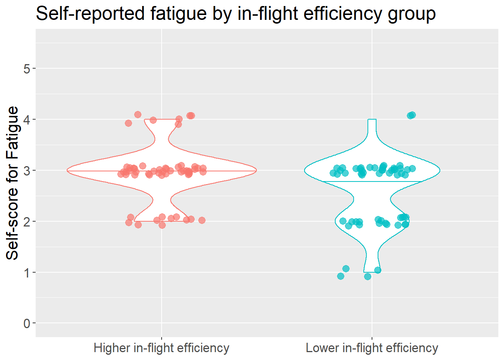

# Impact of flight on well-being {#inflightsleepandwellbeing}

## Omnibus models: Based on in-flight duration group

<table class="table" style="margin-left: auto; margin-right: auto;">
<caption>(\#tab:tablewellbeinganddurationgroup)Omnibus model results: Well-being &amp; in-flight duration group.</caption>
 <thead>
  <tr>
   <th style="text-align:left;"> Test effect </th>
   <th style="text-align:right;"> Statistic </th>
   <th style="text-align:right;"> df </th>
   <th style="text-align:right;"> p </th>
   <th style="text-align:left;"> Sig. difference? </th>
  </tr>
 </thead>
<tbody>
  <tr grouplength="3"><td colspan="5" style="border-bottom: 1px solid;"><strong>Fatigue</strong></td></tr>
<tr>
   <td style="text-align:left; padding-left: 2em;" indentlevel="1"> Main effect: In-flight duration group </td>
   <td style="text-align:right;"> 0.0871 </td>
   <td style="text-align:right;"> 1.0000 </td>
   <td style="text-align:right;"> 0.7679 </td>
   <td style="text-align:left;"> No </td>
  </tr>
  <tr>
   <td style="text-align:left; padding-left: 2em;" indentlevel="1"> Main effect: Date </td>
   <td style="text-align:right;"> 1.6428 </td>
   <td style="text-align:right;"> 4.2928 </td>
   <td style="text-align:right;"> 0.1557 </td>
   <td style="text-align:left;"> No </td>
  </tr>
  <tr>
   <td style="text-align:left; padding-left: 2em;" indentlevel="1"> Interaction: Group x Date </td>
   <td style="text-align:right;"> 1.7424 </td>
   <td style="text-align:right;"> 4.2928 </td>
   <td style="text-align:right;"> 0.1325 </td>
   <td style="text-align:left;"> No </td>
  </tr>
  <tr grouplength="3"><td colspan="5" style="border-bottom: 1px solid;"><strong>Sleep quality</strong></td></tr>
<tr>
   <td style="text-align:left; padding-left: 2em;" indentlevel="1"> Main effect: In-flight duration group </td>
   <td style="text-align:right;"> 3.6892 </td>
   <td style="text-align:right;"> 1.0000 </td>
   <td style="text-align:right;"> 0.0548 </td>
   <td style="text-align:left;"> No </td>
  </tr>
  <tr>
   <td style="text-align:left; padding-left: 2em;" indentlevel="1"> Main effect: Date </td>
   <td style="text-align:right;"> 2.2046 </td>
   <td style="text-align:right;"> 4.2567 </td>
   <td style="text-align:right;"> 0.0616 </td>
   <td style="text-align:left;"> No </td>
  </tr>
  <tr>
   <td style="text-align:left; padding-left: 2em;" indentlevel="1"> Interaction: Group x Date </td>
   <td style="text-align:right;"> 0.7845 </td>
   <td style="text-align:right;"> 4.2567 </td>
   <td style="text-align:right;"> 0.5421 </td>
   <td style="text-align:left;"> No </td>
  </tr>
  <tr grouplength="3"><td colspan="5" style="border-bottom: 1px solid;"><strong>Soreness</strong></td></tr>
<tr>
   <td style="text-align:left; padding-left: 2em;" indentlevel="1"> Main effect: In-flight duration group </td>
   <td style="text-align:right;"> 1.0475 </td>
   <td style="text-align:right;"> 1.0000 </td>
   <td style="text-align:right;"> 0.3061 </td>
   <td style="text-align:left;"> No </td>
  </tr>
  <tr>
   <td style="text-align:left; padding-left: 2em;" indentlevel="1"> Main effect: Date </td>
   <td style="text-align:right;"> 1.4108 </td>
   <td style="text-align:right;"> 2.8799 </td>
   <td style="text-align:right;"> 0.2385 </td>
   <td style="text-align:left;"> No </td>
  </tr>
  <tr>
   <td style="text-align:left; padding-left: 2em;" indentlevel="1"> Interaction: Group x Date </td>
   <td style="text-align:right;"> 0.8474 </td>
   <td style="text-align:right;"> 2.8799 </td>
   <td style="text-align:right;"> 0.4638 </td>
   <td style="text-align:left;"> No </td>
  </tr>
  <tr grouplength="3"><td colspan="5" style="border-bottom: 1px solid;"><strong>Stress</strong></td></tr>
<tr>
   <td style="text-align:left; padding-left: 2em;" indentlevel="1"> Main effect: In-flight duration group </td>
   <td style="text-align:right;"> 0.4384 </td>
   <td style="text-align:right;"> 1.0000 </td>
   <td style="text-align:right;"> 0.5079 </td>
   <td style="text-align:left;"> No </td>
  </tr>
  <tr>
   <td style="text-align:left; padding-left: 2em;" indentlevel="1"> Main effect: Date </td>
   <td style="text-align:right;"> 0.7716 </td>
   <td style="text-align:right;"> 3.7623 </td>
   <td style="text-align:right;"> 0.5362 </td>
   <td style="text-align:left;"> No </td>
  </tr>
  <tr>
   <td style="text-align:left; padding-left: 2em;" indentlevel="1"> Interaction: Group x Date </td>
   <td style="text-align:right;"> 2.1615 </td>
   <td style="text-align:right;"> 3.7623 </td>
   <td style="text-align:right;"> 0.0748 </td>
   <td style="text-align:left;"> No </td>
  </tr>
  <tr grouplength="3"><td colspan="5" style="border-bottom: 1px solid;"><strong>Overall score</strong></td></tr>
<tr>
   <td style="text-align:left; padding-left: 2em;" indentlevel="1"> Main effect: In-flight duration group </td>
   <td style="text-align:right;"> 0.3066 </td>
   <td style="text-align:right;"> 1.0000 </td>
   <td style="text-align:right;"> 0.5798 </td>
   <td style="text-align:left;"> No </td>
  </tr>
  <tr>
   <td style="text-align:left; padding-left: 2em;" indentlevel="1"> Main effect: Date </td>
   <td style="text-align:right;"> 0.7489 </td>
   <td style="text-align:right;"> 3.3441 </td>
   <td style="text-align:right;"> 0.5362 </td>
   <td style="text-align:left;"> No </td>
  </tr>
  <tr>
   <td style="text-align:left; padding-left: 2em;" indentlevel="1"> Interaction: Group x Date </td>
   <td style="text-align:right;"> 0.3959 </td>
   <td style="text-align:right;"> 3.3441 </td>
   <td style="text-align:right;"> 0.7774 </td>
   <td style="text-align:left;"> No </td>
  </tr>
</tbody>
</table>

## Omnibus models: Based on in-flight efficiency group

<table class="table" style="margin-left: auto; margin-right: auto;">
<caption>(\#tab:tablewellbeingandefficiencygroup)Omnibus model results: Well-being &amp; in-flight efficiency group.</caption>
 <thead>
  <tr>
   <th style="text-align:left;"> Test effect </th>
   <th style="text-align:right;"> Statistic </th>
   <th style="text-align:right;"> df </th>
   <th style="text-align:right;"> p </th>
   <th style="text-align:left;"> Sig. difference? </th>
  </tr>
 </thead>
<tbody>
  <tr grouplength="3"><td colspan="5" style="border-bottom: 1px solid;"><strong>Fatigue</strong></td></tr>
<tr>
   <td style="text-align:left; padding-left: 2em;" indentlevel="1"> Main effect: In-flight efficiency group </td>
   <td style="text-align:right;"> 5.4327 </td>
   <td style="text-align:right;"> 1.0000 </td>
   <td style="text-align:right;"> 0.0198 </td>
   <td style="text-align:left;"> Yes </td>
  </tr>
  <tr>
   <td style="text-align:left; padding-left: 2em;" indentlevel="1"> Main effect: Date </td>
   <td style="text-align:right;"> 1.4481 </td>
   <td style="text-align:right;"> 3.7542 </td>
   <td style="text-align:right;"> 0.2181 </td>
   <td style="text-align:left;"> No </td>
  </tr>
  <tr>
   <td style="text-align:left; padding-left: 2em;" indentlevel="1"> Interaction: Group x Date </td>
   <td style="text-align:right;"> 1.0772 </td>
   <td style="text-align:right;"> 3.7542 </td>
   <td style="text-align:right;"> 0.3642 </td>
   <td style="text-align:left;"> No </td>
  </tr>
  <tr grouplength="3"><td colspan="5" style="border-bottom: 1px solid;"><strong>Sleep quality</strong></td></tr>
<tr>
   <td style="text-align:left; padding-left: 2em;" indentlevel="1"> Main effect: In-flight efficiency group </td>
   <td style="text-align:right;"> 0.0753 </td>
   <td style="text-align:right;"> 1.0000 </td>
   <td style="text-align:right;"> 0.7837 </td>
   <td style="text-align:left;"> No </td>
  </tr>
  <tr>
   <td style="text-align:left; padding-left: 2em;" indentlevel="1"> Main effect: Date </td>
   <td style="text-align:right;"> 2.2432 </td>
   <td style="text-align:right;"> 4.2926 </td>
   <td style="text-align:right;"> 0.0571 </td>
   <td style="text-align:left;"> No </td>
  </tr>
  <tr>
   <td style="text-align:left; padding-left: 2em;" indentlevel="1"> Interaction: Group x Date </td>
   <td style="text-align:right;"> 1.2066 </td>
   <td style="text-align:right;"> 4.2926 </td>
   <td style="text-align:right;"> 0.3050 </td>
   <td style="text-align:left;"> No </td>
  </tr>
  <tr grouplength="3"><td colspan="5" style="border-bottom: 1px solid;"><strong>Soreness</strong></td></tr>
<tr>
   <td style="text-align:left; padding-left: 2em;" indentlevel="1"> Main effect: In-flight efficiency group </td>
   <td style="text-align:right;"> 0.2197 </td>
   <td style="text-align:right;"> 1.0000 </td>
   <td style="text-align:right;"> 0.6393 </td>
   <td style="text-align:left;"> No </td>
  </tr>
  <tr>
   <td style="text-align:left; padding-left: 2em;" indentlevel="1"> Main effect: Date </td>
   <td style="text-align:right;"> 1.3790 </td>
   <td style="text-align:right;"> 2.8335 </td>
   <td style="text-align:right;"> 0.2483 </td>
   <td style="text-align:left;"> No </td>
  </tr>
  <tr>
   <td style="text-align:left; padding-left: 2em;" indentlevel="1"> Interaction: Group x Date </td>
   <td style="text-align:right;"> 0.3790 </td>
   <td style="text-align:right;"> 2.8335 </td>
   <td style="text-align:right;"> 0.7566 </td>
   <td style="text-align:left;"> No </td>
  </tr>
  <tr grouplength="3"><td colspan="5" style="border-bottom: 1px solid;"><strong>Stress</strong></td></tr>
<tr>
   <td style="text-align:left; padding-left: 2em;" indentlevel="1"> Main effect: In-flight efficiency group </td>
   <td style="text-align:right;"> 0.1345 </td>
   <td style="text-align:right;"> 1.0000 </td>
   <td style="text-align:right;"> 0.7138 </td>
   <td style="text-align:left;"> No </td>
  </tr>
  <tr>
   <td style="text-align:left; padding-left: 2em;" indentlevel="1"> Main effect: Date </td>
   <td style="text-align:right;"> 0.5593 </td>
   <td style="text-align:right;"> 2.7926 </td>
   <td style="text-align:right;"> 0.6293 </td>
   <td style="text-align:left;"> No </td>
  </tr>
  <tr>
   <td style="text-align:left; padding-left: 2em;" indentlevel="1"> Interaction: Group x Date </td>
   <td style="text-align:right;"> 0.7211 </td>
   <td style="text-align:right;"> 2.7926 </td>
   <td style="text-align:right;"> 0.5298 </td>
   <td style="text-align:left;"> No </td>
  </tr>
  <tr grouplength="3"><td colspan="5" style="border-bottom: 1px solid;"><strong>Overall score</strong></td></tr>
<tr>
   <td style="text-align:left; padding-left: 2em;" indentlevel="1"> Main effect: In-flight efficiency group </td>
   <td style="text-align:right;"> 0.4733 </td>
   <td style="text-align:right;"> 1.0000 </td>
   <td style="text-align:right;"> 0.4915 </td>
   <td style="text-align:left;"> No </td>
  </tr>
  <tr>
   <td style="text-align:left; padding-left: 2em;" indentlevel="1"> Main effect: Date </td>
   <td style="text-align:right;"> 0.7714 </td>
   <td style="text-align:right;"> 3.0769 </td>
   <td style="text-align:right;"> 0.5128 </td>
   <td style="text-align:left;"> No </td>
  </tr>
  <tr>
   <td style="text-align:left; padding-left: 2em;" indentlevel="1"> Interaction: Group x Date </td>
   <td style="text-align:right;"> 0.5816 </td>
   <td style="text-align:right;"> 3.0769 </td>
   <td style="text-align:right;"> 0.6313 </td>
   <td style="text-align:left;"> No </td>
  </tr>
</tbody>
</table>

**Note:** No pairwise comparison is needed for the main effect of group, because this factor has only two levels: higher in-flight efficiency and lower in-flight efficiency.

### Summary stats: Fatigue by in-flight efficiency group

<table class="table" style="margin-left: auto; margin-right: auto;">
<caption>(\#tab:tablesummarystatsfatiguebyefficiency)Summary stats: Fatigue by in-flight efficiency group.</caption>
 <thead>
  <tr>
   <th style="text-align:left;"> In-flight efficiency group </th>
   <th style="text-align:right;"> median </th>
   <th style="text-align:right;"> IQR </th>
  </tr>
 </thead>
<tbody>
  <tr>
   <td style="text-align:left;"> Higher in-flight efficiency </td>
   <td style="text-align:right;"> 3 </td>
   <td style="text-align:right;"> 0 </td>
  </tr>
  <tr>
   <td style="text-align:left;"> Lower in-flight efficiency </td>
   <td style="text-align:right;"> 3 </td>
   <td style="text-align:right;"> 1 </td>
  </tr>
</tbody>
</table>

 

