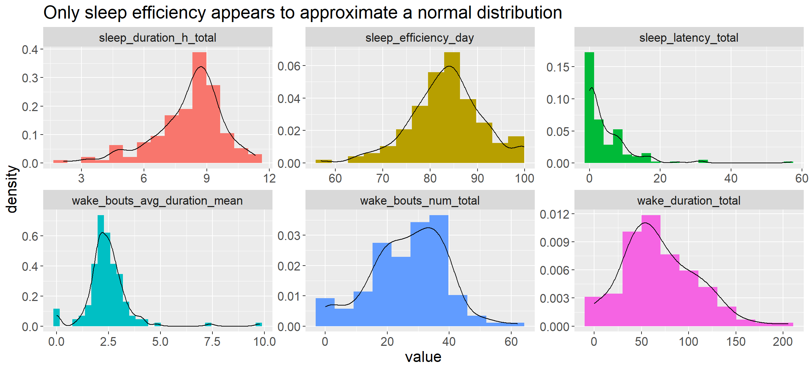
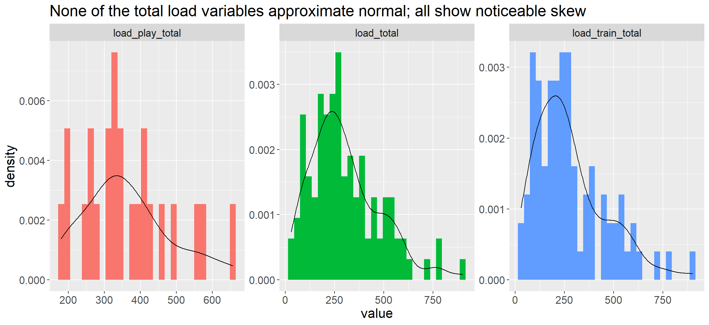
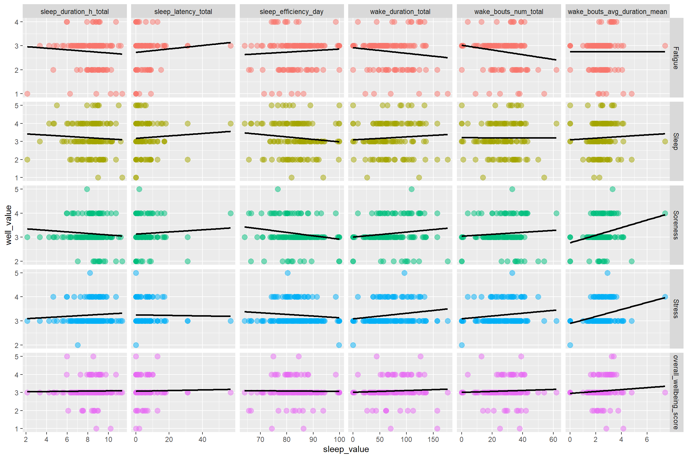
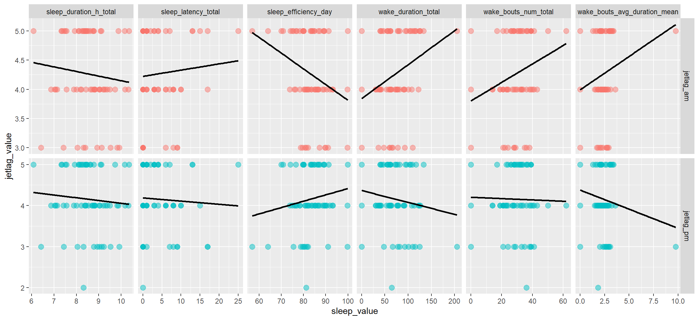

# Correlations {#correlations}

**NOTE:** As of 2020-07-10, this page is a duplicate of what is presented in the [results dashboard here](https://jacquietran.neocities.org/benita-phd-study3/dashboard_rq3.html). Treat the results on this page as **provisional** for now. There is further work to be done to check the underlying data, since some revisions have been made to the data cleaning procedure since these correlations were calculated.


## Assumption tests

### Interpretation of assumption test results

Proceed with the non-parametric Spearman's correlation, since many variables across the load, sleep, jetlag, and well-being measures do not approximate normal.

Histogram + density plots for each measure are shown below.

### Sleep




### Internal load - All variables


### Internal loads - Selected variables




### Perceived jetlag


### Perceived well-being


## Load on Sleep


```
## Joining, by = "sleep_variable"
```

### Correlation scatter plots: Internal loads on subsequent sleep


```
## `geom_smooth()` using formula 'y ~ x'
```


### Correlation coefficients tables

#### Internal training load on subsequent sleep

<table class="table" style="margin-left: auto; margin-right: auto;">
 <thead>
  <tr>
   <th style="text-align:left;"> sleep_variable </th>
   <th style="text-align:right;"> load_train_total_r </th>
   <th style="text-align:right;"> load_train_total_p </th>
  </tr>
 </thead>
<tbody>
  <tr>
   <td style="text-align:left;"> sleep_duration_sum </td>
   <td style="text-align:right;"> -0.04 </td>
   <td style="text-align:right;"> 0.70 </td>
  </tr>
  <tr>
   <td style="text-align:left;"> sleep_latency_mean </td>
   <td style="text-align:right;"> 0.01 </td>
   <td style="text-align:right;"> 0.89 </td>
  </tr>
  <tr>
   <td style="text-align:left;"> sleep_efficiency_mean </td>
   <td style="text-align:right;"> -0.14 </td>
   <td style="text-align:right;"> 0.16 </td>
  </tr>
  <tr>
   <td style="text-align:left;"> wake_duration_sum </td>
   <td style="text-align:right;"> 0.09 </td>
   <td style="text-align:right;"> 0.37 </td>
  </tr>
  <tr>
   <td style="text-align:left;"> wake_bouts_num_sum </td>
   <td style="text-align:right;"> 0.13 </td>
   <td style="text-align:right;"> 0.21 </td>
  </tr>
  <tr>
   <td style="text-align:left;"> wake_bouts_avg_duration_mean </td>
   <td style="text-align:right;"> -0.01 </td>
   <td style="text-align:right;"> 0.89 </td>
  </tr>
</tbody>
</table>

#### Internal playing load on subsequent sleep

<table class="table" style="margin-left: auto; margin-right: auto;">
 <thead>
  <tr>
   <th style="text-align:left;"> sleep_variable </th>
   <th style="text-align:right;"> load_play_total_r </th>
   <th style="text-align:right;"> load_play_total_p </th>
  </tr>
 </thead>
<tbody>
  <tr>
   <td style="text-align:left;"> sleep_duration_sum </td>
   <td style="text-align:right;"> -0.15 </td>
   <td style="text-align:right;"> 0.48 </td>
  </tr>
  <tr>
   <td style="text-align:left;"> sleep_latency_mean </td>
   <td style="text-align:right;"> 0.05 </td>
   <td style="text-align:right;"> 0.80 </td>
  </tr>
  <tr>
   <td style="text-align:left;"> sleep_efficiency_mean </td>
   <td style="text-align:right;"> 0.14 </td>
   <td style="text-align:right;"> 0.50 </td>
  </tr>
  <tr>
   <td style="text-align:left;"> wake_duration_sum </td>
   <td style="text-align:right;"> -0.38 </td>
   <td style="text-align:right;"> 0.06 </td>
  </tr>
  <tr>
   <td style="text-align:left;"> wake_bouts_num_sum </td>
   <td style="text-align:right;"> -0.24 </td>
   <td style="text-align:right;"> 0.25 </td>
  </tr>
  <tr>
   <td style="text-align:left;"> wake_bouts_avg_duration_mean </td>
   <td style="text-align:right;"> -0.10 </td>
   <td style="text-align:right;"> 0.64 </td>
  </tr>
</tbody>
</table>

## Well-being on Sleep


```
## Joining, by = "sleep_variable"
```

### Correlation scatter plots: Well-being on subsequent sleep


```
## `geom_smooth()` using formula 'y ~ x'
```



### Correlation coefficients tables

#### Fatigue on subsequent sleep

<table class="table" style="margin-left: auto; margin-right: auto;">
 <thead>
  <tr>
   <th style="text-align:left;"> sleep_variable </th>
   <th style="text-align:right;"> Fatigue_r </th>
   <th style="text-align:right;"> Fatigue_p </th>
  </tr>
 </thead>
<tbody>
  <tr>
   <td style="text-align:left;"> sleep_duration_sum </td>
   <td style="text-align:right;"> -0.03 </td>
   <td style="text-align:right;"> 0.73 </td>
  </tr>
  <tr>
   <td style="text-align:left;"> sleep_latency_mean </td>
   <td style="text-align:right;"> 0.14 </td>
   <td style="text-align:right;"> 0.08 </td>
  </tr>
  <tr>
   <td style="text-align:left;"> sleep_efficiency_mean </td>
   <td style="text-align:right;"> 0.07 </td>
   <td style="text-align:right;"> 0.41 </td>
  </tr>
  <tr>
   <td style="text-align:left;"> wake_duration_sum </td>
   <td style="text-align:right;"> -0.11 </td>
   <td style="text-align:right;"> 0.16 </td>
  </tr>
  <tr>
   <td style="text-align:left;"> wake_bouts_num_sum </td>
   <td style="text-align:right;"> -0.14 </td>
   <td style="text-align:right;"> 0.08 </td>
  </tr>
  <tr>
   <td style="text-align:left;"> wake_bouts_avg_duration_mean </td>
   <td style="text-align:right;"> 0.00 </td>
   <td style="text-align:right;"> 0.99 </td>
  </tr>
</tbody>
</table>

#### Sleep quality on subsequent sleep

<table class="table" style="margin-left: auto; margin-right: auto;">
 <thead>
  <tr>
   <th style="text-align:left;"> sleep_variable </th>
   <th style="text-align:right;"> Sleep_r </th>
   <th style="text-align:right;"> Sleep_p </th>
  </tr>
 </thead>
<tbody>
  <tr>
   <td style="text-align:left;"> sleep_duration_sum </td>
   <td style="text-align:right;"> -0.16 </td>
   <td style="text-align:right;"> 0.05 </td>
  </tr>
  <tr>
   <td style="text-align:left;"> sleep_latency_mean </td>
   <td style="text-align:right;"> 0.06 </td>
   <td style="text-align:right;"> 0.42 </td>
  </tr>
  <tr>
   <td style="text-align:left;"> sleep_efficiency_mean </td>
   <td style="text-align:right;"> -0.12 </td>
   <td style="text-align:right;"> 0.13 </td>
  </tr>
  <tr>
   <td style="text-align:left;"> wake_duration_sum </td>
   <td style="text-align:right;"> -0.02 </td>
   <td style="text-align:right;"> 0.80 </td>
  </tr>
  <tr>
   <td style="text-align:left;"> wake_bouts_num_sum </td>
   <td style="text-align:right;"> -0.07 </td>
   <td style="text-align:right;"> 0.37 </td>
  </tr>
  <tr>
   <td style="text-align:left;"> wake_bouts_avg_duration_mean </td>
   <td style="text-align:right;"> 0.11 </td>
   <td style="text-align:right;"> 0.15 </td>
  </tr>
</tbody>
</table>

#### Soreness on subsequent sleep

<table class="table" style="margin-left: auto; margin-right: auto;">
 <thead>
  <tr>
   <th style="text-align:left;"> sleep_variable </th>
   <th style="text-align:right;"> Soreness_r </th>
   <th style="text-align:right;"> Soreness_p </th>
  </tr>
 </thead>
<tbody>
  <tr>
   <td style="text-align:left;"> sleep_duration_sum </td>
   <td style="text-align:right;"> -0.03 </td>
   <td style="text-align:right;"> 0.72 </td>
  </tr>
  <tr>
   <td style="text-align:left;"> sleep_latency_mean </td>
   <td style="text-align:right;"> 0.08 </td>
   <td style="text-align:right;"> 0.32 </td>
  </tr>
  <tr>
   <td style="text-align:left;"> sleep_efficiency_mean </td>
   <td style="text-align:right;"> -0.11 </td>
   <td style="text-align:right;"> 0.15 </td>
  </tr>
  <tr>
   <td style="text-align:left;"> wake_duration_sum </td>
   <td style="text-align:right;"> 0.08 </td>
   <td style="text-align:right;"> 0.31 </td>
  </tr>
  <tr>
   <td style="text-align:left;"> wake_bouts_num_sum </td>
   <td style="text-align:right;"> 0.05 </td>
   <td style="text-align:right;"> 0.55 </td>
  </tr>
  <tr>
   <td style="text-align:left;"> wake_bouts_avg_duration_mean </td>
   <td style="text-align:right;"> 0.16 </td>
   <td style="text-align:right;"> 0.05 </td>
  </tr>
</tbody>
</table>

#### Stress on subsequent sleep

<table class="table" style="margin-left: auto; margin-right: auto;">
 <thead>
  <tr>
   <th style="text-align:left;"> sleep_variable </th>
   <th style="text-align:right;"> Stress_r </th>
   <th style="text-align:right;"> Stress_p </th>
  </tr>
 </thead>
<tbody>
  <tr>
   <td style="text-align:left;"> sleep_duration_sum </td>
   <td style="text-align:right;"> 0.06 </td>
   <td style="text-align:right;"> 0.46 </td>
  </tr>
  <tr>
   <td style="text-align:left;"> sleep_latency_mean </td>
   <td style="text-align:right;"> -0.02 </td>
   <td style="text-align:right;"> 0.80 </td>
  </tr>
  <tr>
   <td style="text-align:left;"> sleep_efficiency_mean </td>
   <td style="text-align:right;"> -0.04 </td>
   <td style="text-align:right;"> 0.65 </td>
  </tr>
  <tr>
   <td style="text-align:left;"> wake_duration_sum </td>
   <td style="text-align:right;"> 0.08 </td>
   <td style="text-align:right;"> 0.33 </td>
  </tr>
  <tr>
   <td style="text-align:left;"> wake_bouts_num_sum </td>
   <td style="text-align:right;"> 0.04 </td>
   <td style="text-align:right;"> 0.63 </td>
  </tr>
  <tr>
   <td style="text-align:left;"> wake_bouts_avg_duration_mean </td>
   <td style="text-align:right;"> 0.21 </td>
   <td style="text-align:right;"> 0.01 </td>
  </tr>
</tbody>
</table>

#### Overall well-being on subsequent sleep

<table class="table" style="margin-left: auto; margin-right: auto;">
 <thead>
  <tr>
   <th style="text-align:left;"> sleep_variable </th>
   <th style="text-align:right;"> overall_wellbeing_score_r </th>
   <th style="text-align:right;"> overall_wellbeing_score_p </th>
  </tr>
 </thead>
<tbody>
  <tr>
   <td style="text-align:left;"> sleep_duration_sum </td>
   <td style="text-align:right;"> 0.01 </td>
   <td style="text-align:right;"> 0.95 </td>
  </tr>
  <tr>
   <td style="text-align:left;"> sleep_latency_mean </td>
   <td style="text-align:right;"> 0.03 </td>
   <td style="text-align:right;"> 0.72 </td>
  </tr>
  <tr>
   <td style="text-align:left;"> sleep_efficiency_mean </td>
   <td style="text-align:right;"> -0.06 </td>
   <td style="text-align:right;"> 0.47 </td>
  </tr>
  <tr>
   <td style="text-align:left;"> wake_duration_sum </td>
   <td style="text-align:right;"> 0.08 </td>
   <td style="text-align:right;"> 0.33 </td>
  </tr>
  <tr>
   <td style="text-align:left;"> wake_bouts_num_sum </td>
   <td style="text-align:right;"> 0.05 </td>
   <td style="text-align:right;"> 0.52 </td>
  </tr>
  <tr>
   <td style="text-align:left;"> wake_bouts_avg_duration_mean </td>
   <td style="text-align:right;"> 0.17 </td>
   <td style="text-align:right;"> 0.03 </td>
  </tr>
</tbody>
</table>

## Jetlag on Sleep


```
## Joining, by = "sleep_variable"
```

### Correlation scatter plots: Jetlag on subsequent sleep


```
## `geom_smooth()` using formula 'y ~ x'
```



### Correlation coefficients

<table class="table" style="margin-left: auto; margin-right: auto;">
 <thead>
  <tr>
   <th style="text-align:left;"> sleep_variable </th>
   <th style="text-align:right;"> jetlag_am_r </th>
   <th style="text-align:right;"> jetlag_am_p </th>
   <th style="text-align:right;"> jetlag_pm_r </th>
   <th style="text-align:right;"> jetlag_pm_p </th>
  </tr>
 </thead>
<tbody>
  <tr>
   <td style="text-align:left;"> sleep_duration_sum </td>
   <td style="text-align:right;"> -0.03 </td>
   <td style="text-align:right;"> 0.81 </td>
   <td style="text-align:right;"> -0.02 </td>
   <td style="text-align:right;"> 0.87 </td>
  </tr>
  <tr>
   <td style="text-align:left;"> sleep_latency_mean </td>
   <td style="text-align:right;"> -0.03 </td>
   <td style="text-align:right;"> 0.76 </td>
   <td style="text-align:right;"> -0.01 </td>
   <td style="text-align:right;"> 0.95 </td>
  </tr>
  <tr>
   <td style="text-align:left;"> sleep_efficiency_mean </td>
   <td style="text-align:right;"> -0.14 </td>
   <td style="text-align:right;"> 0.21 </td>
   <td style="text-align:right;"> 0.16 </td>
   <td style="text-align:right;"> 0.15 </td>
  </tr>
  <tr>
   <td style="text-align:left;"> wake_duration_sum </td>
   <td style="text-align:right;"> 0.20 </td>
   <td style="text-align:right;"> 0.08 </td>
   <td style="text-align:right;"> -0.08 </td>
   <td style="text-align:right;"> 0.47 </td>
  </tr>
  <tr>
   <td style="text-align:left;"> wake_bouts_num_sum </td>
   <td style="text-align:right;"> 0.23 </td>
   <td style="text-align:right;"> 0.04 </td>
   <td style="text-align:right;"> -0.01 </td>
   <td style="text-align:right;"> 0.93 </td>
  </tr>
  <tr>
   <td style="text-align:left;"> wake_bouts_avg_duration_mean </td>
   <td style="text-align:right;"> 0.07 </td>
   <td style="text-align:right;"> 0.51 </td>
   <td style="text-align:right;"> -0.11 </td>
   <td style="text-align:right;"> 0.35 </td>
  </tr>
</tbody>
</table>
